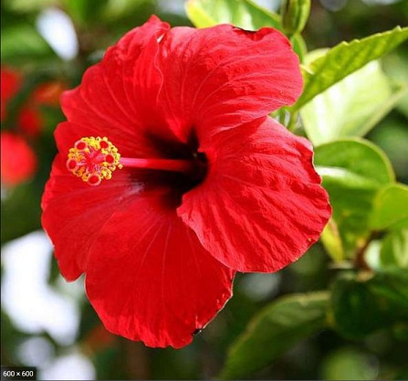
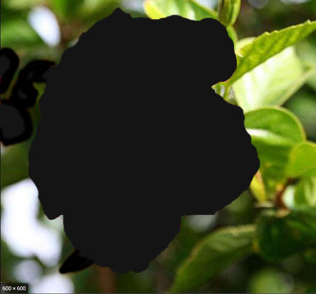

## 23. 经典光照

计算机渲染做的工作就是模拟真实世界的效果。

真实世界是一个物理、化学世界，这是一个超级复杂的世界，用世界上最强大的计算机都没办法进行计算的世界。

在`22. Physx物理引擎`这一章介绍物理引擎时就说过，想要完全模拟真实世界是不可能的，物理是如此，光照也是如此。

### 1. 现实中的光照

我们知道物体本身是没有颜色的，它只是一堆原子靠相互间的引力，聚集在一起形成了一个杯子形状。

太阳光是由多种波长的光组成的，有不可见的紫外线、红外线灯的，也有可见的紫蓝青绿黄橙红。

在白天，我看见一朵红色的花。

是因为组成花的这一堆原子，它吸收了太阳光中 `除红色可见光的` 其他波长的光，然后将 `红色可见光` 反射到我的眼睛里。

然后我的眼睛告诉大脑，这朵花是红色的。

现在我带着这朵花来到了另一个星系，这个星系里的恒星和太阳不同，它发出的光，没有红色可见光！

这下好了，这朵花将所有波长的光都吸收了，没有任何可见光反射到我的眼睛。

我的眼睛告诉大脑，这里没有东西，那大脑就在这里，以花的形状，创建了一块黑色区域，也就是黑色的花。

一束光，是由无数个光子组成的。

太阳燃烧发出光线，被红色的花吸收、反射。

其实是无数个光子，从太阳出发，以光速向这朵花飞来。

红色可见光波长的光子，被组成花的原子反弹，弹到我的眼睛里。

其他波长的光子，全部打进了花里面，光子与组成花的原子发生碰撞，产生了热量，所以阳光下的花暖暖的。

这本质上是物理现象。

前面就说过了，计算机没有办法完全计算出现实世界的物理现象，只能模拟！

那么光照这种物理现象，也只能模拟！！！

### 2. 模拟光照

还记得上一节的物理模拟，怎么模拟两个物体碰撞吗？

创建无数个原子，组成物体，然后碰撞的时候计算每个原子的势能？

这是不可能的，没有这么大的算力。

搞两个立方体盒子，算算距离，检测下是否立方体相交就可以了。

那么模拟光照也是这样，搞这么真干嘛，想搞也搞不了，做做样子就可以了。

| 真实世界  |  模拟 |
|:--|:--|
|物体本身是没有颜色  |  将顶点色去除或者设置为黑色 |
|太阳燃烧发出无数光子，以光速，朝着花朵的方向射来。|光子是没有的，只能定义太阳位置，用来计算太阳到花朵的方向。|
|某个波长的可见光的光子打到花朵上，被反射到眼睛，眼睛就识别到了这个颜色。|在模型上用颜色贴图，就有颜色了。|
|笔直朝向太阳的地方会亮一些，倾斜的地方暗一些。|计算法线方向与光照方向夹角cos值，乘以颜色值。|
|某个区域大量的光子反射，眼睛就识别到这里更亮，就是高光。|就让这一块地方的贴图颜色乘以一个较大系数看起来更亮好了。|
|光子被花朵不规则表面反弹后，会有少量最终反弹到花朵背面，再反弹到眼睛里，就看见了背面。|给个默认的环境颜色和亮度，再乘以颜色贴图的颜色，这样场景就不会全黑。|

### 3. 光源

太阳光被认为是直射的，就称之为方向光(Directional Light)。

太阳燃烧发出无数光子，以光速，朝着花朵的方向射来。

模拟的太阳也没法发光，只能配置个方向。

光源只是一组参数，用来配置光的朝向。

有的光源，例如手电筒，它发出的光是一个圆锥形的，那在模拟的时候，光源还要配置这个圆锥的大小。

### 4. 光照模型

游戏中不同的物体，在受到相同光照下，表现不同。

例如UI是完全不受光照影响，我们就称之为无光照模型(No Lighting)。

有的物体只正面会被光照影响，而背面则完全不管，就称之为漫反射光照模型(Diffuse Lighting)。

有的物体如金属、塑料，被光照射后，会有明显的一块地方，比其他地方更亮，这就是高光模型(Specular Lighting)。