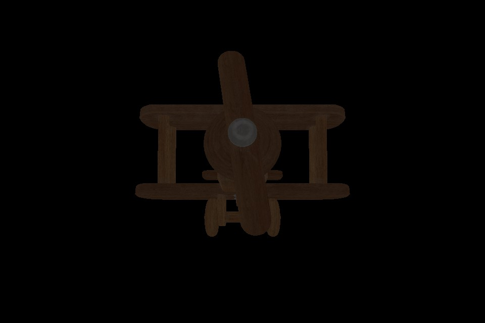
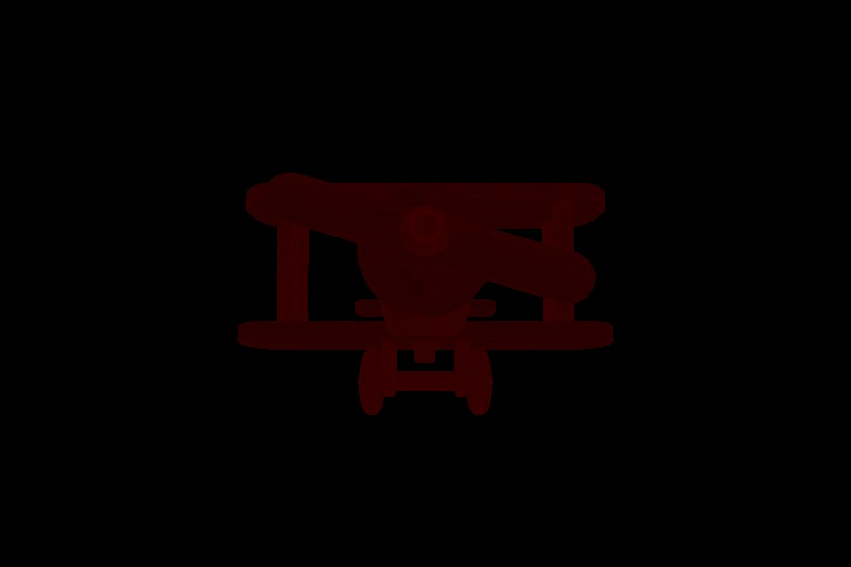
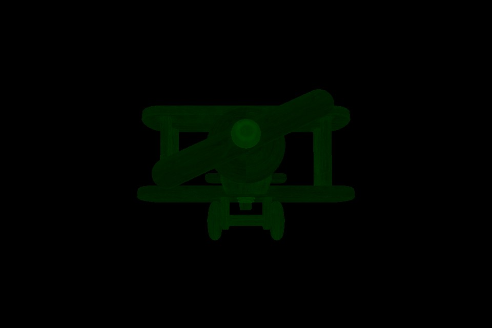

## 23.1 环境光

```bash
CLion项目文件位于 samples\classic_lighting\ambient
```

我躲在房间里，客厅的灯开着。

光从房间门缝里透进来，房间里也有了微弱的光，勉强能看清楚东西。

这是因为光子从门缝进到房间后，会不断反射到房间其他角落。

不过从门缝进到房间的光子比较少，大部分光子在不断反弹耗尽能量后，没有进入到人的眼镜。

仅少部分光子进入眼镜，所以看起来很暗。

游戏里实际上也并不会出现纯黑的场景，不然玩家怎么操作。

我们将这种间接的、很微弱的光，称之为环境光。

先来看下这一节实现的效果吧。



### 1. 光的通用属性

自然界的光是由多种波长的光子组成的，可见光也有很多种，不能被物体吸收的光子反射到眼镜，在人脑海里形成了对应的颜色。

在显示器里，其实看到的是模型纹理上的颜色，所以正儿八经来说，模拟的光只要一个强度(intensity)字段就可以了，如下 `Environment` 结构。

```c++
/// 环境配置
class Environment {
public:
    Environment();

private:
    float ambient_color_intensity_;// 环境颜色强度
};
```

不过我还是给它加上了一个颜色值，用环境光的颜色值与模型纹理的颜色值相乘，看起来就像彩灯的效果。

客厅开了一个彩灯，光透过房间门缝后，把房间也照亮成了彩色。

光的颜色、强度，是光的通用属性。

增加了颜色之后， `Environment` 结构如下：

```c++
//file:source/lighting/environment.h

/// 环境配置
class Environment {
public:
    Environment();

    /// 设置环境颜色
    void set_ambient_color(const glm::vec3 &ambient_color){ambient_color_= ambient_color;}

    /// 获取环境颜色
    const glm::vec3 &ambient_color() const{return ambient_color_;}

    /// 设置环境强度
    void set_ambient_color_intensity(float ambient_color_intensity){ambient_color_intensity_ = ambient_color_intensity;}

    /// 获取环境强度
    float ambient_color_intensity() const{return ambient_color_intensity_;}

private:
    glm::vec3 ambient_color_;// 环境颜色
    float ambient_color_intensity_;// 环境颜色强度
};
```

### 2. 片段着色器应用环境光

顶点着色器输出顶点数据，片段着色器输出颜色数据。

在片段着色器，将环境光颜色乘以纹理颜色，然后输出。

```glsl
#version 330 core

uniform sampler2D u_diffuse_texture;//颜色纹理
uniform vec3 u_ambient_light_color;//环境光
uniform float u_ambient_light_intensity;//环境光强度

in vec4 v_color;//顶点色
in vec2 v_uv;

layout(location = 0) out vec4 o_fragColor;
void main()
{
    o_fragColor = texture(u_diffuse_texture,v_uv) * vec4(u_ambient_light_color,1.0) * u_ambient_light_intensity;
    o_fragColor.a=1.0;
}
```

### 3. 向片段Shader传递环境光属性

实例化`Environment`时设置好颜色，没有特殊要求，这里就是白色：

```lua
--file:example/login_scene.lua line:33

function LoginScene:Awake()
    print("LoginScene Awake")
    LoginScene.super.Awake(self)

    self:CreateEnvironment()
    self:CreateMainCamera()
    self:CreatePlayer()
end

--- 环境光设置
function LoginScene:CreateEnvironment()
    self.environment_=Environment.new()
    self.environment_:set_ambient_color(glm.vec3(1.0,1.0,1.0))
    self.environment_:set_ambient_color_intensity(0.3)
end
```

在Update时，传递到片段Shader中：

```lua
--file:example/login_scene.lua line:95

function LoginScene:Update()
    ......

    --设置环境光颜色和强度
    self.material_:SetUniform3f("u_ambient_light_color",self.environment_:ambient_color())
    self.material_:SetUniform1f("u_ambient_light_intensity",self.environment_:ambient_color_intensity())

    ......
end
```

### 4. 测试

动手调整环境光的颜色和强度，对比不同效果。

```lua
self.environment_:set_ambient_color(glm.vec3(1.0,0.0,0.0))
```



```lua
self.environment_:set_ambient_color(glm.vec3(0.0,1.0,0.0))
```

