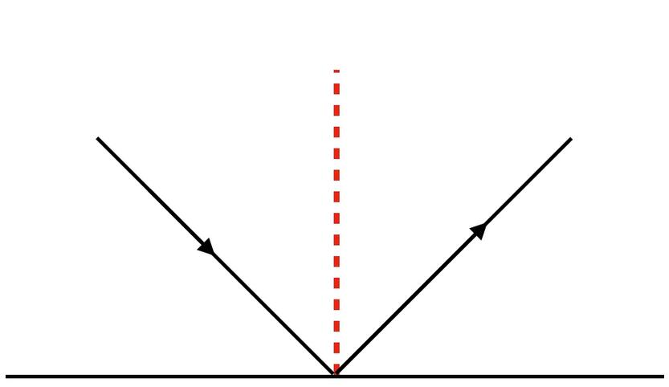

## 23.1 漫反射光照模型

在只有环境光下，模型看起来很假。

设计师设计的效果是这样的：

 <iframe title="Basic Plane" frameborder="0" allowfullscreen mozallowfullscreen="true" webkitallowfullscreen="true" allow="autoplay; fullscreen; xr-spatial-tracking" xr-spatial-tracking execution-while-out-of-viewport execution-while-not-rendered web-share width="640" height="480" src="https://sketchfab.com/models/319a57619948416288cc2d2880c70a4a/embed?dnt=1"> </iframe> 

这是因为人眼是靠阴影，在大脑中创建3D物体的。

一个物体，如果所有的地方，颜色相同，那人类不会认为这是一个三维物体。

真实世界，是因为光子被上层反弹走了，没有击中更下层的地方，导致下层没有反射光子到人眼。

计算机没有那么大的算力去呈现真实光子物理现象。

前人就想出了一些简单的数学公式来简单模拟，这些数学公式，我们称之为光照模型。

### 1. 法线

在学习光照模型之前，先来了解法线。

法线（normal line），是指始终垂直于某平面的直线。

那么我们平时说的顶点法线，这话看起来是错误的，因为法线是属于`面`。

在图形学里，`点`是一个实际存在的东西，`面` 却是一个逻辑上的东西。

一个模型要渲染出来，是先将顶点数据交由顶点处理器处理，组成了逻辑上的三角面。

即渲染的输入是顶点，而不是三角面。

那我要设置三角面的法线，就只能往顶点里塞数据，将法线数据作为顶点属性传入了。

这就是为什么我们平时叫顶点法线的原因。

### 2. 漫反射光照模型

将从顶点到 片段 的向量看作光的方向。

计算 光的方向 与 法线的角度Cos值，作为片段受光照影响的强弱。

当光源直射时，光方向 与 法线角度为0，Cos值为1，此时受光最强。

当片段位于背面或侧面，光方向 与 法线角度为 -1 或0，此时不受光。

