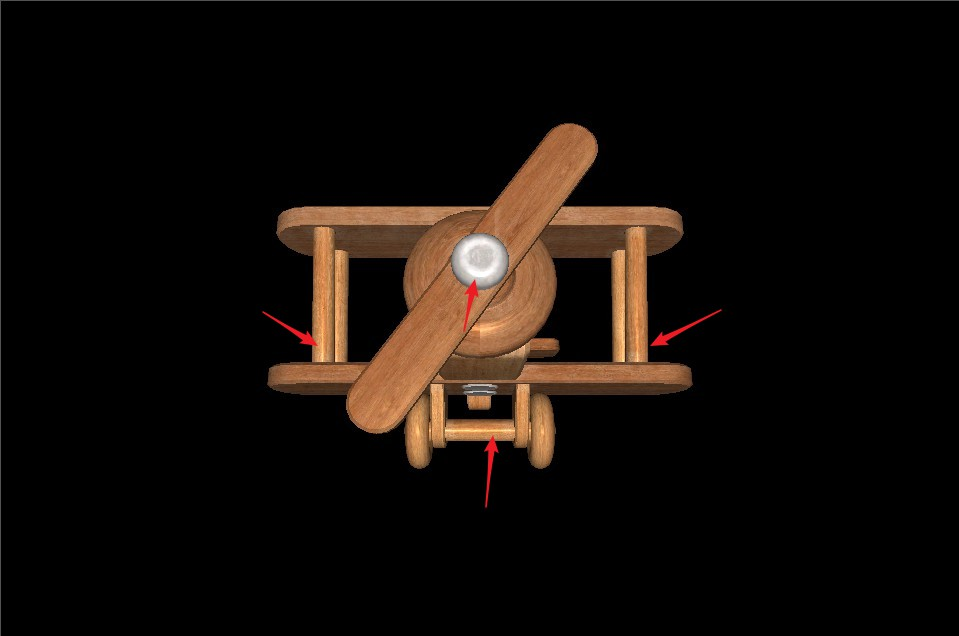
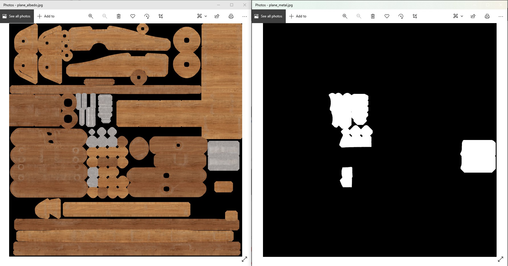
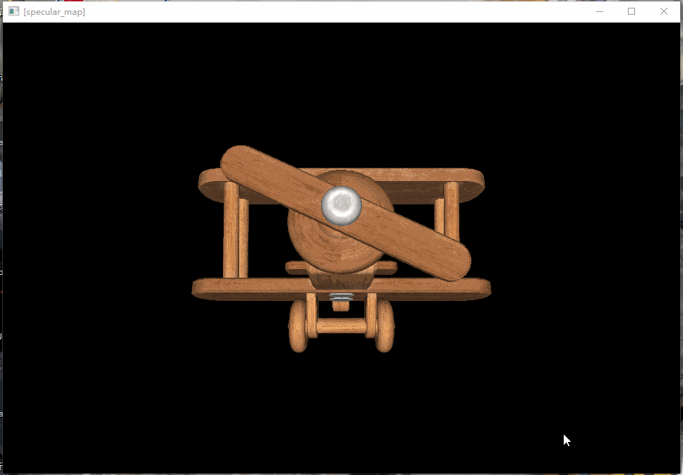
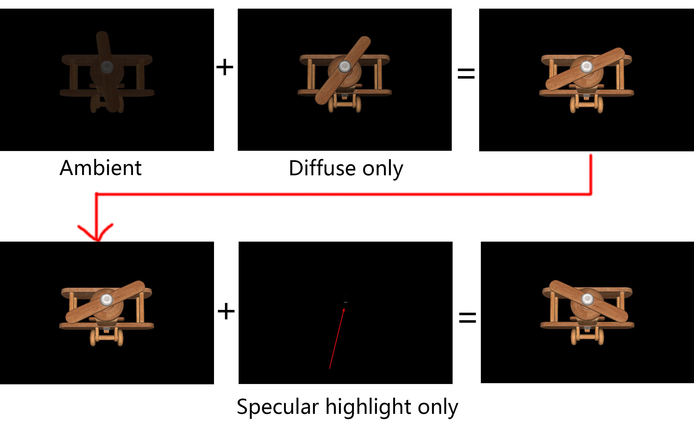

### 23.4 高光贴图

这个飞机还是很奇怪的，它是一个木头飞机，但是却像是打了蜡一样，亮蹭蹭的。



再对比设计师设计的效果：

<div class="sketchfab-embed-wrapper"> <iframe title="Basic Plane" frameborder="0" allowfullscreen mozallowfullscreen="true" webkitallowfullscreen="true" allow="autoplay; fullscreen; xr-spatial-tracking" xr-spatial-tracking execution-while-out-of-viewport execution-while-not-rendered web-share width="640" height="480" src="https://sketchfab.com/models/319a57619948416288cc2d2880c70a4a/embed?dnt=1"> </iframe> </div>

正确的是只有金属部分才有高光，木头部分是不能有高光的。

那怎么控制呢？

### 1. 顶点属性与高光贴图的抉择

我们往OpenGL里传入数据，有2种方式：
1. 顶点数据
2. 纹理

顶点数据里有个 `顶点颜色` ,在前面章节，我们用顶点颜色来绘制出彩色的三角形。

```c++
//file:source/renderer/mesh_filter.h line:21

//顶点
struct Vertex{
    glm::vec3 position_;
    glm::vec4 color_;//顶点颜色
    glm::vec2 uv_;
    glm::vec3 normal_;
};
```

但是从使用了纹理之后，顶点颜色就闲置了没有再使用，我们可以用顶点颜色来表示顶点是否计算高光。

对于要高光显示的区域，将顶点颜色指定为 (1,1,1)。

不需要高光的区域，将顶点颜色指定为 (0,0,0)。

原理上看起来没什么问题，但实际上是不太行的。

在【5.1 颜色和贴图】有类似的疑问，既然顶点有颜色，为什么还需要纹理贴图呢？p

缘由就是，顶点颜色是顶点属性，在顶点Shader中处理。

而最终我们在屏幕上看到的像素颜色，是在片段着色器中输出的。

6个顶点组成的正方形，铺满了100x100大小的屏幕。

只有正方形的4个角所在的顶点，才有顶点颜色数据，中间的都靠插值。


插值只能插出渐变色，是插不出一个圆圈、一个人的。

而高光的计算逻辑，就需要在这个100x100的屏幕块上，能精确的控制某一个像素，是否参与高光计算。

纹理就是专为每一个像素提供数据的。

所以目前都是使用高光贴图，来高精度地，控制模型的某一块是否参与高光计算。

项目用到的飞机模型是PBR的，从sketchfab下载过来带了颜色贴图和金属度贴图。



左边是颜色贴图，右边是金属度贴图。

金属是反光的，木头不反光，所以我们可以将金属度贴图，当做高光贴图来使用。

这里也可以看出，使用高光贴图的另一个好处就是：制作方便。

将颜色贴图复制一份，需要高光的地方涂白色，不需要的地方涂黑色，就完成了高光贴图的制作。

### 2. 使用高光贴图

上面介绍了这么久的高光贴图原理，使用就很简单了。

白色的地方，高光强度是1，表示需要计算高光。

黑色的地方，高光强度是0，表示不要计算高光。

#### 2.1 从高光贴图获取高光强度

来看片段着色器的计算过程。

```glsl
//file:data/shader/specular_map.frag 

#version 330 core

uniform sampler2D u_diffuse_texture;//颜色纹理

uniform vec3 u_ambient_light_color;//环境光
uniform float u_ambient_light_intensity;//环境光强度

uniform vec3 u_light_pos;
uniform vec3 u_light_color;
uniform float u_light_intensity;

uniform vec3 u_view_pos;//眼睛的位置
//uniform float u_specular_highlight_intensity;//镜面高光强度
uniform sampler2D u_specular_texture;//高光贴图
uniform float u_specular_highlight_shininess;//物体反光度，越高反光能力越强，高光点越小。

in vec4 v_color;//顶点色
in vec2 v_uv;
in vec3 v_normal;
in vec3 v_frag_pos;

layout(location = 0) out vec4 o_fragColor;
void main()
{
    ......

    //specular(镜面高光)
    vec3 reflect_dir=reflect(-light_dir,v_normal);//计算反射光的方向向量
    vec3 view_dir=normalize(u_view_pos-v_frag_pos);//计算视线方向向量
    float cos_value=max(dot(view_dir,reflect_dir),0.0);//计算反射光与视线的夹角cos值
    float spec=pow(cos_value,u_specular_highlight_shininess);//用反光度做次方，计算得到高光值。
    float specular_highlight_intensity = texture(u_specular_texture,v_uv).r;//从高光贴图中取镜面高光强度。1表示计算高光，0表示无高光。
    vec3 specular_color = u_light_color * spec * specular_highlight_intensity * texture(u_diffuse_texture,v_uv).rgb;

    o_fragColor = vec4(ambient_color + diffuse_color + specular_color,1.0);
}
```

取消了 `u_specular_highlight_intensity` 表示镜面高光强度的变量，现在改为从高光贴图中获取了。

```glsl
float specular_highlight_intensity = texture(u_specular_texture,v_uv).r;//从高光贴图中取镜面高光强度。1表示最大高光，0表示无高光。
```

#### 2.2 指定高光贴图

在材质文件中，指定高光贴图文件。

```xml
<!--data/material/basic_plane_specular_map.mat-->

<material shader="shader/specular_map">
    <texture name="u_diffuse_texture" image="images/plane_albedo.cpt"/>
    <texture name="u_specular_texture" image="images/plane_metal.cpt"/>
</material>
```

### 3. 测试



可以看到木质的机身已经没有了高光效果，仅中间的金属还剩一点高光。

### 4. 效果拆解

