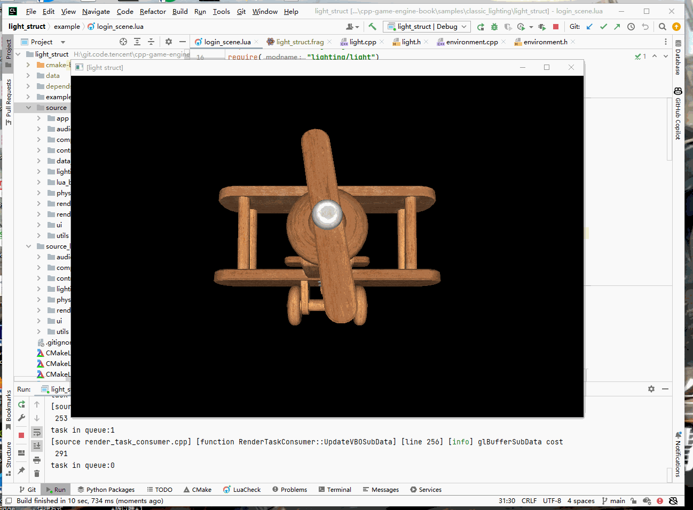

## 23.5 Shader结构体

```bash
CLion项目文件位于 samples\classic_lighting\light_struct
```

到现在为止，不论是环境光，还是Diffuse、Specular光照模型，他们所需的灯光颜色、灯光强度，在Shader中都是独立存在的变量。

```glsl
uniform vec3 u_ambient_light_color;//环境光
uniform float u_ambient_light_intensity;//环境光强度

uniform vec3 u_light_pos;
uniform vec3 u_light_color;
uniform float u_light_intensity;
```

指定它们的值，也是在Update中一个一个设置。

```lua
function LoginScene:Update()
    ......

    --设置环境光颜色和强度
    self.material_:SetUniform3f("u_ambient_light_color",self.environment_:ambient_color())
    self.material_:SetUniform1f("u_ambient_light_intensity",self.environment_:ambient_color_intensity())
    --设置灯光位置、颜色、强度
    self.material_:SetUniform3f("u_light_pos",glm.vec3(0,0,20))
    self.material_:SetUniform3f("u_light_color",glm.vec3(1.0,1.0,1.0))
    self.material_:SetUniform1f("u_light_intensity",1.0)

    ......
end
```

这就有2个问题：
1. Uniform变量是有限定个数的。
2. 多个单独的Uniform看起来很乱，一点都不面向对象。

对于这种多个变量，同属于一个功能的，要把它们组织成对象，这样看起来就整洁漂亮。

OpenGL Shader语言GLSL是类C的语言，也支持Struct。

### 1. Shader中使用Struct

将环境光、灯光分别归纳为Struct。

```glsl
//file:data/shader/light_struct.frag line:5

//环境光
struct Ambient {
    vec3  light_color;//环境光
    float light_intensity;//环境光强度
};
uniform Ambient u_ambient;

//灯光
struct Light {
    vec3  pos;
    vec3  color;
    float intensity;
};
uniform Light u_light;
```

使用方式也和C语言一样，用 `.` 来访问成员变量，例如：` u_ambient.light_color`。

将片段Shader改造如下：

```glsl
//file:data/shader/light_struct.frag

#version 330 core

uniform sampler2D u_diffuse_texture;//颜色纹理

//环境光
struct Ambient {
    vec3  light_color;//环境光
    float light_intensity;//环境光强度
};
uniform Ambient u_ambient;

//灯光
struct Light {
    vec3  pos;
    vec3  color;
    float intensity;
};
uniform Light u_light;

uniform vec3 u_view_pos;
uniform sampler2D u_specular_texture;//颜色纹理
uniform float u_specular_highlight_shininess;//物体反光度，越高反光能力越强，高光点越小。

in vec4 v_color;//顶点色
in vec2 v_uv;
in vec3 v_normal;
in vec3 v_frag_pos;

layout(location = 0) out vec4 o_fragColor;
void main()
{
    //ambient
    vec3 ambient_color = u_ambient.light_color * u_ambient.light_intensity * texture(u_diffuse_texture,v_uv).rgb;

    //diffuse
    vec3 normal=normalize(v_normal);
    vec3 light_dir=normalize(u_light.pos - v_frag_pos);
    float diffuse_intensity = max(dot(normal,light_dir),0.0);
    vec3 diffuse_color = u_light.color * diffuse_intensity * u_light.intensity * texture(u_diffuse_texture,v_uv).rgb;

	//specular
	vec3 reflect_dir=reflect(-light_dir,v_normal);
	vec3 view_dir=normalize(u_view_pos-v_frag_pos);
	float spec=pow(max(dot(view_dir,reflect_dir),0.0),u_specular_highlight_shininess);
    float specular_highlight_intensity = texture(u_specular_texture,v_uv).r;//从纹理中获取高光强度
	vec3 specular_color = u_light.color * spec * specular_highlight_intensity * texture(u_diffuse_texture,v_uv).rgb;

    o_fragColor = vec4(ambient_color + diffuse_color + specular_color,1.0);
}
```

### 2. 设置Struct

将环境光、普通Light的参数，分别整合到 `Environment` `Light` 两个类中，在 Update 中，对Struct进行设置。

#### 2.1 设置环境光

环境是全局的，所以并没有将它设计为 `Component`。

```c++
//file:source/lighting/environment.h

/// 环境配置
class Environment {
public:
    Environment();

    /// 设置环境颜色
    void set_ambient_color(const glm::vec3 &ambient_color){ambient_color_= ambient_color;}

    /// 获取环境颜色
    const glm::vec3 &ambient_color() const{return ambient_color_;}

    /// 设置环境强度
    void set_ambient_color_intensity(float ambient_color_intensity){ambient_color_intensity_ = ambient_color_intensity;}

    /// 获取环境强度
    float ambient_color_intensity() const{return ambient_color_intensity_;}

    void Update();

private:
    glm::vec3 ambient_color_;// 环境颜色
    float ambient_color_intensity_;// 环境颜色强度
};
```

```c++
//file:source/lighting/environment.cpp

Environment::Environment():
    ambient_color_(glm::vec3(1.0f, 1.0f, 1.0f)),ambient_color_intensity_(1.0f) {
}

void Environment::Update() {
    GameObject::Foreach([this](GameObject* game_object){
        if(game_object->active()==false){
            return;
        }
        MeshRenderer* mesh_renderer=game_object->GetComponent<MeshRenderer>();
        if(mesh_renderer== nullptr){
            return;
        }
        Material* material = mesh_renderer->material();
        material->SetUniform3f("u_ambient.light_color",ambient_color_);
        material->SetUniform1f("u_ambient.light_intensity",ambient_color_intensity_);
    });
}
```

这里遍历所有 MeshRenderer，设置环境光参数。

注意设置Struct成员变量，和Shader中访问，都是需要用 `.` ：

```glsl
material->SetUniform3f("u_ambient.light_color",ambient_color_);
```

#### 2.2 设置灯光

场景中可以有多个灯，所以灯是设计为组件形式。

```c++
//file:source/lighting/light.h

//~zh 灯光
class Light: public Component {
public:
    Light();
    ~Light();

    glm::vec3 color() const{return color_;};
    void set_color(glm::vec3 color){color_ = color;};

    float intensity() const{return intensity_;};
    void set_intensity(float intensity){intensity_ = intensity;};

public:
    void Update() override;

private:
    glm::vec3 color_;//颜色
    float intensity_;//强度

RTTR_ENABLE();
};
```

```c++
//file:source/lighting/light.cpp

using namespace rttr;
RTTR_REGISTRATION//注册反射
{
    registration::class_<Light>("Light")
            .constructor<>()(rttr::policy::ctor::as_raw_ptr);
}

Light::Light():Component() {}

Light::~Light() {}

void Light::Update() {
    GameObject::Foreach([this](GameObject* iterate_game_object){
        if(iterate_game_object->active() == false){
            return;
        }
        MeshRenderer* mesh_renderer=iterate_game_object->GetComponent<MeshRenderer>();
        if(mesh_renderer== nullptr){
            return;
        }
        Material* material = mesh_renderer->material();
        //设置灯光位置、颜色、强度
        glm::vec3 light_position=game_object()->GetComponent<Transform>()->position();
        material->SetUniform3f("u_light.pos",light_position);
        material->SetUniform3f("u_light.color",color_);
        material->SetUniform1f("u_light.intensity",intensity_);
    });
}
```

遍历所有 MeshRenderer，设置灯光参数。

### 3.测试

创建 `Environment` 实例。

创建一个或多个 `Light`。

```lua
--file:example/login_scene.lua

function LoginScene:Awake()
    ......

    self:CreateEnvironment()
    self:CreateLight()
    ......
end

--- 创建环境
function LoginScene:CreateEnvironment()
    self.environment_=Environment.new()
    self.environment_:set_ambient_color(glm.vec3(1.0,1.0,1.0))
    self.environment_:set_ambient_color_intensity(0.3)
end

--- 创建灯
function LoginScene:CreateLight()
    local go_light= GameObject.new("light")
    go_light:AddComponent(Transform):set_position(glm.vec3(0,0,20))
    local light=go_light:AddComponent(Light)
    light:set_color(glm.vec3(1.0,1.0,1.0))
    light:set_intensity(1.0)
end

......

function LoginScene:Update()
    ......

    self.environment_:Update()

    ......
end
```


