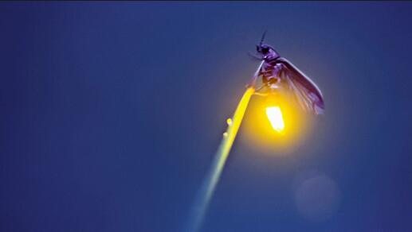
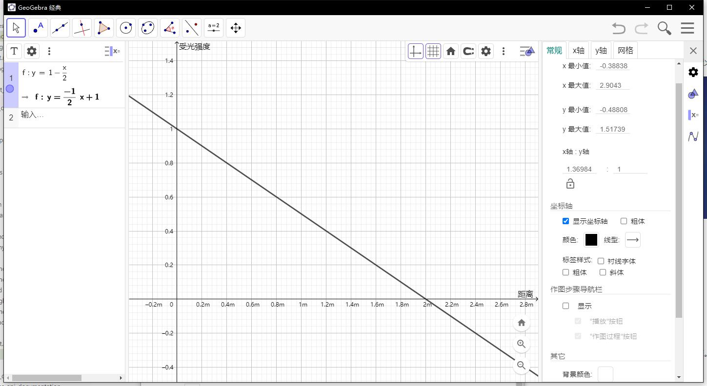
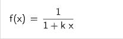
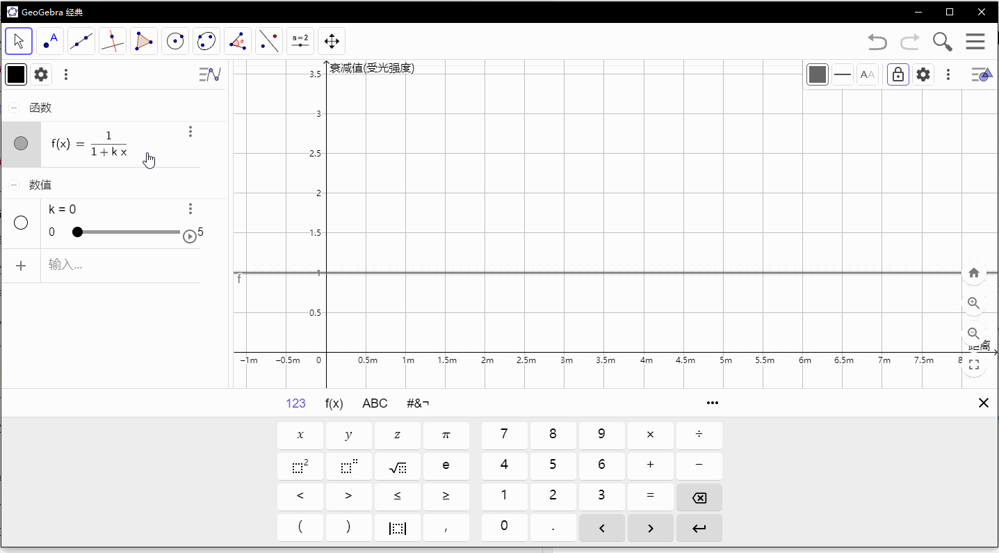
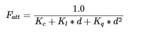
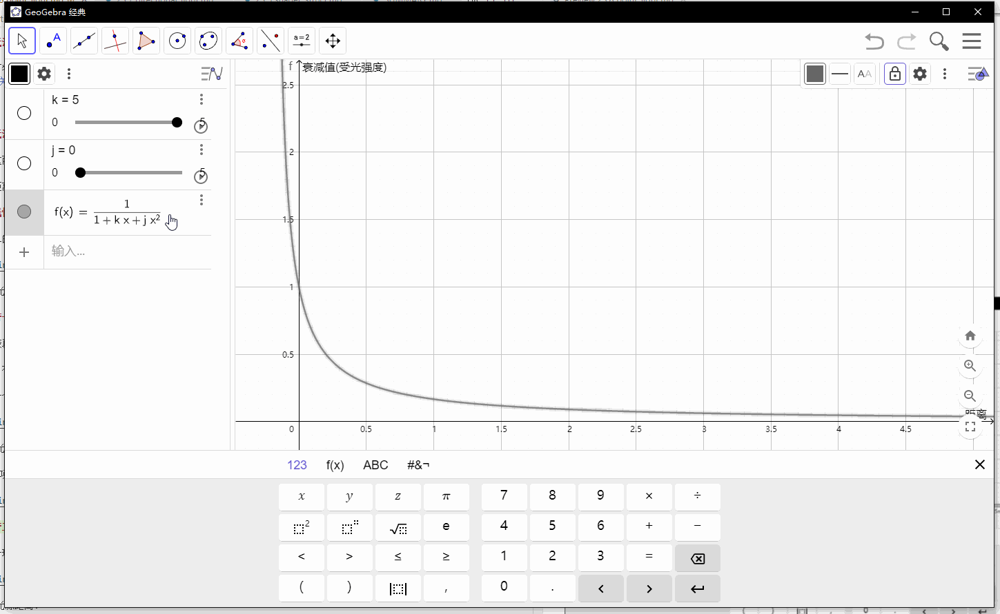
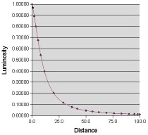
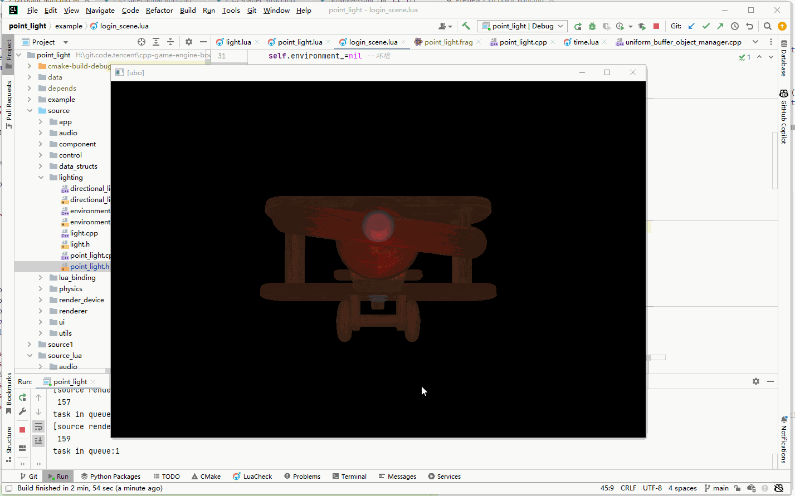

## 23.8 点光源

```bash
CLion项目文件位于 samples\classic_lighting\point_light
```

点光源发出的光子，向四面八方发射，到一定距离后消亡，例如萤火虫的光。



### 1. 点光源特点

点光源有以下特点：
1. 与位置有关
2. 无方向
3. 有衰减

### 2. 点光源衰减

位置、方向这两个特点，之前都实现过了，现在要考虑衰减的问题。

衰减就是随距离越大，受到光照影响越弱，也就是受光强度越小。

#### 2.1 线性衰减

我们可以简单的写个函数，来做线性的衰减。



$ x $ 是与光源距离。

#### 2.2 带一次项曲线衰减

也可以做比较真的模拟。

现实世界里，在靠近光源的一段距离内，衰减的厉害，随着距离远了，变化就不是很大。

我们可以用一个稍微复杂的公式来模拟。



$ x $ 是与光源距离。

$ K $是一次项，和距离相乘，随着$ K $增大，衰减值变化如下图。




#### 2.3 带二次项曲线衰减

一般来说带一次项曲线衰减，效果足够了，不过科学家写了一个更真实的模拟函数。



$ d $ 是与光源距离。

$ K_c $是常数项，一般是1.0，这是为了保证衰减值不会大于1.0。

$ K_l $是一次项，和距离相乘，就是线性的。

$ K_q $是二次项，和距离平方相乘。

由于二次项的存在，光线会在大部分时候以线性的方式衰退，直到距离变得足够大，让二次项超过一次项，光的强度会以更快的速度下降。

这样的结果就是，光在近距离时亮度很高，但随着距离变远亮度迅速降低，最后会以更慢的速度减少亮度。



从上面的动图可以看到，在二次项的影响下，在近距离衰减的更厉害了，然后远距离衰减的变缓了。

针对不同的效果，大家也总结出了一些参数值，供我们直接套用，下面是Ogre3d引擎给出的一套参数。

```c++
Range Constant Linear Quadratic

3250, 1.0, 0.0014, 0.000007

600, 1.0, 0.007, 0.0002

325, 1.0, 0.014, 0.0007

200, 1.0, 0.022, 0.0019

160, 1.0, 0.027, 0.0028

100, 1.0, 0.045, 0.0075

65, 1.0, 0.07, 0.017

50, 1.0, 0.09, 0.032

32, 1.0, 0.14, 0.07

20, 1.0, 0.22, 0.20

13, 1.0, 0.35, 0.44

7, 1.0, 0.7, 1.8

```

衰减曲线如下图：



原文地址：`https://wiki.ogre3d.org/tiki-index.php?page=-Point+Light+Attenuation`

依据想要的效果，自己多测试几套。

### 3. 点光源实现

将上面的公式，套入到片段Shader中。

```glsl
//file:data/shader/point_light.frag

#version 330 core

uniform sampler2D u_diffuse_texture;//颜色纹理

//环境光
struct Ambient{
    vec3  color;//环境光 alignment:12 offset:0
    float intensity;//环境光强度 alignment:4 offset:12
};

layout(std140) uniform AmbientBlock {
    Ambient data;
}u_ambient;

//点光
struct PointLight {
    vec3  pos;//位置 alignment:16 offset:0
    vec3  color;//颜色 alignment:12 offset:16
    float intensity;//强度 alignment:4 offset:28

    float constant;//点光衰减常数项 alignment:4 offset:32
    float linear;//点光衰减一次项 alignment:4 offset:36
    float quadratic;//点光衰减二次项 alignment:4 offset:40
};

layout(std140) uniform PointLightBlock {
    PointLight data;
}u_point_light;

uniform vec3 u_view_pos;
uniform sampler2D u_specular_texture;//颜色纹理
uniform float u_specular_highlight_shininess;//物体反光度，越高反光能力越强，高光点越小。

in vec4 v_color;//顶点色
in vec2 v_uv;
in vec3 v_normal;
in vec3 v_frag_pos;

layout(location = 0) out vec4 o_fragColor;
void main()
{
    //ambient
    vec3 ambient_color = u_ambient.data.color * u_ambient.data.intensity * texture(u_diffuse_texture,v_uv).rgb;

    //diffuse
    vec3 normal=normalize(v_normal);
    vec3 light_dir=normalize(u_point_light.data.pos - v_frag_pos);
    float diffuse_intensity = max(dot(normal,light_dir),0.0);
    vec3 diffuse_color = u_point_light.data.color * diffuse_intensity * u_point_light.data.intensity * texture(u_diffuse_texture,v_uv).rgb;

    //specular
    vec3 reflect_dir=reflect(-light_dir,v_normal);
    vec3 view_dir=normalize(u_view_pos-v_frag_pos);
    float spec=pow(max(dot(view_dir,reflect_dir),0.0),u_specular_highlight_shininess);
    float specular_highlight_intensity = texture(u_specular_texture,v_uv).r;//从纹理中获取高光强度
    vec3 specular_color = u_point_light.data.color * spec * specular_highlight_intensity * texture(u_diffuse_texture,v_uv).rgb;

    // attenuation
    float distance=length(u_point_light.data.pos - v_frag_pos);
    float attenuation = 1.0 / (u_point_light.data.constant + u_point_light.data.linear * distance + u_point_light.data.quadratic * (distance * distance));

    o_fragColor = vec4(ambient_color + diffuse_color*attenuation + specular_color*attenuation,1.0);
}
```

计算出衰减值之后，作用到漫反射和高光上。

### 4. 设置点光源参数

新建`PointLight` 类，来负责点光源参数的更新。

```c++
//file:source/lighting/point_light.cpp

......

void PointLight::set_color(glm::vec3 color) {
    Light::set_color(color);
    UniformBufferObjectManager::UpdateUniformBlockSubData3f("u_point_light","data.color",color_);
};

void PointLight::set_intensity(float intensity) {
    Light::set_intensity(intensity);
    UniformBufferObjectManager::UpdateUniformBlockSubData1f("u_point_light","data.intensity",intensity_);
};

/// 设置衰减常数项
/// \param attenuation_constant
void PointLight::set_attenuation_constant(float attenuation_constant){
    attenuation_constant_ = attenuation_constant;
    UniformBufferObjectManager::UpdateUniformBlockSubData1f("u_point_light","data.constant",attenuation_constant_);
}

/// 设置衰减一次项
/// \param attenuation_linear
void PointLight::set_attenuation_linear(float attenuation_linear){
    attenuation_linear_ = attenuation_linear;
    UniformBufferObjectManager::UpdateUniformBlockSubData1f("u_point_light","data.linear",attenuation_linear_);
}

/// 设置衰减二次项
/// \param attenuation_quadratic
void PointLight::set_attenuation_quadratic(float attenuation_quadratic){
    attenuation_quadratic_ = attenuation_quadratic;
    UniformBufferObjectManager::UpdateUniformBlockSubData1f("u_point_light","data.quadratic",attenuation_quadratic_);
}

void PointLight::Update(){
    glm::vec3 light_position=game_object()->GetComponent<Transform>()->position();
    UniformBufferObjectManager::UpdateUniformBlockSubData3f("u_point_light","data.pos",light_position);
}
```

### 5. 测试

编写测试代码，创建点光源，并且给定衰减参数。

```lua
--file:example/login_scene.lua

function LoginScene:Awake()
    ......

    self:CreateLight()
    ......
end

......

--- 创建灯
function LoginScene:CreateLight()
    self.go_light_= GameObject.new("point_light")
    self.go_light_:AddComponent(Transform):set_position(glm.vec3(0,0,5))
    ---@type PointLight
    local light=self.go_light_:AddComponent(PointLight)

    light:set_color(glm.vec3(1.0,0.0,0.0))
    light:set_intensity(1.0)
    --衰减曲线 https://wiki.ogre3d.org/tiki-index.php?page=-Point+Light+Attenuation
    light:set_attenuation_constant(1.0)
    light:set_attenuation_linear( 0.35)
    light:set_attenuation_quadratic( 0.44)
end

......
```

这里添加了一个红色的点光源，效果如下图。

