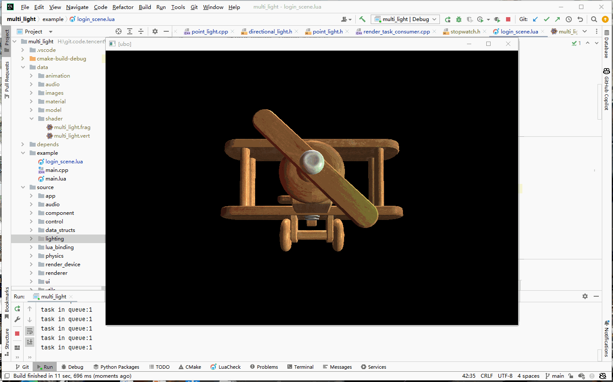

## 23.9 多光源

```bash
CLion项目文件位于 samples\classic_lighting\directional_light
```

前面介绍了方向光、点光源，游戏里一般是有环境光+1个方向光+多个点光源，这一节就来介绍如何添加多个光源。

提起多个，就想到用数组，那么首先要解决的问题就是，如何在片段Shader里，创建点光源的数组？

### 1. 在Shader中使用数组

在Shader中定义数组和C语言很相似，也是用中括号。

下面代码在Uniform Block中，定义了长度为128的点光源数组 `data` 。

```glsl
//点光
struct PointLight {
    vec3  pos;//位置 alignment:16 offset:0
    vec3  color;//颜色 alignment:12 offset:16
    float intensity;//强度 alignment:4 offset:28

    float constant;//点光衰减常数项 alignment:4 offset:32
    float linear;//点光衰减一次项 alignment:4 offset:36
    float quadratic;//点光衰减二次项 alignment:4 offset:40
};

#define POINT_LIGHT_MAX_NUM 128

//灯光数组
layout(std140) uniform PointLightBlock {
    PointLight data[POINT_LIGHT_MAX_NUM];
}u_point_light_array;
```

访问数组元素也和C语言相似。

下面代码访问了点光源数组 `data` 的第0个元素。

```glsl
vec3 light_dir=normalize(u_point_light_array.data[0].pos - v_frag_pos);
```

灯光的效果是叠加的，所以在片段着色器中，对每一类型的灯光，要进行遍历，然后计算，然后叠加。

```glsl
void main()
{
    //ambient
    vec3 ambient_color = u_ambient.data.color * u_ambient.data.intensity * texture(u_diffuse_texture,v_uv).rgb;
    
    vec3 total_diffuse_color;//总的漫反射光照
    vec3 total_specular_color;//总的高光

    //directional light
    ......

    //point light
    for(int i=0;i<POINT_LIGHT_MAX_NUM;i++){
        PointLight point_light=u_point_light_array.data[i];

        //diffuse 计算漫反射光照
        vec3 normal=normalize(v_normal);
        vec3 light_dir=normalize(point_light.pos - v_frag_pos);
        float diffuse_intensity = max(dot(normal,light_dir),0.0);
        vec3 diffuse_color = point_light.color * diffuse_intensity * point_light.intensity * texture(u_diffuse_texture,v_uv).rgb;

        //specular 计算高光
        vec3 reflect_dir=reflect(-light_dir,v_normal);
        vec3 view_dir=normalize(u_view_pos-v_frag_pos);
        float spec=pow(max(dot(view_dir,reflect_dir),0.0),u_specular_highlight_shininess);
        float specular_highlight_intensity = texture(u_specular_texture,v_uv).r;//从纹理中获取高光强度
        vec3 specular_color = point_light.color * spec * specular_highlight_intensity * texture(u_diffuse_texture,v_uv).rgb;

        //attenuation 计算点光源衰减值
        float distance=length(point_light.pos - v_frag_pos);
        float attenuation = 1.0 / (point_light.constant + point_light.linear * distance + point_light.quadratic * (distance * distance));

        //将每一个点光源的计算结果叠加
        total_diffuse_color=total_diffuse_color+diffuse_color*attenuation;
        total_specular_color=total_specular_color+specular_color*attenuation;
    }

    o_fragColor = vec4(ambient_color + total_diffuse_color + total_specular_color,1.0);
}
```

不用关注具体的光照计算，只需要记住：每一个点光源都要计算一次，然后叠加。

#### 1.1 实际灯光数量

这里定义了长度为128的点光源数组 `data` ，那么就是说会循环128次计算点光源效果。

那游戏场景里没有灯怎么办，岂不是浪费性能！

所以在点光源的Uniform Block里加上实际创建的灯光数量。

```glsl
//灯光数组
layout(std140) uniform PointLightBlock {
    PointLight data[POINT_LIGHT_MAX_NUM];
    int actually_used_count;//实际创建的灯光数量
}u_point_light_array;
```

遍历总数就只有实际创建的灯光数量。

```glsl
void main()
{

    ......

    //point light
    for(int i=0;i<u_point_light_array.actually_used_count;i++){
        //diffuse 计算漫反射光照
        ......

        //specular 计算高光
        ......

        //attenuation 计算点光源衰减值
        ......

        //将每一个点光源的计算结果叠加
        ......
    }

    o_fragColor = vec4(ambient_color + total_diffuse_color + total_specular_color,1.0);
}
```


### 2. 设置灯光数组参数

#### 2.1 访问数组元素

要从逻辑代码中去设置Shader数组的值，需要对每一个元素进行设置。

怎么理解 每一个元素 这5个字？

下面的代码创建了长度为2的点光源数组。

```glsl
//file:data/shader/multi_light.frag line:30

//点光
struct PointLight {
    vec3  pos;//位置 alignment:16 offset:0
    vec3  color;//颜色 alignment:12 offset:16
    float intensity;//强度 alignment:4 offset:28

    float constant;//点光衰减常数项 alignment:4 offset:32
    float linear;//点光衰减一次项 alignment:4 offset:36
    float quadratic;//点光衰减二次项 alignment:4 offset:40
};

//灯光数组
layout(std140) uniform PointLightBlock {
    PointLight data[2];
    int actually_used_count;//实际创建的灯光数量
}u_point_light_array;
```

这段代码在Uniform Block中定义了长度为2的数组，而数组类型本身是Struct。

那么要用如下的形式，先遍历数组，然后逐个设置Struct成员变量。

```c++
std::string uniform_block_member_name;

for(int i=0;i<2;i++)
{
    //设置颜色
    uniform_block_member_name=fmt::format("data[{}].color",i);
    UniformBufferObjectManager::UpdateUniformBlockSubData3f("u_point_light_array",uniform_block_member_name,color_);

    uniform_block_member_name=fmt::format("data[{}].intensity",light_id_);
    UniformBufferObjectManager::UpdateUniformBlockSubData1f("u_point_light_array",uniform_block_member_name,intensity_);

    ......

    uniform_block_member_name=fmt::format("data[{}].quadratic",light_id_);
    UniformBufferObjectManager::UpdateUniformBlockSubData1f("u_point_light_array",uniform_block_member_name,attenuation_quadratic_);
}

......
```

也就是说，逻辑代码只能访问到Shader最外层的、以layout/varying/uniform修饰的变量，如果这个变量是Struct，那么就需要构造字符串去访问。

如上面的点光源数组，逻辑代码只能访问到 `u_point_light_array` 这个 layout 修饰的变量，而对于数组中的某一个元素，就需要构造字符串了。

#### 2.2 Uniform Block的尺寸

上面Uniform Block中，定义了一个长度为2的点光源Struct数组。

回顾std140内存布局的规则：

```bash
N=4
1. float算1N
2. 单独vec3算4N
3. vec3跟vec3算4N
4. vec3后面跟float，满足4N，那么(vec3+float)就算3N(vec3)+float(1N)=4N
5. struct需要满足4N的倍数
6. strcut[]按struct单个规则，满足4N倍数
```

匹配到第6条，那么 `sizeof(PointLightBlock) = sizeof(PointLight) x 2 + sizeof(actually_used_count)`。

#### 2.3 记录Uniform Block结构

为了方便设置Uniform Block中的变量值，我们在`UniformBufferObjectManager`中，记录Uniform Block结构。

因为这里Uniform Block中的变量是数组，所以成员变量就要乘以数组元素个数了，Uniform Block尺寸也需要乘以数组元素个数。

```c++
//file:source/render_device/uniform_buffer_object_manager.cpp line:12

#define DIRECTIONAL_LIGHT_MAX_NUM 128 //最大方向光数量
#define POINT_LIGHT_MAX_NUM 128 //最大点光源数量

std::vector<UniformBlockInstanceBindingInfo> UniformBufferObjectManager::kUniformBlockInstanceBindingInfoArray={
        ......
        {"u_directional_light_array","DirectionalLightBlock",32*DIRECTIONAL_LIGHT_MAX_NUM+sizeof(int),1,0},
        {"u_point_light_array","PointLightBlock",48*POINT_LIGHT_MAX_NUM+sizeof(int),2,0}
};

std::unordered_map<std::string,UniformBlock> UniformBufferObjectManager::kUniformBlockMap;

void UniformBufferObjectManager::Init(){
    ......

    //方向光
    kUniformBlockMap["DirectionalLightBlock"]={{}};
    {
        std::vector<UniformBlockMember>& uniform_block_member_vec=kUniformBlockMap["DirectionalLightBlock"].uniform_block_member_vec_;
        for(int i=0;i<POINT_LIGHT_MAX_NUM;i++){
            uniform_block_member_vec.push_back({fmt::format("data[{}].dir",i),32*i+0,sizeof(glm::vec3)});
            uniform_block_member_vec.push_back({fmt::format("data[{}].color",i),32*i+16,sizeof(glm::vec3)});
            uniform_block_member_vec.push_back({fmt::format("data[{}].intensity",i),32*i+28,sizeof(float)});
        }
        uniform_block_member_vec.push_back({"actually_used_count",32*POINT_LIGHT_MAX_NUM,sizeof(int)});
    }

    //点光源数组
    kUniformBlockMap["PointLightBlock"]={{}};
    {
        std::vector<UniformBlockMember>& uniform_block_member_vec=kUniformBlockMap["PointLightBlock"].uniform_block_member_vec_;
        for(int i=0;i<POINT_LIGHT_MAX_NUM;i++){
            uniform_block_member_vec.push_back({fmt::format("data[{}].pos",i),48*i+0,sizeof(glm::vec3)});
            uniform_block_member_vec.push_back({fmt::format("data[{}].color",i),48*i+16,sizeof(glm::vec3)});
            uniform_block_member_vec.push_back({fmt::format("data[{}].intensity",i),48*i+28,sizeof(float)});
            uniform_block_member_vec.push_back({fmt::format("data[{}].constant",i),48*i+32,sizeof(float)});
            uniform_block_member_vec.push_back({fmt::format("data[{}].linear",i),48*i+36,sizeof(float)});
            uniform_block_member_vec.push_back({fmt::format("data[{}].quadratic",i),48*i+40,sizeof(float)});
        }
        uniform_block_member_vec.push_back({"actually_used_count",48*POINT_LIGHT_MAX_NUM,sizeof(int)});
    }
}
```

#### 2.4 更新UBO

定义变量 `unsigned short light_id_;` 来作为光源数组的下标。

定义变量 `unsigned int light_count_;` 来表示实际创建的光源数量。

点光源更新UBO。

```c++
//source/lighting/point_light.cpp

unsigned short PointLight::light_count_=0;

PointLight::PointLight():Light(),attenuation_constant_(0),attenuation_linear_(0),attenuation_quadratic_(0)
{
    light_id_=light_count_;
    light_count_++;
    UniformBufferObjectManager::UpdateUniformBlockSubData1i("u_point_light_array","actually_used_count",light_count_);
}

......

void PointLight::set_color(glm::vec3 color){
    Light::set_color(color);
    std::string uniform_block_member_name=fmt::format("data[{}].color",light_id_);
    UniformBufferObjectManager::UpdateUniformBlockSubData3f("u_point_light_array",uniform_block_member_name,color_);
};

void PointLight::set_intensity(float intensity){
    Light::set_intensity(intensity);
    std::string uniform_block_member_name=fmt::format("data[{}].intensity",light_id_);
    UniformBufferObjectManager::UpdateUniformBlockSubData1f("u_point_light_array",uniform_block_member_name,intensity_);
};

void PointLight::set_attenuation_constant(float attenuation_constant){
    attenuation_constant_ = attenuation_constant;
    std::string uniform_block_member_name=fmt::format("data[{}].constant",light_id_);
    UniformBufferObjectManager::UpdateUniformBlockSubData1f("u_point_light_array",uniform_block_member_name,attenuation_constant_);
}

void PointLight::set_attenuation_linear(float attenuation_linear){
    attenuation_linear_ = attenuation_linear;
    std::string uniform_block_member_name=fmt::format("data[{}].linear",light_id_);
    UniformBufferObjectManager::UpdateUniformBlockSubData1f("u_point_light_array",uniform_block_member_name,attenuation_linear_);
}

void PointLight::set_attenuation_quadratic(float attenuation_quadratic){
    attenuation_quadratic_ = attenuation_quadratic;
    std::string uniform_block_member_name=fmt::format("data[{}].quadratic",light_id_);
    UniformBufferObjectManager::UpdateUniformBlockSubData1f("u_point_light_array",uniform_block_member_name,attenuation_quadratic_);
}

void PointLight::Update(){
    glm::vec3 light_position=game_object()->GetComponent<Transform>()->position();
    std::string uniform_block_member_name=fmt::format("data[{}].pos",light_id_);
    UniformBufferObjectManager::UpdateUniformBlockSubData3f("u_point_light_array",uniform_block_member_name,light_position);
}
```

方向光同理。

### 3. 测试

创建2个方向光(右侧、上方)、2个点光源(左侧红色、右侧绿色)。

```lua
--file:example/login_scene.lua

function LoginScene:Awake()
    ......
    self:CreateDirectionalLight1()
    self:CreateDirectionalLight2()
    self:CreatePointLight1()
    self:CreatePointLight2()
    ......
end
......

--- 创建方向光1 右侧
function LoginScene:CreateDirectionalLight1()
    self.go_directional_light_1_= GameObject.new("directional_light_1")
    self.go_directional_light_1_:AddComponent(Transform)
    self.go_directional_light_1_:GetComponent(Transform):set_rotation(glm.vec3(0,60,0))

    local light=self.go_directional_light_1_:AddComponent(DirectionalLight)
    light:set_color(glm.vec3(1.0,1.0,1.0))
    light:set_intensity(1.0)
end

--- 创建方向光2 上方
function LoginScene:CreateDirectionalLight2()
    self.go_directional_light_2_= GameObject.new("directional_light_2")
    self.go_directional_light_2_:AddComponent(Transform)
    self.go_directional_light_2_:GetComponent(Transform):set_rotation(glm.vec3(240,0,0))

    local light=self.go_directional_light_2_:AddComponent(DirectionalLight)
    light:set_color(glm.vec3(1.0,1.0,1.0))
    light:set_intensity(1.0)
end

--- 创建点光源1 左侧 红色
function LoginScene:CreatePointLight1()
    self.go_point_light_1_= GameObject.new("point_light_1")
    self.go_point_light_1_:AddComponent(Transform):set_position(glm.vec3(-2,0,5))
    ---@type PointLight
    local light=self.go_point_light_1_:AddComponent(PointLight)

    light:set_color(glm.vec3(1.0,0.0,0.0))
    light:set_intensity(1.0)
    light:set_attenuation_constant(1.0)
    light:set_attenuation_linear( 0.35)
    light:set_attenuation_quadratic( 0.44)
end

--- 创建点光源2 右侧 绿色
function LoginScene:CreatePointLight2()
    self.go_point_light_2_= GameObject.new("point_light_2")
    self.go_point_light_2_:AddComponent(Transform):set_position(glm.vec3(2,0,5))
    ---@type PointLight
    local light=self.go_point_light_2_:AddComponent(PointLight)

    light:set_color(glm.vec3(0.0,1.0,0.0))
    light:set_intensity(1.0)
    light:set_attenuation_constant(1.0)
    light:set_attenuation_linear( 0.35)
    light:set_attenuation_quadratic( 0.44)
end
```

效果如下图：

