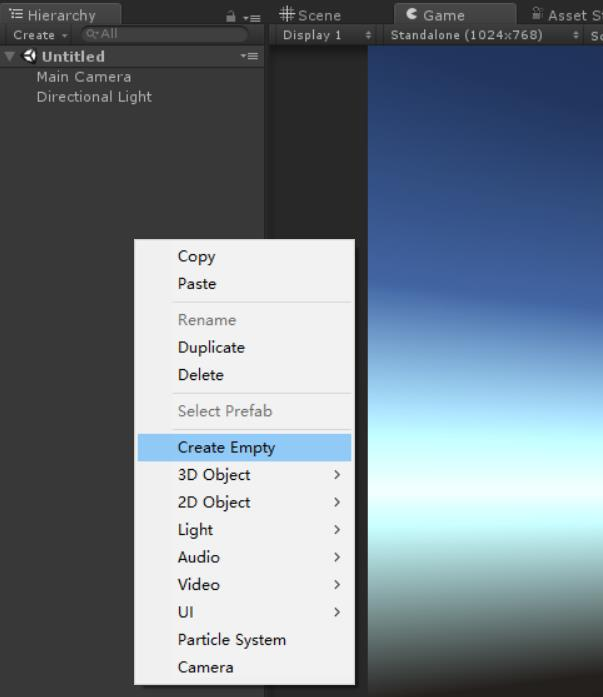
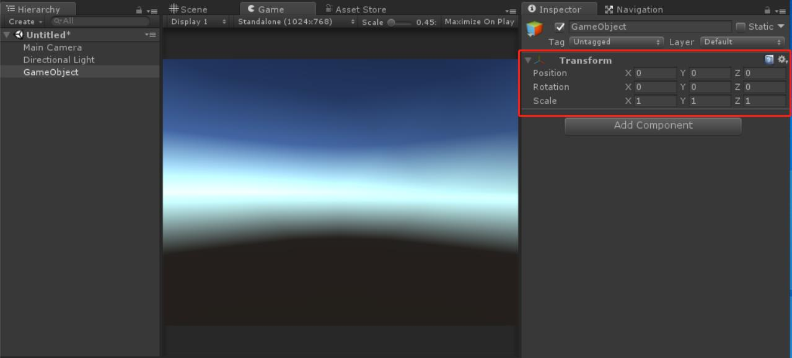
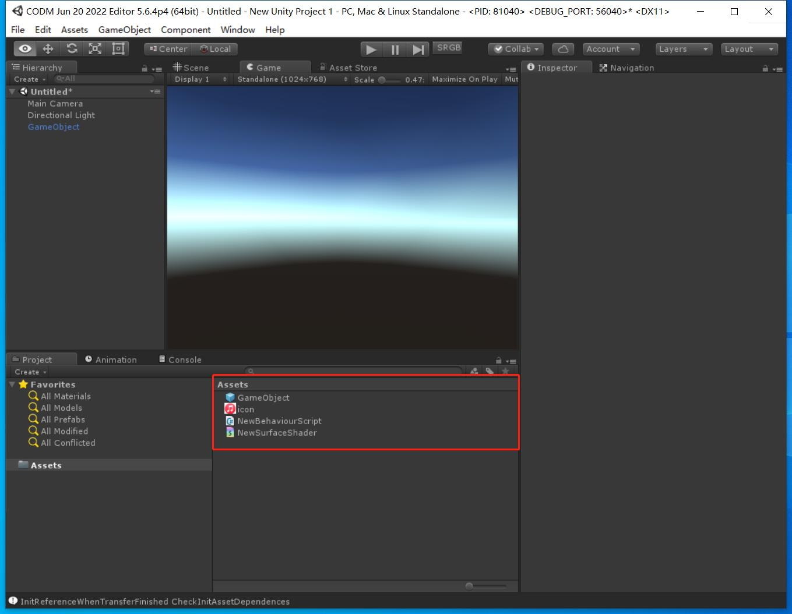

## 24. 引擎编辑器的实现

在10年前，最流行的手机游戏引擎是Cocos2d-x，没有编辑器，UI靠纯C++手写。

十年后的今天，Cocos的编辑器已经进化了几个版本，但是用户体验仍然与Unity、UE有一定差距。

从卡牌回合到3D大世界，游戏越来越庞大，现在让我去手写C++做UI，我肯定是不会再干了，更别说做场景了，一个功能完善的编辑器就成了必需品。

### 1. 编辑器的实现方式

那么怎么样做一个编辑器呢，方式大致有以下几种：

1. UI框架+游戏渲染界面
   用MFC做场景编辑器、游戏渲染窗口嵌入到Qt里，网上能搜到较多的教程都是这个框架。
   将游戏渲染界面，嵌入到UI框架里，CryEngine就是这样做的。
   非游戏引擎的，例如Maya也是用Qt来做的。
2. 引擎自绘
   先用引擎写出一套UI框架，然后用UI框架来写编辑器，这就是引擎自绘。
   好处是自主可控，没有多余的学习成本。
   Unity3d、UE都是引擎自绘。
3. IDE+游戏渲染界面
   对IDE进行扩展，将游戏渲染窗口嵌入到IDE中，比较特殊，目前看到只有Laya，基于VSCode打造的编辑器。

### 2. 编辑器的功能

编辑器有简单的、复杂的、超复杂的，这里就列一些最简单的功能吧。

1. 基础的编辑功能，创建物体、删除物体。
   
2. 物体属性编辑。
   
3. 项目资源管理。
   

后续章节，以引擎自绘的方案，来实现一个简单的编辑器。

