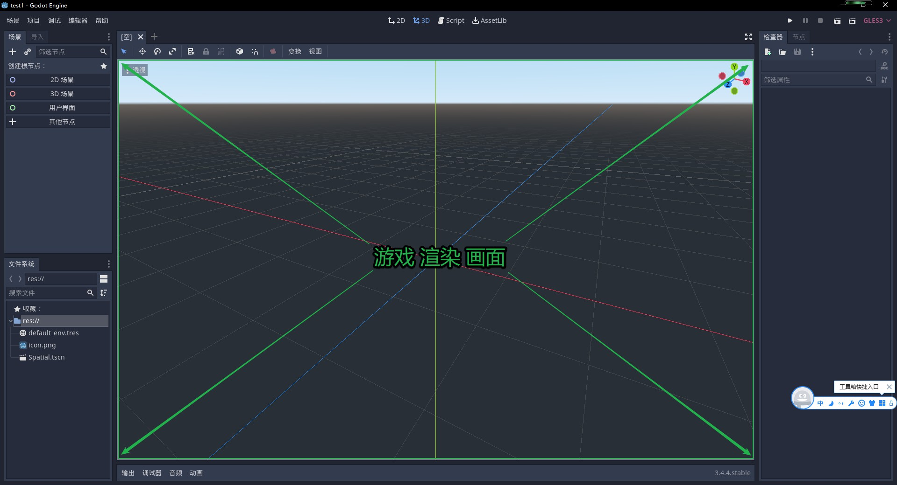
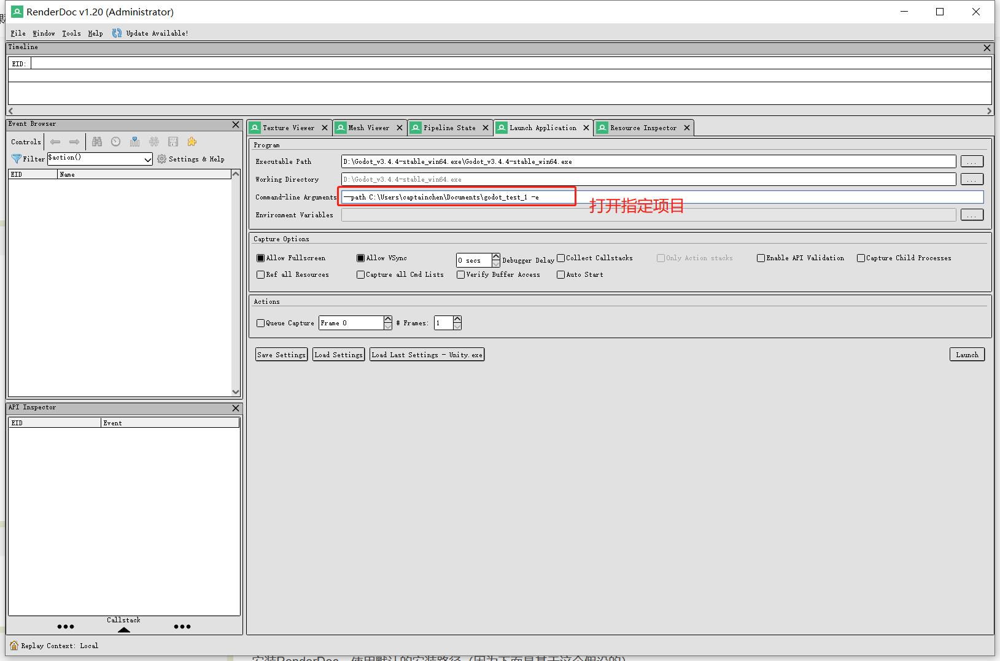
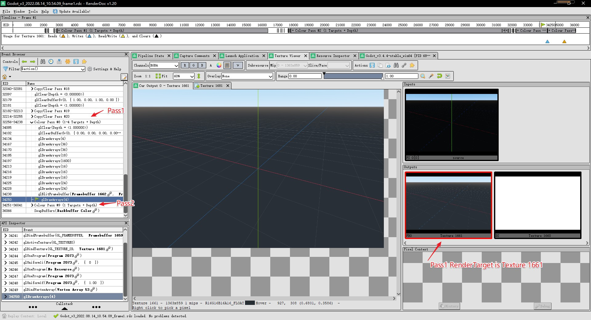
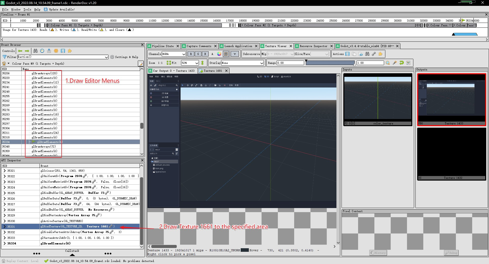
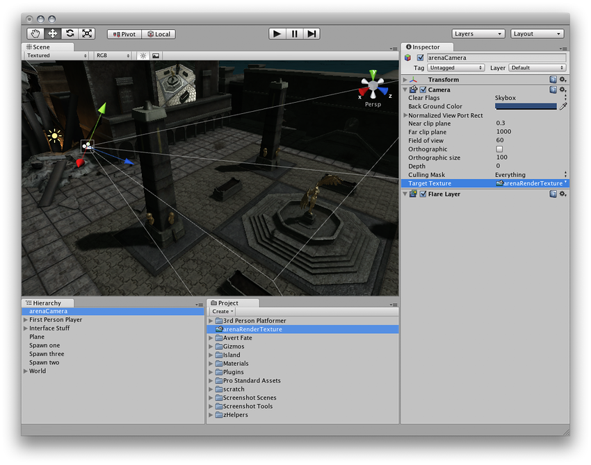
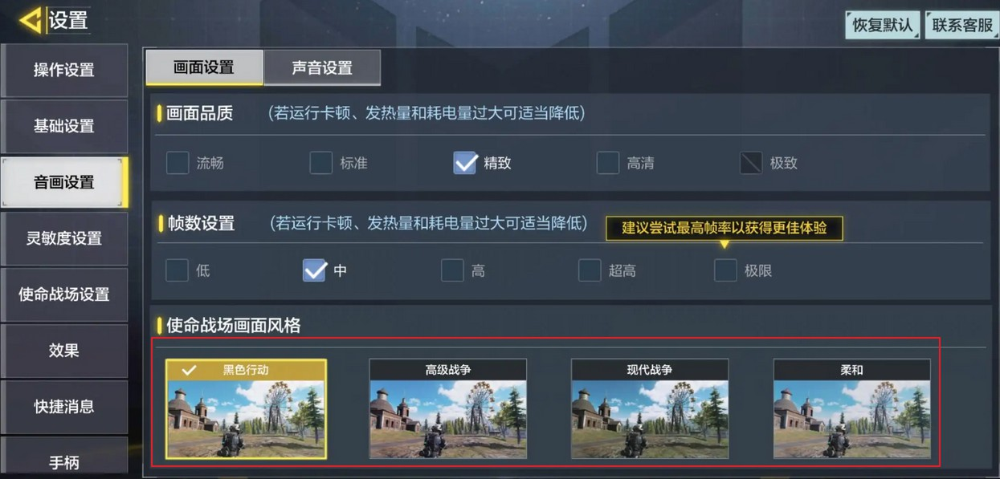
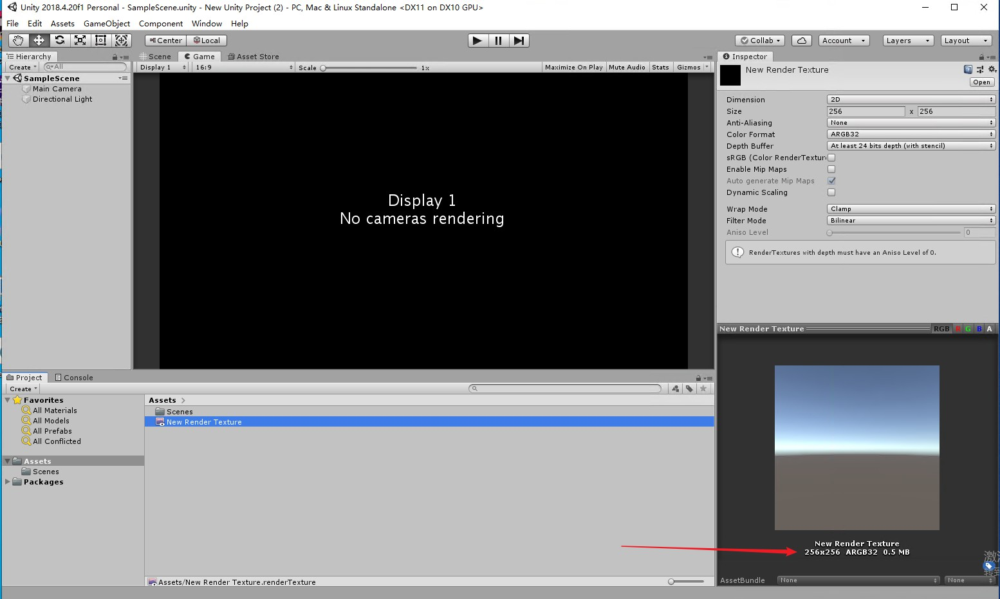
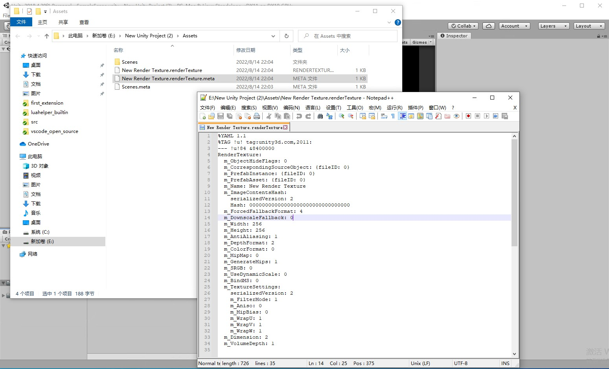

## 24.1 分析Godot引擎编辑器

这也是我第一次写编辑器，所以先学习下别的引擎是怎么实现的。

这是Godot，它是目前最流行的开源引擎项目，它是基于OpenGL ES的，并且使用引擎自绘的方式实现了编辑器，来看下它的实现。

### 1. RenderDoc分析Godot

Godot和Unity类似，打开exe出现的是项目列表而不是编辑器本体。

所以在RenderDoc打开时需要加上参数设置为直接打开项目，如下图：

启动截取一帧进行分析。

可以看到编辑器绘制使用了2个Pass。

Pass1是绘制了游戏场景，并最终将游戏场景渲染到了贴图 Texture 1661 上。

Pass2则绘制了编辑器的框架和菜单，然后在指定的位置绘制了贴图 Texture 1661，就将游戏场景嵌入到了编辑器中。

这个嵌入的操作是不是很熟悉！

将游戏场景渲染到贴图，这个操作大家都用过，就是Unity的RTT。

在人物装备界面要渲染人物3D模型，可以用一个相机对着人物3D模型，然后将相机Target设置到一个RenderTexture上，然后在界面上渲染这个RenderTexture。

原来引擎编辑器和我们做一个人物装备界面是一样的原理，so easy!

### 2. 制定OpenGL实现方案

经过分析，发现引擎编辑器的原理并不陌生，不过实现起来却不是那么简单，首先我们得搞清楚2点：
1. 什么是Pass？为什么要用多个Pass？
2. Unity中的RenderTexture，在OpenGL中要怎么实现及使用？

#### 2.1 什么是Pass？

一个Pass就是一个步骤、一个工序。

以装修刷墙为例，包括多个工序：清理墙面→修补墙面→涂刷界面剂→防开裂处理→自攻丝防锈处理→石膏找平→第一遍刮腻子→第二遍刮腻子→打磨砂光→刷乳胶漆底漆→刷第一遍乳胶漆面漆→刷第二遍乳胶漆面漆。

上面分析看到Godot引擎编辑器有2个工序：将游戏场景渲染到贴图->将贴图渲染到指定区域。

多Pass也常用在游戏的后处理，例如使命召唤手游可以设置多种画面风格，可以理解为将整个场景渲染到RenderTexture之后，再对其做了色相、颜色鲜艳度的调整。

所以Pass是一个逻辑上的概念，实际OpenGL中并没有Pass这个东西。

大家用Pass是便于区分当前的工序内容。

#### 2.2 什么是RenderTexture？

在Unity中创建一个256x256的RenderTexture，在属性面板中看到它是一个32位的纹理，占用0.5MB内存，那它应该是一张图片？

在文件管理器中查看，发现它只有1kb大小，打开一看是文本，里面是YAML格式数据，记录了在Unity属性面板看到的数据，那它又不是一张图片？

那RenderTexture到底是什么？

先假定RenderTexture就是一张图片，那么使用RenderTexture的流程是这样的：

Pass1：显卡中渲染3D场景，颜色数据存储到一块显存中-->从显存复制颜色数据到内存-->将内存颜色数据保存到硬盘图片文件。

Pass2：从硬盘读取图片文件到内存-->上传到显卡显存-->渲染。

流程十分长，而且在第五章介绍过，读取图片、上传图片都是十分耗时的操作，所以从流程原理上就决定了RenderTexture不会是一张图片文件。

那么再回过头来，我们使用RenderTexture的目的，是为了拿到第一个Pass的结果，去做一些其他的处理，例如拿去渲染、拿去做色彩风格调整。

这些处理，几乎都是发生在显卡上的，那么就没有必要把它从显存下载到内存。

只需要提供一个句柄(Handle)、或者说一个TextureID，在需要的时候，在CPP代码中BindTexture来进行渲染即可。

所以Unity的RenderTexture其实是一个句柄，它指向了Pass1的渲染结果所在的显存。

在OpenGL中，渲染结果默认是输出到屏幕，不过我们可以设置其输出到一块显存Buffer中，并且可以将这块Buffer指定为Texture，这就是RenderTexture。

显存Buffer已经使用过很多了，有VBO、VAO、UBO。

将整个场景渲染结果、将整个屏幕的渲染结果，存储起来的，叫FrameBufferObject，简称FBO。

将FBO的颜色数据拿出来，作为Texture，就是RenderTexture。

好，了解了Pass和RenderTexture，那么引擎编辑器的方案就制定好了：
1. Pass1：渲染整个场景，存储到FBO中，并将颜色数据指定为Texture。
2. 将上面的Texture，渲染到编辑器指定区域。

