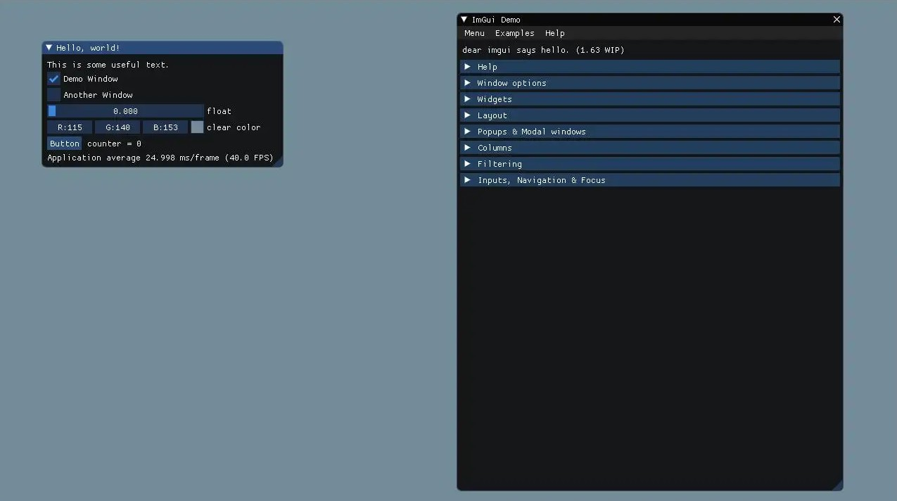
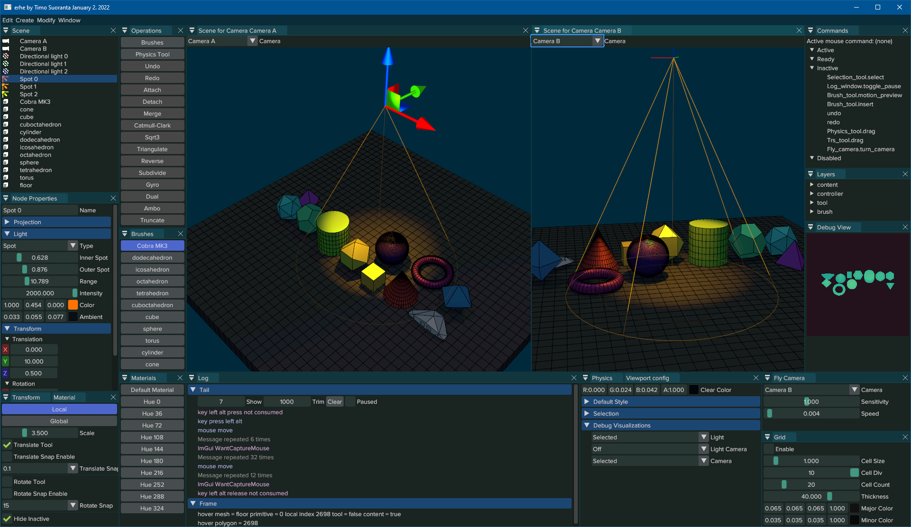
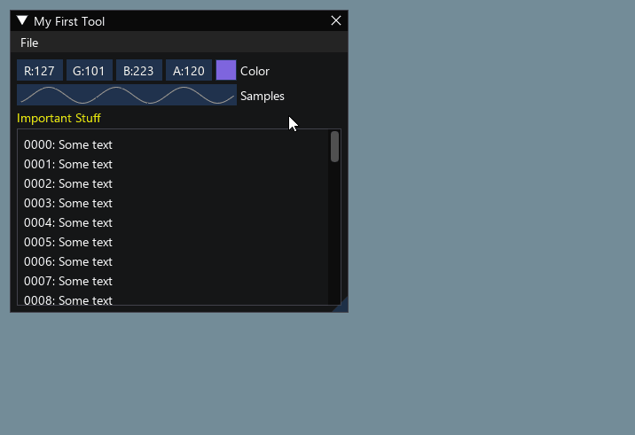
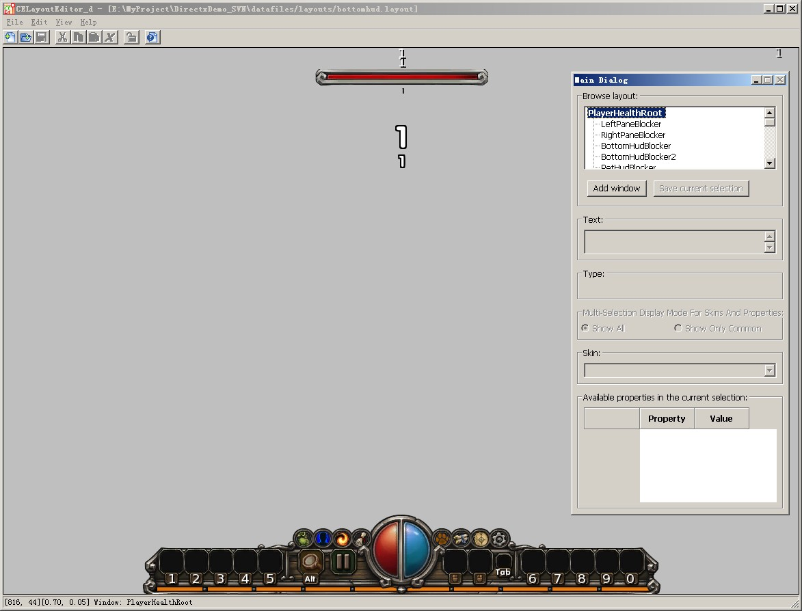
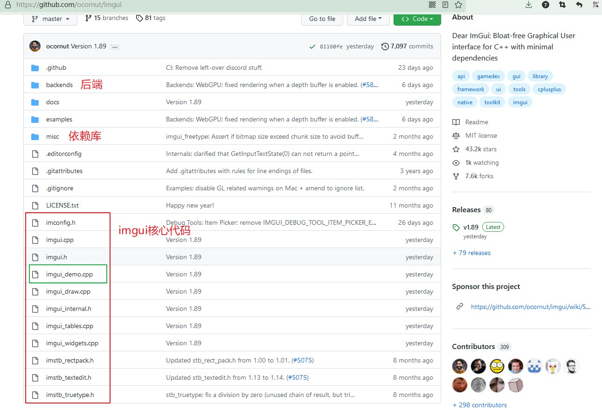
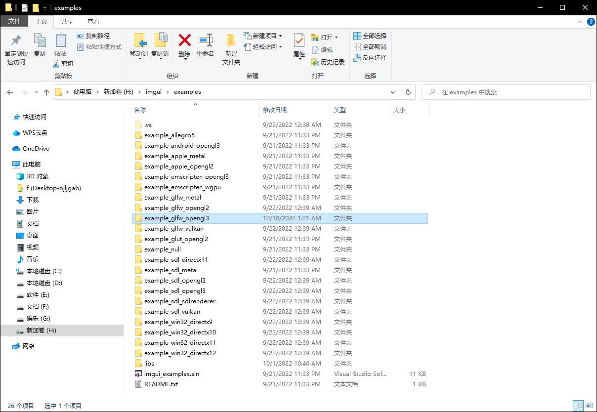
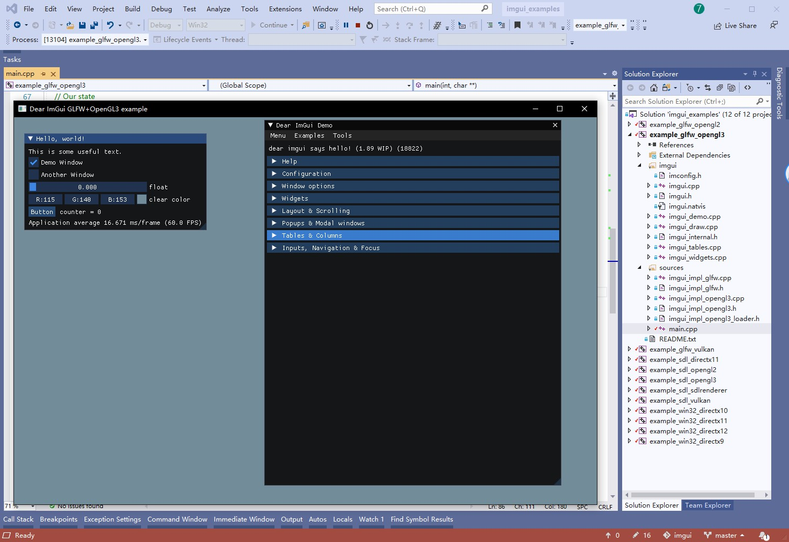
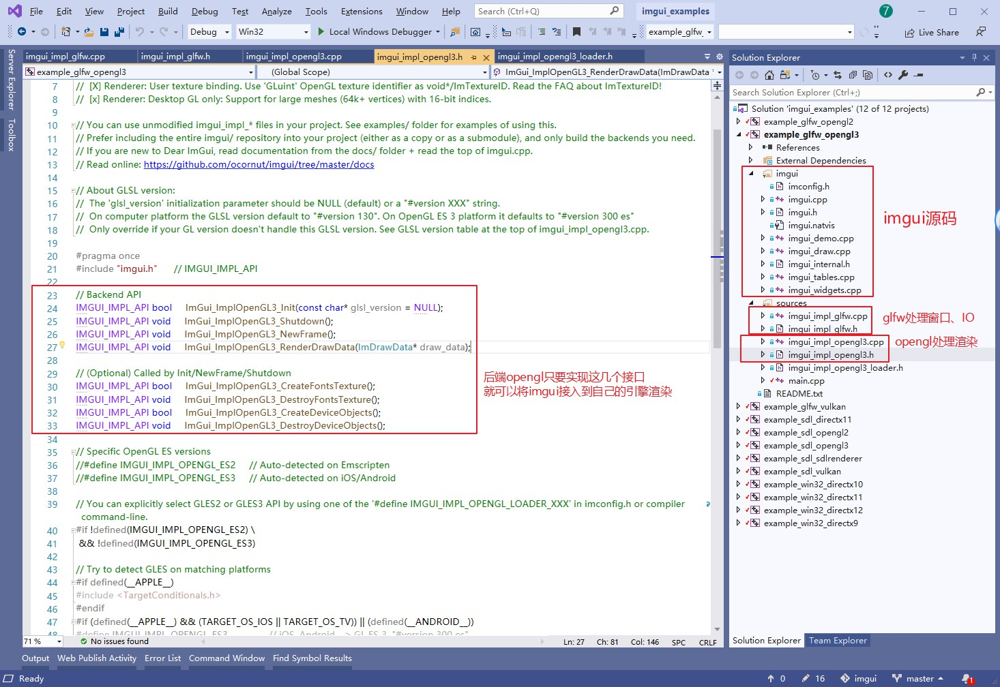

## 24.3 imgui介绍与使用

imgui是目前最流行的ui库，它长这样。



你能在各种开源引擎、工具、软件看见它，它的风格比较特别，让你一眼就知道，这个软件的界面是imgui做的。



我们前面也介绍了gui相关的实现，那为什么不使用引擎的gui，而是使用三方的imgui呢？

### 1. 选择合适的ui库

虽然前面实现了button、image、uimask这几个控件，但是它们只是ui库的最基础，相比较完整的ui库，还有十万八千里的距离。

最难的不是显示一个图片、按钮，而是如何去组织它们，使多个控件组合成窗口、列表等复杂控件。



这最后的Layout布局运算，才是最复杂、最耗费心神的。

在github上你能看到的开源游戏引擎，它们的游戏gui实现，一般都很简单，能简单显示图片文字就行。

cocos2dx的gui都比它们复杂几倍，更别说商业游戏引擎的gui系统，复杂百倍。

各大游戏公司的自研引擎，也都是集成开源的gui库，例如cegui、cocos2dx等。



而编辑器的ui，大家都会选择imgui，因为它真的特别简单。

### 2. 初试imgui

Github下载代码：`https://github.com/ocornut/imgui`



imgui核心就10个代码文件，直接复制粘贴到项目中就可以使用。

把代码下载过来，打开`examples`，可以看到有多个示例文件夹，每个示例都是不同的后端。



#### 1. 前端后端

imgui采用前后端分离的架构。

imgui自身就是前端，我们知道要渲染一个图片，需要计算4个顶点，然后准备纹理、Shader，然后送到OpenGL去渲染。

imgui就只负责计算顶点数据、准备纹理、Shader，然后具体的渲染就交给后端。

例如`example_sdl_opengl3`就表示后端使用`sdl_opengl3`来渲染，而`example_glfw_opengl3`就表示后端使用`glfw_opengl3`来渲染。

`sdl_opengl3`和`glfw_opengl3`的区别又是什么？

OpenGL只是一个图形库，它在不同的操作系统上依赖于操作系统的GUI系统，我们在教程中使用`glfw`来创建Window并处理IO事件，而`sdl`是另外一套处理Window与IO事件的框架。

如果你使用的不是`sdl`、`glfw` 这个目录中的任何一个，例如你用的是`Cocos2d-x`、`UnrealEngine`等引擎，你也可以写一个自己的`example_cocos2dx_opengl3`、`example_unrealengine_dx12`之类的，只要将imgui提供出来的顶点数据、纹理、shader用引擎接口进行处理送去渲染即可。

#### 2. 实例源码结构

打开`examples/imgui_examples.sln`，启动`example_glfw_opengl3`，F5运行。





`sources`目录下就是后端代码。

`imgui_impl_glfw.cpp` 负责使用glfw创建Window和处理IO。

`imgui_impl_opengl3.cpp`负责处理渲染相关事情，可以看到只需要实现几个接口，就可以将imgui接入到自己的引擎项目中。

#### 3. 实例源码解析

代码并不多，分为以下几个步骤：
1. 初始化glfw 创建window
2. 初始化imgui
3. 初始化imgui后端
4. 主循环，在每一帧里创建GUI并渲染

```c++
//file:main.cpp

int main(int, char**)
{
    // 1. 初始化glfw 创建window
    glfwSetErrorCallback(glfw_error_callback);
    if (!glfwInit())
        return 1;

    const char* glsl_version = "#version 130";
    glfwWindowHint(GLFW_CONTEXT_VERSION_MAJOR, 3);
    glfwWindowHint(GLFW_CONTEXT_VERSION_MINOR, 0);


    GLFWwindow* window = glfwCreateWindow(1280, 720, "Dear ImGui GLFW+OpenGL3 example", NULL, NULL);
    if (window == NULL)
        return 1;

    glfwMakeContextCurrent(window);
    glfwSwapInterval(1); // 开启垂直同步

    // 2. 初始化imgui
    IMGUI_CHECKVERSION();
    ImGui::CreateContext();
    ImGuiIO& io = ImGui::GetIO(); (void)io;

    ImGui::StyleColorsDark();


    // 3. 初始化imgui后端
    ImGui_ImplGlfw_InitForOpenGL(window, true);
    ImGui_ImplOpenGL3_Init(glsl_version);

    bool show_demo_window = true;
    bool show_another_window = false;
    ImVec4 clear_color = ImVec4(0.45f, 0.55f, 0.60f, 1.00f);

    // 4. 主循环，在每一帧里创建GUI并渲染
    while (!glfwWindowShouldClose(window))
    {
        glfwPollEvents();

        // 开始新的一帧
        ImGui_ImplOpenGL3_NewFrame();
        ImGui_ImplGlfw_NewFrame();
        ImGui::NewFrame();

        // 1. 显示大的demo窗口
        if (show_demo_window)
            ImGui::ShowDemoWindow(&show_demo_window);

        // 2. 创建小的demo窗口，这里可以熟悉下按钮、选中框等的绘制
        {
            static float f = 0.0f;
            static int counter = 0;

            ImGui::Begin("Hello, world!");                          // Create a window called "Hello, world!" and append into it.

            ImGui::Text("This is some useful text.");               // Display some text (you can use a format strings too)
            ImGui::Checkbox("Demo Window", &show_demo_window);      // Edit bools storing our window open/close state
            ImGui::Checkbox("Another Window", &show_another_window);

            ImGui::SliderFloat("float", &f, 0.0f, 1.0f);            // Edit 1 float using a slider from 0.0f to 1.0f
            ImGui::ColorEdit3("clear color", (float*)&clear_color); // Edit 3 floats representing a color

            if (ImGui::Button("Button"))                            // Buttons return true when clicked (most widgets return true when edited/activated)
                counter++;
            ImGui::SameLine();
            ImGui::Text("counter = %d", counter);

            ImGui::Text("Application average %.3f ms/frame (%.1f FPS)", 1000.0f / ImGui::GetIO().Framerate, ImGui::GetIO().Framerate);
            ImGui::End();
        }

        // 3. 创建一个窗口 里面放个按钮
        if (show_another_window)
        {
            ImGui::Begin("Another Window", &show_another_window);   // Pass a pointer to our bool variable (the window will have a closing button that will clear the bool when clicked)
            ImGui::Text("Hello from another window!");
            if (ImGui::Button("Close Me"))
                show_another_window = false;
            ImGui::End();
        }

        // 渲染
        ImGui::Render();
        int display_w, display_h;
        glfwGetFramebufferSize(window, &display_w, &display_h);
        glViewport(0, 0, display_w, display_h);
        glClearColor(clear_color.x * clear_color.w, clear_color.y * clear_color.w, clear_color.z * clear_color.w, clear_color.w);
        glClear(GL_COLOR_BUFFER_BIT);
        ImGui_ImplOpenGL3_RenderDrawData(ImGui::GetDrawData());

        glfwSwapBuffers(window);
    }

    // Cleanup
    ImGui_ImplOpenGL3_Shutdown();
    ImGui_ImplGlfw_Shutdown();
    ImGui::DestroyContext();

    glfwDestroyWindow(window);
    glfwTerminate();

    return 0;
}
```

