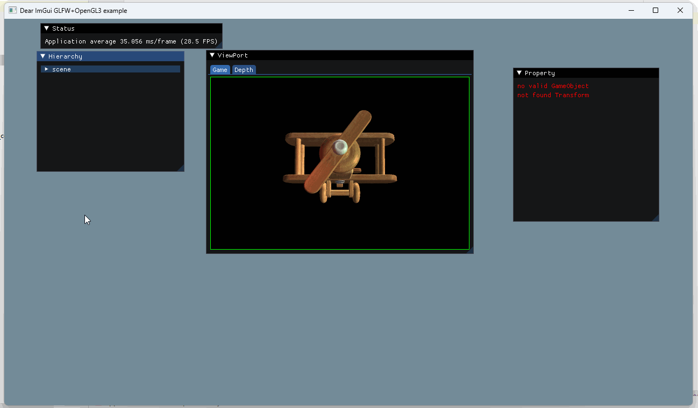
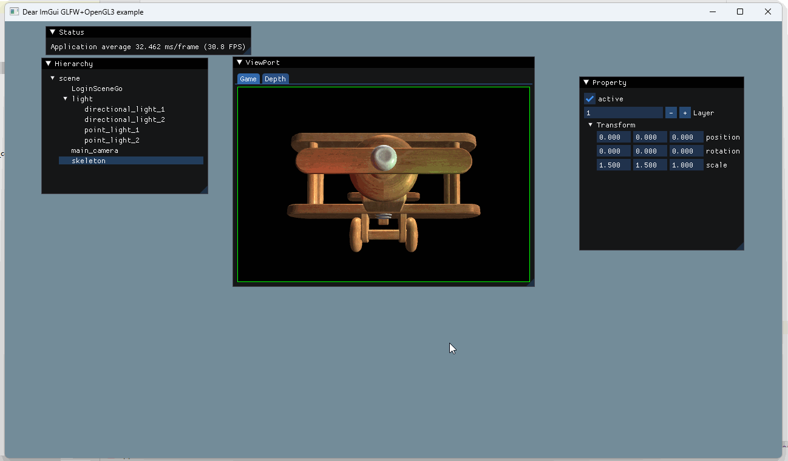

## 24.6 Hierarchy与Inspector面板

```bash
CLion项目文件位于 samples\engine_editor\hierarchy
```

在引擎编辑器里可以很方便的选择节点，并修改属性，然后立即能看到修改后的效果。

现在我们也来实现简单的Hierarchy和Inspector，先来看下效果。


需要实现以下功能：
1. Hierarchy窗口：遍历GameObject，然后输出到ImGui列表。
2. Inspector窗口：获取选中GameObject信息，并获取Transform组件信息，显示到ImGui，并应用修改。

其中需要用到ImGui的列表、文本输入框、按钮等组件，在ImGui的Demo窗口都可以找到参考，在 *imgui_demo.cpp* 可以找到相关代码。

### 1. 实现Hierarchy

主要使用ImGui的 *TreeNodeEx* 组件来绘制列表。

先拿到GameObject Root节点，然后对GameObject这颗树遍历。

```c++
//file:source/app/application_editor.cpp

void ApplicationEditor::Run() {
    ApplicationBase::Run();

    ImVec4 clear_color = ImVec4(0.45f, 0.55f, 0.60f, 1.00f);

    while (!glfwWindowShouldClose(editor_glfw_window_))
    {
        glfwPollEvents();

        //ImGui刷帧
        ImGui_ImplOpenGL3_NewFrame();
        ImGui_ImplGlfw_NewFrame();
        ImGui::NewFrame();

        ......

        // 3. Hierarchy
        {
            ImGui::Begin("Hierarchy");
            ImGuiTreeNodeFlags base_flags = ImGuiTreeNodeFlags_OpenOnArrow | ImGuiTreeNodeFlags_OpenOnDoubleClick | ImGuiTreeNodeFlags_SpanAvailWidth;
            Tree::Node* root_node=GameObject::game_object_tree().root_node();
            DrawHierarchy(root_node, "scene",base_flags);
            ImGui::End();
        }

        ......
    }

    Exit();
}

void ApplicationEditor::DrawHierarchy(Tree::Node* node,const char* label,int base_flags) {
    int flags=base_flags;

    if(selected_node_==node){//如果当前Node是被选中的，那么设置flag，显示样式为选中。
        flags |= ImGuiTreeNodeFlags_Selected;
    }

    std::list<Tree::Node*>& children=node->children();
    if(children.size()>0){
        if(ImGui::TreeNodeEx(label, flags)){//如果被点击，就展开子节点。
            if(ImGui::IsItemClicked()){
                selected_node_=node;
            }
            for(auto* child:children){
                GameObject* game_object= dynamic_cast<GameObject *>(child);
//                DEBUG_LOG_INFO("game object:{} depth:{}",game_object->name(),game_object->depth());
                DrawHierarchy(child, game_object->name(), base_flags);
            }
            ImGui::TreePop();//可以点击展开的TreeNode，需要加上TreePop()。
        }
    }else{//没有子节点，不显示展开按钮
        flags |= ImGuiTreeNodeFlags_Leaf | ImGuiTreeNodeFlags_NoTreePushOnOpen;
        ImGui::TreeNodeEx(label, flags);
        if(ImGui::IsItemClicked()){
            selected_node_=node;
        }
    }
}
```

看看效果：



上面代码也处理了选中GameObject，将其储存到 *selected_node_*，下面在Inspector窗口中，就显示选中节点信息。

### 2. 实现Inspector

Inspector显示GameObject属性，以及其身上挂着的多个*Component*属性。

Unity是基于C#的，通过反射可以将Public变量和标记了[Serialized]变量，在编辑器中显示出来。

但我们引擎中的*Component*是基于Lua的，从Lua中获取到需要序列化显示的变量，后续还需要实现一些特殊处理，这里就不介绍，先实现最简单的对*Transform*组件显示与修改。

实现以下功能：
1. 显示修改GameObject Active、Layer属性。
2. 显示修改Transform Pos、Rotation、Scale属性。

```c++
//file:source/app/application_editor.cpp

void ApplicationEditor::Run() {
    ApplicationBase::Run();

    ImVec4 clear_color = ImVec4(0.45f, 0.55f, 0.60f, 1.00f);

    while (!glfwWindowShouldClose(editor_glfw_window_))
    {
        glfwPollEvents();

        //ImGui刷帧
        ImGui_ImplOpenGL3_NewFrame();
        ImGui_ImplGlfw_NewFrame();
        ImGui::NewFrame();

        ......

        //4. Property
        {
            ImGui::Begin("Property");

            //4.1 GameObject属性
            GameObject* game_object=nullptr;
            if(selected_node_!= nullptr){
                game_object=dynamic_cast<GameObject*>(selected_node_);
            }
            if(game_object!=nullptr){
                //是否Active
                bool active_self = game_object->active_self();
                if(ImGui::Checkbox("active", &active_self)){
                    game_object->set_active_self(active_self);
                }
                //Layer
                int layer=game_object->layer();
                if(ImGui::InputInt("Layer",&layer)){
                    game_object->set_layer(layer);
                }

            }else{
                ImGui::TextColored(ImVec4(1.0f, 0.0f, 0.0f, 1.0f), "no valid GameObject");
            }

            //4.2 Transform属性
            Transform* transform=nullptr;
            glm::vec3 position,rotation,scale;

            if(game_object!= nullptr){
                transform=game_object->GetComponent<Transform>();
            }

            if(transform!= nullptr){
                position=transform->position();
                rotation=transform->rotation();
                scale=transform->scale();

                if(ImGui::TreeNode("Transform")){
                    // 显示属性，如果数值改变，将数据写回Transform
                    if(ImGui::InputFloat3("position",(float*)&position)){
                        transform->set_position(position);
                    }
                    if(ImGui::InputFloat3("rotation",(float*)&rotation)){
                        transform->set_rotation(rotation);
                    }
                    if(ImGui::InputFloat3("scale",(float*)&scale)){
                        transform->set_scale(scale);
                    }
                    ImGui::TreePop();
                }
            }else{
                ImGui::TextColored(ImVec4(1.0f, 0.0f, 0.0f, 1.0f), "not found Transform");
            }

            ImGui::End();
        }
        ......
    }

    Exit();
}
```

效果如下：

