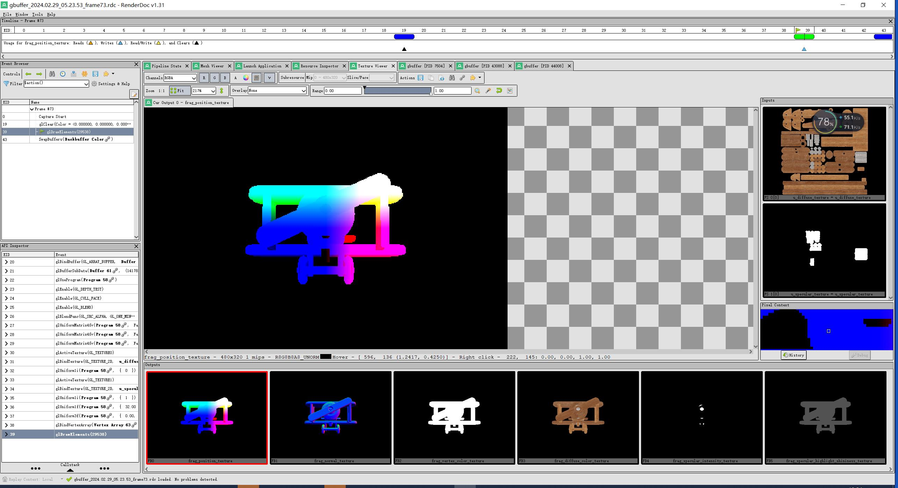

## 24.7 Geometry Buffer

```bash
CLion项目文件位于 samples\engine_editor\gbuffer
```

在搜索资料时看到`G-Buffer`，以为是`Global Buffer`，全局缓冲之类的意思，一直不得其意，结果是`Geometry Buffer`，这就一目了然。

### 1. G-Buffer是什么？

在一次渲染过程中，首先是在Vertex Shader中将世界坐标的顶点计算到裁剪空间，然后光栅化后到了屏幕空间，成为片段坐标。

在上一章节介绍光照时，已经在Fragment Shader使用片段坐标来进行计算片段受光的情况。

所谓`Geometry Buffer`，就是`Geometry FrameBuffer`，就是将几何信息存储到帧缓冲区，也就是将片段坐标存储到帧缓冲区。

当然几何信息包括很多，目前接触到的就有：

1. 片段坐标
2. 片段颜色
3. 片段法线

那么本小节，就将上面三种几何信息，存储到`G-Buffer`。

在RenderDoc中展示如下：



### 2. G-Buffer的作用

#### 2.1 正向渲染

当场景中存在一个灯光，一个物体时，需要对这个物体在屏幕上显示的区域的像素，进行遍历，进行受光计算。

当场景中存在两个物体时，首先需要对物体A在屏幕的区域进行遍历进行计算，然后对物体B做相同操作。

假如物体A 完全覆盖 物体B，那么就只需要计算其中一个物体吗？

不是的，仍然需要对物体A在屏幕的区域进行遍历进行计算，然后对物体B做相同操作。

这是因为在OpenGL中，渲染是以绘制为单位，物体A和B是分两次绘制，那么它们就需要进行两次计算，尽管它们在屏幕上是重叠的。

这种计算光照的方式叫做正向渲染(Forward Rendering)或者正向着色法(Forward Shading)。

#### 2.2 延迟着色法

那么能不能先将物体A和B先渲染一遍，然后将最前面的，没有被遮挡的片段收集起来，最后再进行光照计算呢？

答案是可以的。

前面介绍了FBO，将物体A和B先渲染一遍，经过深度测试后，最终FBO中存储的，就是最前面的，没有被遮挡的片段。

在光照计算中，需要的其实是片段的几何信息，那么将物体A和B先渲染一遍，然后将片段的几何信息存入FBO中，这就是`G-Buffer`了。

在后续的光照计算里，就可以从`G-Buffer`对应的FBO中根据坐标取出对应的几何信息。

这样对物体A和B，光照计算就只计算A和B实际在屏幕占的区域，不会再重复计算被遮挡的区域。

这种计算光照的方式叫做延迟着色法(Deferred Shading)，或者说是延迟渲染(Deferred Rendering)

### 3. 创建G-Buffer

上面说了，将片段的几何信息存入FBO中，就是`G-Buffer`。

那么创建G-Buffer，实际上是创建FBO，只不过是将3种几何信息都分别写入到FBO Attach的一张Texture中。


注意右侧Texture的名字，代表了它们存储的几何信息。

#### 3.1 G-Buffer的管理形式

既然创建G-Buffer，实际上是创建FBO。

而之前创建FBO是封装到了`RenderTexture`，那么这里创建`RenderTextureGeometryBuffer`继承自`RenderTexture`即可。

```cpp
//file:render_texture_geometry_buffer.h

class RenderTextureGeometryBuffer: public RenderTexture{
public:
    RenderTextureGeometryBuffer();
    virtual ~RenderTextureGeometryBuffer();

    /// 初始化RenderTexture，在GPU生成帧缓冲区对象(FrameBufferObject)
    /// \param width
    /// \param height
    virtual void Init(unsigned short width,unsigned short height) override;

    Texture2D* frag_position_texture_2d(){
        return frag_position_texture_2d_;
    }
    Texture2D* frag_normal_texture_2d(){
        return frag_normal_texture_2d_;
    }
    Texture2D* frag_color_texture_2d(){
        return frag_color_texture_2d_;
    }
private:
    Texture2D* frag_position_texture_2d_;//将FBO颜色附着点0关联的颜色纹理,存储顶点片段坐标数据,绑定到FBO颜色附着点0
    Texture2D* frag_normal_texture_2d_;//将FBO颜色附着点1关联的颜色纹理，存储顶点片段法线数据,绑定到FBO颜色附着点1
    Texture2D* frag_color_texture_2d_;//将FBO颜色附着点2关联的颜色纹理，存储顶点片段颜色数据，绑定到FBO颜色附着点2
};
```

与`RenderTexture`不同的是，`RenderTextureGeometryBuffer`创建了3个Texture2D来存储3种几何信息。

```cpp
//file:source/renderer/render_texture_geometry_buffer.cpp

RenderTextureGeometryBuffer::RenderTextureGeometryBuffer(): RenderTexture(), frag_position_texture_2d_(nullptr), frag_normal_texture_2d_(nullptr), frag_color_texture_2d_(nullptr) {
}

RenderTextureGeometryBuffer::~RenderTextureGeometryBuffer() {
    if(frame_buffer_object_handle_>0){
        RenderTaskProducer::ProduceRenderTaskDeleteFBO(frame_buffer_object_handle_);
    }
    //删除Texture2D
    if(frag_position_texture_2d_ != nullptr){
        delete frag_position_texture_2d_;
    }
    if(frag_normal_texture_2d_ != nullptr){
        delete frag_normal_texture_2d_;
    }
    if(frag_color_texture_2d_ != nullptr){
        delete frag_color_texture_2d_;
    }
}

void RenderTextureGeometryBuffer::Init(unsigned short width, unsigned short height) {
    width_=width;
    height_=height;
    frag_position_texture_2d_=Texture2D::Create(width_, height_, GL_RGBA, GL_RGB, GL_FLOAT, nullptr, 0);
    frag_normal_texture_2d_=Texture2D::Create(width_, height_, GL_RGBA, GL_RGB, GL_FLOAT, nullptr, 0);
    frag_color_texture_2d_=Texture2D::Create(width_, height_, GL_RGBA, GL_RGB, GL_FLOAT, nullptr, 0);
    //创建FBO任务
    frame_buffer_object_handle_ = GPUResourceMapper::GenerateFBOHandle();
    RenderTaskProducer::ProduceRenderTaskCreateGBuffer(frame_buffer_object_handle_, width_, height_, frag_position_texture_2d_->texture_handle(), frag_normal_texture_2d_->texture_handle(), frag_color_texture_2d_->texture_handle());
}
```

在`Override Init`函数里，向RenderThread发出了创建`G-Buffer`的命令。

#### 3.2 渲染线程创建G-Buffer FBO

然后在RenderThread中，创建FBO，并Attach 3个存储几何信息的Texture。

```cpp
//file:source/render_device/render_task_consumer.cpp line:493

void RenderTaskConsumer::CreateGBuffer(RenderTaskBase *task_base) {
    RenderTaskCreateGBuffer* task=dynamic_cast<RenderTaskCreateGBuffer*>(task_base);
    //查询当前GL实现所支持的最大的RenderBufferSize,就是尺寸
    GLint support_size=0;
    glGetIntegerv(GL_MAX_RENDERBUFFER_SIZE, &support_size);
    //如果我们设定的尺寸超过了所支持的尺寸，就抛出错误
    if (support_size <= task->width_ || support_size <= task->height_) {
        DEBUG_LOG_ERROR("CreateGBuffer FBO Size Too Large!Not Support!");
        return;
    }
    //创建FBO
    GLuint frame_buffer_object_id=0;
    glGenFramebuffers(1, &frame_buffer_object_id);__CHECK_GL_ERROR__
    if(frame_buffer_object_id==0){
        DEBUG_LOG_ERROR("CreateGBuffer FBO Error!");
        return;
    }
    GPUResourceMapper::MapFBO(task->fbo_handle_, frame_buffer_object_id);

    glBindFramebuffer(GL_FRAMEBUFFER, frame_buffer_object_id);__CHECK_GL_ERROR__
    //将FBO颜色附着点0关联的颜色纹理,存储着顶点片段坐标数据,绑定到FBO颜色附着点0
    GLuint frag_position_texture=GPUResourceMapper::GetTexture(task->frag_position_texture_handle_);
    glFramebufferTexture2D(GL_FRAMEBUFFER, GL_COLOR_ATTACHMENT0, GL_TEXTURE_2D, frag_position_texture, 0);__CHECK_GL_ERROR__
    //将FBO颜色附着点1关联的颜色纹理，存储着顶点片段法线数据,绑定到FBO颜色附着点1
    GLuint frag_normal_texture=GPUResourceMapper::GetTexture(task->frag_normal_texture_handle_);
    glFramebufferTexture2D(GL_FRAMEBUFFER, GL_COLOR_ATTACHMENT1, GL_TEXTURE_2D, frag_normal_texture, 0);__CHECK_GL_ERROR__
    //将FBO颜色附着点2关联的颜色纹理，存储着顶点片段颜色数据，绑定到FBO颜色附着点2
    GLuint frag_color_texture=GPUResourceMapper::GetTexture(task->frag_color_texture_handle_);
    glFramebufferTexture2D(GL_FRAMEBUFFER, GL_COLOR_ATTACHMENT2, GL_TEXTURE_2D, frag_color_texture, 0);__CHECK_GL_ERROR__

    glBindFramebuffer(GL_FRAMEBUFFER, 0);__CHECK_GL_ERROR__

    //自定义Texture名
    glObjectLabel(GL_TEXTURE, frag_position_texture, -1, "frag_position_texture");
    glObjectLabel(GL_TEXTURE, frag_normal_texture, -1, "frag_normal_texture");
    glObjectLabel(GL_TEXTURE, frag_color_texture, -1, "frag_color_texture");
}
```

#### 3.3 激活G-Buffer的FBO

在Camera切换到离屏渲染时，检查当前是否使用延迟渲染，如果是，则激活G-Buffer的FBO.

```cpp
//file:source/renderer/camera.cpp line:71

void Camera::CheckRenderToTexture(){
    if(target_render_texture_== nullptr){//没有设置目标RenderTexture
        return;
    }
    if(target_render_texture_->in_use()){
        return;
    }
    if(target_render_texture_->frame_buffer_object_handle() == 0){//还没有初始化，没有生成FBO。
        return;
    }
    RenderTaskProducer::ProduceRenderTaskSetViewportSize(target_render_texture_->width(),target_render_texture_->height());

    if(deferred_shading_ == false) {
        RenderTaskProducer::ProduceRenderTaskBindFBO(target_render_texture_->frame_buffer_object_handle());
    } else {
        RenderTaskProducer::ProduceRenderTaskBindGBuffer(target_render_texture_->frame_buffer_object_handle());//使用延迟渲染，激活G-Buffer的FBO.
    }

    target_render_texture_->set_in_use(true);
}
```

在渲染线程中绑定FBO，并调用`glDrawBuffers`告诉OpenGL我们将要使用(帧缓冲的)哪种颜色附件来进行渲染。

```cpp
//file:source/render_device/render_task_consumer.cpp line:532

/// 绑定使用G-Buffer任务
void RenderTaskConsumer::BindGBuffer(RenderTaskBase* task_base){
    RenderTaskBindGBuffer* task=dynamic_cast<RenderTaskBindGBuffer*>(task_base);

    GLuint frame_buffer_object_id = GPUResourceMapper::GetFBO(task->fbo_handle_);
    glBindFramebuffer(GL_FRAMEBUFFER, frame_buffer_object_id);__CHECK_GL_ERROR__
    //检测帧缓冲区完整性，如果完整的话就开始进行绘制
    GLenum status = glCheckFramebufferStatus(GL_FRAMEBUFFER);__CHECK_GL_ERROR__
    if (status != GL_FRAMEBUFFER_COMPLETE) {
        DEBUG_LOG_ERROR("BindGBuffer FBO Error,Status:{} !",status);
        return;
    }
    // - 告诉OpenGL我们将要使用(帧缓冲的)哪种颜色附件来进行渲染
    GLuint attachments[3] = { GL_COLOR_ATTACHMENT0, GL_COLOR_ATTACHMENT1, GL_COLOR_ATTACHMENT2 };
    glDrawBuffers(3, attachments);
}
```

### 4. 测试

运行测试，屏幕为黑色，因为是离屏渲染。

在RenderDoc中运行并截取一帧，得到下面结果，在Texture列表中，能看到存储3种几何信息的Texture。

