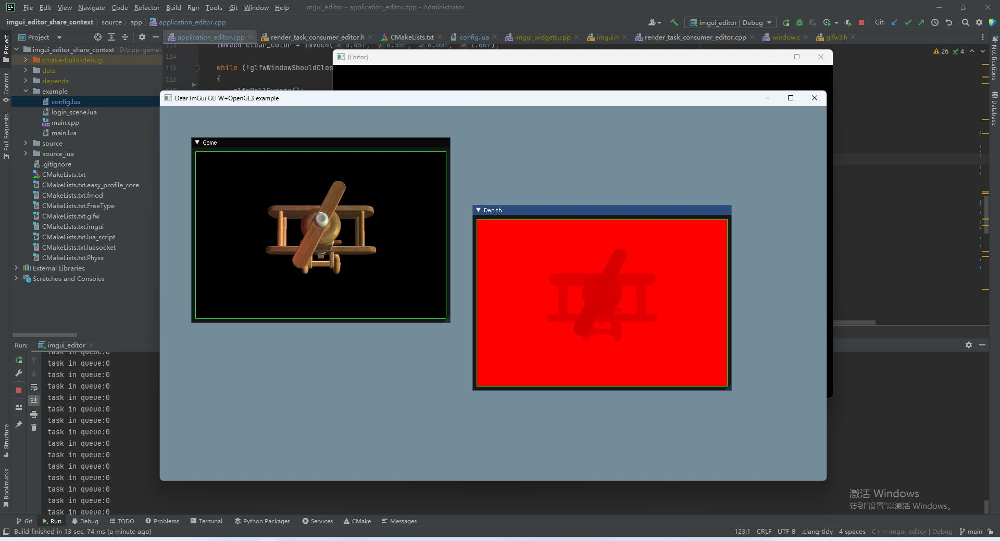
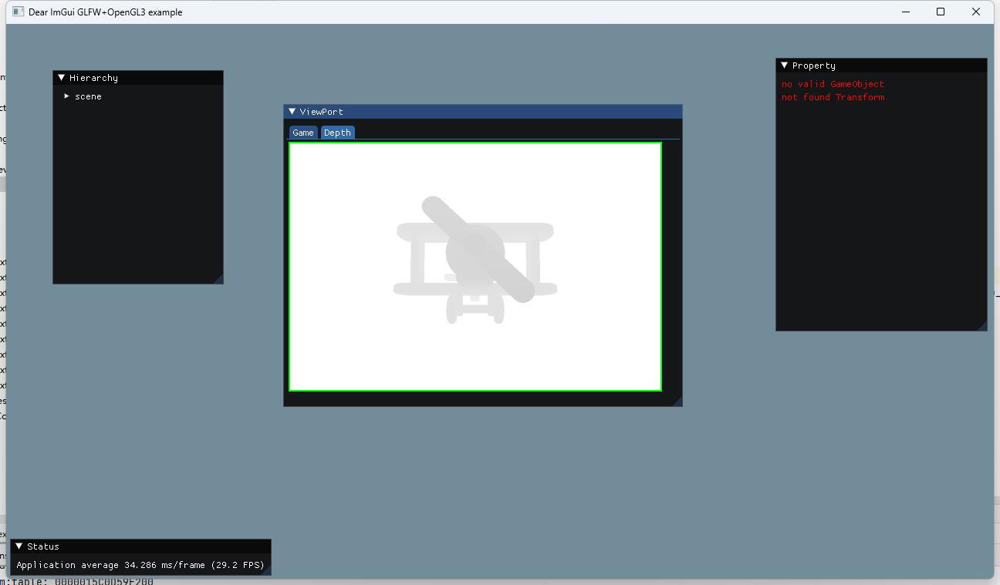

## 25.1 深度图

```bash
CLion项目文件位于 samples\shadow_mapping\depth_texture
```

前面说了，深度图就是深度缓冲区。

在 `24.2 FBO RenderTexture GameTurbo DLSS` 这一小节中，介绍了深度测试与深度缓冲区，也介绍了如何创建深度图，并Attach到FBO中。

而且在`24.5 使用ImGui实现引擎编辑器` 这一小节中，就已经将深度图绘制出来了。

下面红色的就是深度图。



### 1. 为什么深度图是红色的？

在Unity中，深度图看起来是灰度图，那为什么在这里是红色的呢？

对比创建颜色图和深度图的代码。

```c++
//创建颜色纹理 Attach到FBO颜色附着点上
glTexImage2D(GL_TEXTURE_2D, 0, GL_RGBA, 960, 640, 0, GL_RGBA, GL_UNSIGNED_BYTE, nullptr);__CHECK_GL_ERROR__
glFramebufferTexture2D(GL_FRAMEBUFFER, GL_COLOR_ATTACHMENT0, GL_TEXTURE_2D, color_texture_id_, 0);__CHECK_GL_ERROR__

//创建深度纹理 Attach到FBO深度附着点上
glTexImage2D(GL_TEXTURE_2D, 0, GL_DEPTH_COMPONENT, 960, 640, 0, GL_DEPTH_COMPONENT, GL_UNSIGNED_BYTE, nullptr);__CHECK_GL_ERROR__
glFramebufferTexture2D(GL_FRAMEBUFFER, GL_DEPTH_ATTACHMENT, GL_TEXTURE_2D, depth_texture_id_, 0);__CHECK_GL_ERROR__
```

可以看到，深度图是通过 `GL_DEPTH_COMPONENT` 来创建的，这个是单通道的，而颜色图是通过 `GL_RGBA` 来创建的，这个是四通道的。

单通道就是R通道，所以绘制出来的深度图就是红色的。

### 2. 绘制深度图为灰度图

如果要将单通道的Texture渲染为灰度图，可以在片段着色器中进行操作。

具体来说，可以从单通道Texture中采样像素值，然后将其复制到RGB三个通道上，代码示例如下：

```glsl
#version 330 core

precision mediump float;

in vec2 TexCoord;  // 纹理坐标输入

uniform sampler2D Texture;  // 单通道Texture

out vec4 FragColor;  // RGB三通道输出

void main()
{
    float gray = texture(Texture, TexCoord).r;  // 从Texture中采样单通道像素值

    FragColor = vec4(gray, gray, gray, 1.0);  // 将像素值复制到RGB三通道上
}
```

一般来说，在从FBO中拿到DepthTexture之后，可以再创建一个FBO，将DepthTexture作为普通Texture，用正交相机再绘制一次，让其经过上面的片段着色器，就可以将深度图绘制为灰度图了。

这就是相机后处理。

不过目前还没有到这一步，所以暂时不用管这个，后面章节再说。

本小节还是借助ImGui现有功能，将深度图绘制为灰度图。

### 3. 自定义ImGui绘制Shader

ImGui的绘制Shader是内置的，不过可以自定义。

在 `imgui_impl_opengl3.cpp` 的 `void ImGui_ImplOpenGL3_RenderDrawData(ImDrawData* draw_data)`函数，是ImGui的绘制函数。

这个函数里，先准备了绘制所需的资源和数据，然后会检查是否设置了自定义的步骤，如果有就执行，如果没有就直接绘制。

```c++
//file:depends/imgui/backends/imgui_impl_opengl3.cpp line:533

// User callback, registered via ImDrawList::AddCallback()
// (ImDrawCallback_ResetRenderState is a special callback value used by the user to request the renderer to reset render state.)
if (pcmd->UserCallback == ImDrawCallback_ResetRenderState)
    ImGui_ImplOpenGL3_SetupRenderState(draw_data, fb_width, fb_height, vertex_array_object);
else
    pcmd->UserCallback(cmd_list, pcmd);
```

所以，我们可以通过设置自定义的步骤，来自定义ImGui的绘制。

自定义的步骤，就从 `ImGui_ImplOpenGL3_SetupRenderState` 函数拷贝代码然后修改即可。

```c++
//file:source/app/application_editor.cpp line:114

/// 绘制DepthTexture回调，更换自定义Shader。
void DrawDepthTextureCallbackUseCustomShader(const ImDrawList*, const ImDrawCmd*) {
    static GLuint depth_texture_custom_shader_program_id_=0;
    if(depth_texture_custom_shader_program_id_==0)
    {
        //注意Shader代码是从imgui_impl_opengl3.cpp的 bool ImGui_ImplOpenGL3_CreateDeviceObjects()函数中复制。
        //只能修改逻辑，只能修改非资源相关的变量如ProjMtx，需要手动设置非资源相关的变量值如ProjMtx。
        //不能修改资源相关的变量名例如Position UV Color Texture,如果修改需要手动设置值。

        //顶点着色器代码
        const char* vertex_shader_text =R"(
            #version 330 core
            precision mediump float;
            layout (location = 0) in vec2 Position;
            layout (location = 1) in vec2 UV;
            layout (location = 2) in vec4 Color;

            uniform mat4 ProjMtx;
            out vec2 Frag_UV;
            out vec4 Frag_Color;

            void main()
            {
                Frag_UV = UV;
                Frag_Color = Color;
                gl_Position = ProjMtx * vec4(Position.xy,0,1);
            }
        )";
        //片段着色器代码
        const char* fragment_shader_text =R"(
            #version 330 core
            precision mediump float;

            in vec2 Frag_UV;
            in vec4 Frag_Color;
            uniform sampler2D Texture;
            layout (location = 0) out vec4 Out_Color;

            void main()
            {
                float gray = texture(Texture, Frag_UV.st).r;// 从Texture中采样单通道像素值
                Out_Color = Frag_Color * vec4(gray, gray, gray, 1.0);// 将像素值复制到RGB三通道上
            }
        )";

        //创建顶点Shader
        GLuint vertex_shader = glCreateShader(GL_VERTEX_SHADER);
        //指定Shader源码
        glShaderSource(vertex_shader, 1, &vertex_shader_text, NULL);
        //编译Shader
        glCompileShader(vertex_shader);
        //获取编译结果
        GLint compile_status=GL_FALSE;
        glGetShaderiv(vertex_shader, GL_COMPILE_STATUS, &compile_status);
        if (compile_status == GL_FALSE)
        {
            GLchar message[256];
            glGetShaderInfoLog(vertex_shader, sizeof(message), 0, message);
            DEBUG_LOG_ERROR("compile vs error:{}",message);
        }

        //创建片段Shader
        GLuint fragment_shader = glCreateShader(GL_FRAGMENT_SHADER);
        //指定Shader源码
        glShaderSource(fragment_shader, 1, &fragment_shader_text, NULL);
        //编译Shader
        glCompileShader(fragment_shader);
        //获取编译结果
        compile_status=GL_FALSE;
        glGetShaderiv(fragment_shader, GL_COMPILE_STATUS, &compile_status);
        if (compile_status == GL_FALSE)
        {
            GLchar message[256];
            glGetShaderInfoLog(fragment_shader, sizeof(message), 0, message);
            DEBUG_LOG_ERROR("compile fs error:{}",message);
        }

        //创建GPU程序
        GLuint program = glCreateProgram();
        //附加Shader
        glAttachShader(program, vertex_shader);
        glAttachShader(program, fragment_shader);
        //Link
        glLinkProgram(program);
        //获取编译结果
        GLint link_status=GL_FALSE;
        glGetProgramiv(program, GL_LINK_STATUS, &link_status);
        if (link_status == GL_FALSE)
        {
            GLchar message[256];
            glGetProgramInfoLog(program, sizeof(message), 0, message);
            DEBUG_LOG_ERROR("link error:{}",message);
        }
        depth_texture_custom_shader_program_id_=program;
    }

    //从imgui_impl_opengl3.cpp的ImGui_ImplOpenGL3_SetupRenderState函数中复制出来正交投影矩阵计算代码。
    ImDrawData* draw_data = ImGui::GetDrawData();
    float L = draw_data->DisplayPos.x;
    float R = draw_data->DisplayPos.x + draw_data->DisplaySize.x;
    float T = draw_data->DisplayPos.y;
    float B = draw_data->DisplayPos.y + draw_data->DisplaySize.y;

    const float ortho_projection[4][4] =
            {
                    { 2.0f/(R-L),   0.0f,         0.0f,   0.0f },
                    { 0.0f,         2.0f/(T-B),   0.0f,   0.0f },
                    { 0.0f,         0.0f,        -1.0f,   0.0f },
                    { (R+L)/(L-R),  (T+B)/(B-T),  0.0f,   1.0f },
            };

    glUseProgram(depth_texture_custom_shader_program_id_);
    glUniformMatrix4fv(glGetUniformLocation(depth_texture_custom_shader_program_id_, "ProjMtx"), 1, GL_FALSE, &ortho_projection[0][0]);
};
```

然后在绘制DepthTexture的时候，设置自定义的步骤。

```c++
//file:source/app/application_editor.cpp line:277

void ApplicationEditor::Run() {
    ......

    while (!glfwWindowShouldClose(editor_glfw_window_))
    {
        ......

        // 2. 游戏渲染画面
        {
            ImGui::Begin("ViewPort");
            if (ImGui::BeginTabBar("ViewPortTabBar", ImGuiTabBarFlags_None)){
                // 2.1 Game视图
                ......

                // 2.2 深度视图
                if (ImGui::BeginTabItem("Depth")) {
                    RenderTaskConsumerEditor* render_task_consumer_editor= dynamic_cast<RenderTaskConsumerEditor *>(RenderTaskConsumer::Instance());

                    GLuint texture_id=render_task_consumer_editor->depth_texture_id();
                    ImTextureID image_id = (void*)(intptr_t)texture_id;

                    //设置自定义Shader渲染深度图
                    ImDrawList* drawList = ImGui::GetWindowDrawList();
                    drawList->AddCallback(&DrawDepthTextureCallbackUseCustomShader, nullptr);
                    ImVec2 wSize = ImGui::GetWindowSize();

                    ImGuiWindow* w = ImGui::GetCurrentWindow();

                    ImGui::Image(image_id, ImVec2(480,320), ImVec2(0.0, 1.0), ImVec2(1.0, 0.0), ImVec4(255, 255, 255, 1), ImVec4(0, 255, 0, 1));

                    //还原
                    drawList->AddCallback(ImDrawCallback_ResetRenderState, nullptr);

                    ImGui::EndTabItem();
                }
                ImGui::EndTabBar();
            }
            ImGui::End();
        }


        ......
    }

    Exit();
}
```

效果如下：



可以看到靠近摄像机的飞机旋翼部分，深度值较小，更趋近于(0.0)，则颜色趋近黑色。

靠近远处的飞机机身部分，深度值较大，更趋近于(1.0)，则颜色趋近于白色。