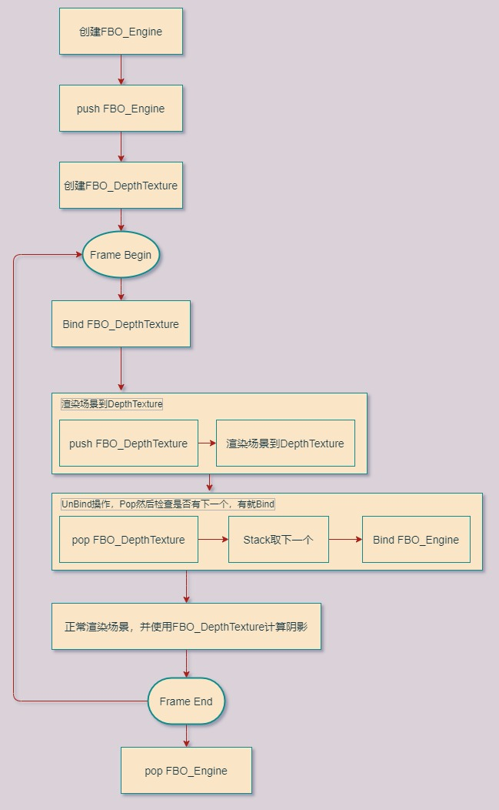

## 25.2 简单阴影

在OpenGL中获取DepthTexture很简单，只需要将场景渲染到FBO，并且设置DepthTarget为Texture。

但是实际想去使用它，却颇为困难。

还是先看下本小节实现的效果吧，Alt+鼠标左键旋转，可以看到飞机投影到后面的墙壁上。


### 1. FBO Stack

在上一节，将整个场景渲染到FBO，然后在ImGUI中显示出来DepthTexture，似乎很简单，这是只使用1个FBO的情况。

但这一节，我们使用Shadow Mapping，来实现阴影。

首先需要将场景渲染到FBO，得到DepthTexture，这个FBO先称之为FBO_DepthTexture。

然后再正常渲染一次场景到FBO，用于在Editor中显示，这个FBO称之为FBO_Engine。

那么如何去管理这多个FBO呢？

我们知道FBO其实是个虚拟的屏幕，当Bind一个FBO，后续所有的Draw结果都存储到了这个FBO里。

所以要按照先使用，先Bind的规则，依次对FBO进行Bind操作，然后再取消Bind。

先进先出，所以用Stack来存储。

两个FBO的使用规则如下图：



主要代码如下：

```c++
//file:source/render_device/render_target_stack.h

/// 渲染目标栈
class RenderTargetStack {
public:
    RenderTargetStack();
    ~RenderTargetStack();

    /// 压入渲染目标
    /// \param frame_buffer_object_id 帧缓冲
    void Push(GLuint frame_buffer_object_id);

    /// 弹出渲染目标
    void Pop();

    /// 检查是否为空
    /// \return 是否为空
    bool Empty();

    /// 获取栈顶渲染目标
    /// \return 栈顶渲染目标
    GLuint Top();

private:
    std::stack<GLuint> fbo_stack_;// 帧缓冲栈
};
```

压入FBO_Engine

```c++
//file:source/render_device/render_task_consumer_editor.cpp line:77

void RenderTaskConsumerEditor::InitGraphicsLibraryFramework() {
    ......

    //压入渲染目标栈
    render_target_stack_.Push(frame_buffer_object_id);
}
```

Bind并压入FBO_DepthTexture

```c++
//file:source/render_device/render_task_consumer_base.cpp line:459

/// 绑定使用FBO任务
void RenderTaskConsumerBase::BindFBO(RenderTaskBase* task_base){
    RenderTaskBindFBO* task=dynamic_cast<RenderTaskBindFBO*>(task_base);

    GLuint frame_buffer_object_id = GPUResourceMapper::GetFBO(task->fbo_handle_);
    glBindFramebuffer(GL_FRAMEBUFFER, frame_buffer_object_id);__CHECK_GL_ERROR__
    //检测帧缓冲区完整性，如果完整的话就开始进行绘制
    GLenum status = glCheckFramebufferStatus(GL_FRAMEBUFFER);__CHECK_GL_ERROR__
    if (status != GL_FRAMEBUFFER_COMPLETE) {
        DEBUG_LOG_ERROR("BindFBO FBO Error,Status:{} !",status);
        return;
    }

    //压入渲染目标栈
    render_target_stack_.Push(frame_buffer_object_id);
}
```

UnBind操作，Pop然后检查是否有下一个，有就Bind

```c++
//file:source/render_device/render_task_consumer_base.cpp line:476

/// 取消使用FBO任务
void RenderTaskConsumerBase::UnBindFBO(RenderTaskBase* task_base){
    RenderTaskBindFBO* task=dynamic_cast<RenderTaskBindFBO*>(task_base);
    //弹出渲染目标栈
    render_target_stack_.Pop();
    //检查是否还有渲染目标
    if(render_target_stack_.Empty()){
        //如果没有渲染目标了，就使用默认的渲染目标
        glBindFramebuffer(GL_FRAMEBUFFER, GL_NONE);__CHECK_GL_ERROR__
    }else{
        //如果还有渲染目标，就使用栈顶的渲染目标
        GLuint frame_buffer_object_id = render_target_stack_.Top();
        glBindFramebuffer(GL_FRAMEBUFFER, frame_buffer_object_id);__CHECK_GL_ERROR__
        //检测帧缓冲区完整性
        GLenum status = glCheckFramebufferStatus(GL_FRAMEBUFFER);__CHECK_GL_ERROR__
        if (status != GL_FRAMEBUFFER_COMPLETE) {
            DEBUG_LOG_ERROR("UnBindFBO,BindFBO FBO Error,Status:{} !",status);
            return;
        }
    }
}
```

### 2. 实现阴影

光线从光源发出后，被离光源近的物体遮挡，后面的物体受不到光，就显示为阴影。

我们在光源的位置放一个Camera，就叫它DepthCamera,对场景进行渲染，得到DepthTexture。

DepthTexture是一个二维数组，里面记录着离Camera最近的片段的距离。

当换成普通相机，进行普通渲染时，将当前渲染的片段与DepthCamera距离，与DepthTexture中记录的距离比较。

如果小，说明当前片段没有处在阴影中。

那么需要对现有的Shader做一些改变。

顶点Shader：

```glsl
//file:data/shader/unlit_receive_shadow.vert

#version 330 core

uniform mat4 u_model;
uniform mat4 u_view;
uniform mat4 u_projection;

uniform mat4 u_shadow_camera_view;
uniform mat4 u_shadow_camera_projection;

layout(location = 0) in  vec3 a_pos;
layout(location = 1) in  vec4 a_color;
layout(location = 2) in  vec2 a_uv;

out vec4 v_color;
out vec2 v_uv;

out vec4 v_shadow_camera_gl_Position;

void main()
{
    gl_Position = u_projection * u_view * u_model * vec4(a_pos, 1.0);
    v_color = a_color;
    v_uv = a_uv;

    v_shadow_camera_gl_Position=u_shadow_camera_projection * u_shadow_camera_view * u_model * vec4(a_pos, 1.0);
}
```

因为要将当前渲染片段和DepthTexture中记录的距离进行比较，而DepthTexture是DepthCamera拍下来的，所以需要获取当前片段在DepthCamera空间下的位置 `v_shadow_camera_gl_Position`。

片段Shader：

```glsl
//file:data/shader/unlit_receive_shadow.frag

#version 330 core

uniform sampler2D u_depth_texture;
uniform sampler2D u_diffuse_texture;

in vec4 v_color;
in vec2 v_uv;
in vec4 v_shadow_camera_gl_Position;

layout(location = 0) out vec4 o_fragColor;

float ShadowCalculation(vec4 shadow_camera_gl_Position)
{
    //首先，将传入参数中的x,y,z三个分量除以第四个分量w，得到投影坐标proj_coords。
    vec3 proj_coords = shadow_camera_gl_Position.xyz / shadow_camera_gl_Position.w;
    //将投影坐标映射到范围[0,1]
    proj_coords = proj_coords * 0.5 + 0.5;
    //从深度图纹理(u_depth_texture)中提取最近的深度closest_depth，这个深度代表着从光源位置到当前像素的最短距离。
    float closest_depth = texture(u_depth_texture, proj_coords.xy).r;
    //获取当前像素的深度current_depth，即当前像素与光源之间的距离
    float current_depth = proj_coords.z;
    //如果这个距离大于最近距离closest_depth，则说明当前像素在阴影之中，返回1.0，否则返回0.0，代表没有阴影。
    float shadow = current_depth > closest_depth  ? 1.0 : 0.0;
    return shadow;
}

void main()
{
    float shadow = ShadowCalculation(v_shadow_camera_gl_Position);
    o_fragColor = texture(u_diffuse_texture,v_uv) * v_color * (1-shadow);
}
```

主要代码如下。

```lua
--file:example/login_scene.lua line:77

--- 创建深度相机
function LoginScene:CreateDepthCamera()
    --创建相机1 GameObject
    self.go_depth_camera_= GameObject.new("depth_camera")
    --挂上 Transform 组件
    self.go_depth_camera_:AddComponent(Transform):set_position(glm.vec3(0, 0, 10))
    self.go_depth_camera_:GetComponent(Transform):set_rotation(glm.vec3(0, 0, 0))
    --挂上 Camera 组件
    self.depth_camera_=self.go_depth_camera_:AddComponent(Camera)
    --设置为黑色背景
    self.depth_camera_:set_clear_color(0,0,0,1)
    self.depth_camera_:set_depth(0)
    self.depth_camera_:SetView(glm.vec3(0.0,0.0,0.0), glm.vec3(0.0,1.0,0.0))
    self.depth_camera_:SetPerspective(60, Screen.aspect_ratio(), 1, 1000)
    --设置RenderTexture
    self.depth_render_texture_ = RenderTexture.new()
    self.depth_render_texture_:Init(480,320)
    self.depth_camera_:set_target_render_texture(self.depth_render_texture_)
end
```

然后需要给顶点Shader传入DepthCamera的投影、视图矩阵。

```lua
--file:example/login_scene.lua line:192
function LoginScene:Update()
    ......

    --设置ShadowCamera的参数
    self.material_wall_:SetUniformMatrix4f("u_shadow_camera_view",self.depth_camera_:view_mat4())
    self.material_wall_:SetUniformMatrix4f("u_shadow_camera_projection",self.depth_camera_:projection_mat4())

    ......
end
```
