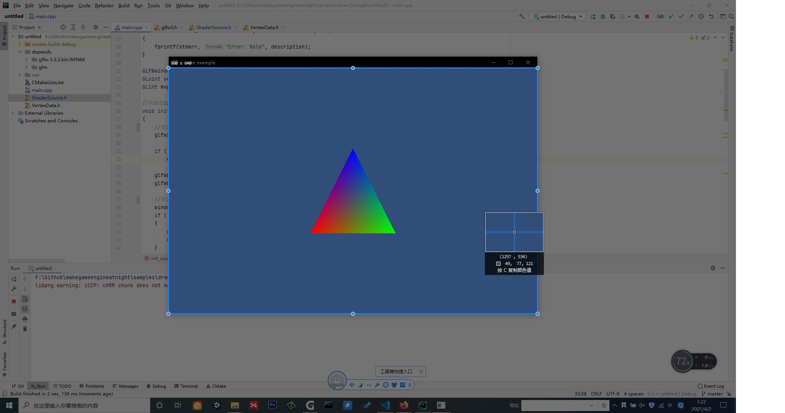

##3.1 画个三角形

    CLion项目文件位于 samples\draw_polygon\draw_triangle\untitled
    

就如同编程语言的`hello world!`，OpenGL的最佳入门范例就是绘制一个三角形，这一节就来做这个。

###1. 项目结构

打开CLion项目，如下图：


主要代码文件有3个：

|   代码文件|   |
|:---|:---|
|main.cpp  |主逻辑   |
|VertexData.h  |  顶点数据(坐标、颜色) |
|ShaderSource.h  | Shader代码(顶点Shader和片段Shader)  |


depends目录存放依赖库，如下：

|   依赖库|   |
|:---|:---|
|glfw-3.3.3.bin.WIN64  |glfw提供对OpenGL API封装   |
|glm  |  数学库，提供Vector、Matrix等数据结构运算 |

###2. 顶点数据

`VertexData.h` 中存放了三角形 三个顶点的坐标数据和颜色数据。

```c++
//
// Created by captain on 2021/3/25.
// 顶点坐标 顶点颜色
//

#ifndef UNTITLED_VERTEXDATA_H
#define UNTITLED_VERTEXDATA_H

#include <glm/glm.hpp>

static const glm::vec3 kPositions[3] = {
        glm::vec3{ -1.0f, -1.0f,0.0f},
        glm::vec3{  1.0f, -1.0f,0.0f},
        glm::vec3{   0.f,  1.0f,0.0f}
};

static const glm::vec4 kColors[3] = {
        glm::vec4{ 1.f, 0.f, 0.f ,1.f},
        glm::vec4{ 0.f, 1.f, 0.f ,1.f},
        glm::vec4{ 0.f, 0.f, 1.f ,1.f}
};

#endif //UNTITLED_VERTEXDATA_H
```

可以修改`kPositions`和`kColors`数值查看效果。

###3. 着色器代码

`ShaderSource.h` 中存放了顶点着色器和片段着色器代码。

```c++
//
// Created by captain on 2021/3/25.
//

#ifndef UNTITLED_SHADERSOURCE_H
#define UNTITLED_SHADERSOURCE_H

//顶点着色器代码
static const char* vertex_shader_text =
        "#version 330\n"

        "uniform mat4 u_mvp;\n"

        "layout(location = 0) in  vec3 a_pos;\n"
        "layout(location = 1) in  vec4 a_color;\n"

        "out vec4 v_color;\n"

        "void main()\n"
        "{\n"
        "    gl_Position = u_mvp * vec4(a_pos, 1.0);\n"
        "    v_color = a_color;\n"
        "}\n";
//片段着色器代码
static const char* fragment_shader_text =
        "#version 330\n"
        "in vec4 v_color;\n"
        "layout(location = 0) out vec4 o_fragColor;\n"
        "void main()\n"
        "{\n"
        "    o_fragColor = v_color;\n"
        "}\n";

#endif //UNTITLED_SHADERSOURCE_H
```

着色器是运行在GPU上的程序，顶点着色器和片段着色器作用于渲染的不同阶段。

这里准备好着色器的代码，然后调用OpenGL API进行编译、链接、运行。

可以以 `lua` 脚本作为参照，方便理解。

着色器在第4章会详细介绍。

###4.主逻辑

`main.cpp` 就是程序主逻辑。

主要分为4个步骤。

1. OpenGL初始化，创建Window。
2. 初始化着色器。
3. 关联着色器变量和顶点数据
4. 主循环

####4.1 OpenGL初始化

```c++
//初始化OpenGL
void init_opengl()
{
    //设置错误回调
    glfwSetErrorCallback(error_callback);

    if (!glfwInit())
        exit(EXIT_FAILURE);

    glfwWindowHint(GLFW_CONTEXT_VERSION_MAJOR, 2);
    glfwWindowHint(GLFW_CONTEXT_VERSION_MINOR, 0);

    //创建窗口
    window = glfwCreateWindow(960, 640, "Simple example", NULL, NULL);
    if (!window)
    {
        glfwTerminate();
        exit(EXIT_FAILURE);
    }

    glfwMakeContextCurrent(window);
    gladLoadGL(glfwGetProcAddress);
    glfwSwapInterval(1);
}
```

主要就是创建OpenGL窗口，分辨率为 960x640，这里可以改变窗口尺寸看下效果。

值得赞扬的是，`glfwCreateWindow`指定的宽高，就是实际显示区域的宽高，不包括标题栏。




####4.2 初始化着色器

在`ShaderSource.h` 提供了着色器代码，既然是代码那么就需要进行编译、链接才能运行，初始化着色器就是做这个。

```c++
//编译、链接Shader
void compile_shader()
{
    //创建顶点Shader
    vertex_shader = glCreateShader(GL_VERTEX_SHADER);
    //指定Shader源码
    glShaderSource(vertex_shader, 1, &vertex_shader_text, NULL);
    //编译Shader
    glCompileShader(vertex_shader);

    //创建片段Shader
    fragment_shader = glCreateShader(GL_FRAGMENT_SHADER);
    //指定Shader源码
    glShaderSource(fragment_shader, 1, &fragment_shader_text, NULL);
    //编译Shader
    glCompileShader(fragment_shader);

    //创建GPU程序
    program = glCreateProgram();
    //附加Shader
    glAttachShader(program, vertex_shader);
    glAttachShader(program, fragment_shader);
    //Link
    glLinkProgram(program);
}
```
过一遍，断点看看就行，不要深究。

####4.3 关联着色器变量和顶点数据
创建好OpenGL窗口、初始化着色器之后，就可以获取着色器的属性ID，与顶点坐标和颜色数据进行关联。

```c++
//获取shader属性ID
mvp_location = glGetUniformLocation(program, "u_mvp");
vpos_location = glGetAttribLocation(program, "a_pos");
vcol_location = glGetAttribLocation(program, "a_color");

//启用顶点Shader属性(a_pos)，指定与顶点坐标数据进行关联
glEnableVertexAttribArray(vpos_location);
glVertexAttribPointer(vpos_location, 3, GL_FLOAT, false, sizeof(glm::vec3), kPositions);

//启用顶点Shader属性(a_color)，指定与顶点颜色数据进行关联
glEnableVertexAttribArray(vcol_location);
glVertexAttribPointer(vcol_location, 3, GL_FLOAT, false, sizeof(glm::vec4), kColors);
```

关联好顶点数据后，就可以在主循环里，将顶点上传然后渲染。

####4.4 进入主循环


```c++
while (!glfwWindowShouldClose(window))
{
    float ratio;
    int width, height;
    glm::mat4 model,view, projection, mvp;

    //获取画面宽高
    glfwGetFramebufferSize(window, &width, &height);
    ratio = width / (float) height;

    glViewport(0, 0, width, height);
    glClear(GL_COLOR_BUFFER_BIT|GL_DEPTH_BUFFER_BIT);
    glClearColor(49.f/255,77.f/255,121.f/255,1.f);

    //坐标系变换
    glm::mat4 trans = glm::translate(glm::vec3(0,0,0)); //不移动顶点坐标;
    glm::mat4 rotation = glm::eulerAngleYXZ(glm::radians(0.f), glm::radians(0.f), glm::radians(0.f)); //使用欧拉角旋转;
    glm::mat4 scale = glm::scale(glm::vec3(2.0f, 2.0f, 2.0f)); //缩放;
    model = trans*scale*rotation;

    view = glm::lookAt(glm::vec3(0, 0, 10), glm::vec3(0, 0,0), glm::vec3(0, 1, 0));

    projection=glm::perspective(glm::radians(60.f),ratio,1.f,1000.f);

    mvp=projection*view*model;

    //指定GPU程序(就是指定顶点着色器、片段着色器)
    glUseProgram(program);
        //上传mvp矩阵
        glUniformMatrix4fv(mvp_location, 1, GL_FALSE, &mvp[0][0]);
        //上传顶点数据并进行绘制
        glDrawArrays(GL_TRIANGLES, 0, 3);

    glUseProgram(-1);

    glfwSwapBuffers(window);
    glfwPollEvents();
}
```

主循环主要做3件事：
1. 坐标系转换
2. 上传mvp矩阵
3. 调用 glDrawArrays 上传顶点数据并进行绘制(这就是一个DrawCall完成)

代码断点看两遍，坐标系变换里面的移动、旋转、缩放数值改改看看效果，就差不多了。