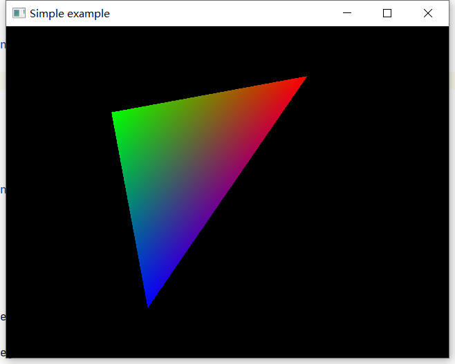

##3.2 画个正方形

        CLion项目文件位于 samples\draw_polygon\draw_quad\untitled

正方形由2个三角形组成，下面的就是2个三角形的6个顶点坐标。

```c++
static const glm::vec3 kPositions[6] = {
        //第一个三角形
        { -1.0f, -1.0f,0.0f},//左下
        {  1.0f, -1.0f,0.0f},//右下
        {   1.0f,  1.0f,0.0f},//右上

        //第二个三角形
        {   1.0f,  1.0f,0.0f},//右上
        { -1.0f, -1.0f,0.0f},//左上
        { -1.0f,1.0f,0.0f}//左下
};
```

直接运行，却仍然是三角形。



这是因为，虽然准备了6个顶点数据，但是顶点数据是在内存中，并没有上传到GPU显存。

代码仍然是上传3个顶点，绘制一个三角形。

```c++
//void glDrawArrays(GLenum mode,GLint first,GLsizei count);
glDrawArrays(GL_TRIANGLES, 0, 3);//表示从第0个顶点开始画，总共画3个顶点。
```

绘制2个三角形 = 绘制6个顶点，所以这里需要修改为6.

```c++
glDrawArrays(GL_TRIANGLES, 0, 6);//表示从第0个顶点开始画，总共画6个顶点，即2个三角形
```

再次运行，成功绘制了2个三角形，组成了正方形。


但是一个三角形是黑色的！

问题出在顶点颜色数据。

顶点从3个增加到了6个，但是顶点颜色数据仍然是3个，那么第二个三角形就没有顶点颜色可以用。

        顶点颜色数据 和 顶点坐标数据 个数要一致，一一对应。

修改如下：

```c++
static const glm::vec4 kColors[6] = {
        //第一个三角形颜色
        { 1.f, 0.f, 0.f ,1.f},//左下
        { 0.f, 1.f, 0.f ,1.f},//右下
        { 0.f, 0.f, 1.f ,1.f},//右上

        //第二个三角形颜色
        { 0.f, 0.f, 1.f ,1.f},//右上
        { 1.f, 0.f, 0.f ,1.f},//左上
        { 1.f, 0.f, 0.f ,1.f}//左下
};
```

再次运行


        参考以下文章：

        https://huutu.blog.csdn.net/article/details/50133131

        https://www.khronos.org/registry/OpenGL-Refpages/es3.0/html/glDrawArrays.xhtml

        https://www.khronos.org/registry/OpenGL-Refpages/es3.0/html/glEnableVertexAttribArray.xhtml