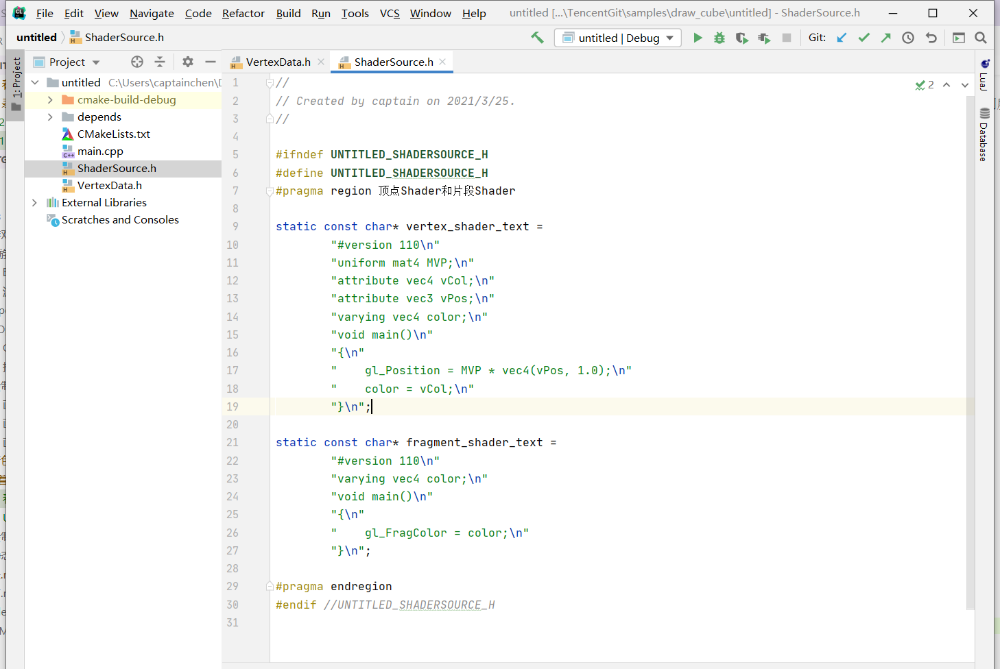

##4.1 着色器是什么

着色器就是Shader，Shader就是一段GPU程序源码。

我们大学就学过的C语言是CPU程序源码，Shader和C 语言有很多相似之处，也要写代码、编译、链接。

通过下面的表格来做对照。

<table>
<tr ><td></td><td bgcolor="AliceBlue"><b>C语言</td><td bgcolor="AliceBlue"><b>Shader</td></tr>
<tr><td><b>目标硬件</td><td>CPU</td><td>GPU</td></tr>
<tr><td rowspan="6"><b>编译流程</td><td>创建项目</td><td>创建GPU程序</td></tr>
<tr><td>创建多个代码文件</td><td>创建Shader对象(顶点Shader和片段Shader) </td></tr>
<tr><td>编写多个代码</td><td>上传Shader源码到Shader对象</td></tr>
<tr><td>编译代码</td><td>编译Shader</td></tr>
<tr><td>添加到链接列表</td><td>添加到链接列表</td></tr>
<tr><td>链接</td><td>链接</td></tr>
</table>

是不是很相似呢！

渲染一个图像，其实就是在GPU上执行了Shader代码，然后将顶点坐标、颜色数据作为输入，经由Shader进行处理，然后输出像素数据到屏幕上。

和C语言不一样的是，C语言只需要一个main.c 文件就可以编译成功。
但是Shader是配套出现的， Vertex Shader(顶点着色器)、Fragment Shader(片段着色器)，两者缺一不可。

<table>
<tr ><td></td><td bgcolor="AliceBlue"><b>C语言</td><td bgcolor="AliceBlue"><b>Shader</td></tr>
<tr><td><b>目标硬件</td><td>CPU</td><td>GPU</td></tr>
<tr><td rowspan="6"><b>代码文件列表</td><td>main.c</td><td>main.vs(Vertex Shader)</td></tr>
<tr><td>...</td><td>main.fs(Fragment Shader)</td></tr>
</table>

###着色器的种类
Vertex Shader(顶点着色器)、Fragment Shader(片段着色器) 我们听到最多的就是这两个。
Geometry Shader、Computer Shader看过但是实际项目中没用过。
Tessellation Control Shader 、Tessellation Evaluation Shader这两个就几乎没有听过。

这是由工作内容决定的，大家都是从事手机游戏开发。
目前市面上的手机，很大一部分仍然是OpenGL ES3.0的版本或更低。

Computer Shader在OpenGL ES 3.1版本才开始支持。
Geometry Shader在OpenGL ES 3.2版本才开始支持。

    更多资料参考OpenGL官网：
    https://www.khronos.org/opengl/wiki/Category:Shaders

本书也仅介绍Vertex Shader(顶点着色器)、Fragment Shader(片段着色器)。

在 `3.绘制简单图形` 这一章的配套项目里，`ShaderSource.h` 里面就存放着Vertex Shader 和 Fragment Shader 的源码。

如下图：

观察这段代码，又发现和C语言的相同之处 -- 入口都是 `main` 函数。

<table>
<tr ><td></td><td bgcolor="AliceBlue"><b>C语言</td><td bgcolor="AliceBlue"><b>Shader</td></tr>
<tr><td><b>目标硬件</td><td>CPU</td><td>GPU</td></tr>
<tr><td rowspan="6"><b>入口</td><td>void main()</td><td>void main()</td></tr>
</table>

当前小节对Shader有了一个大概的映像即可，后续章节再详细介绍。