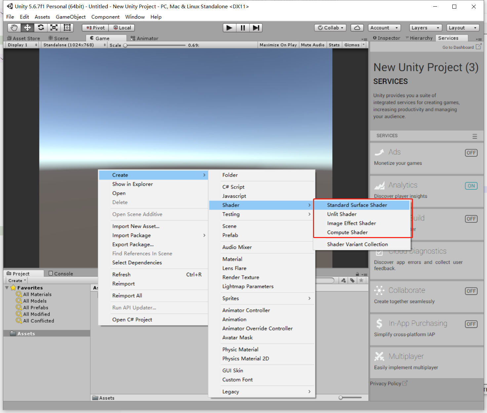
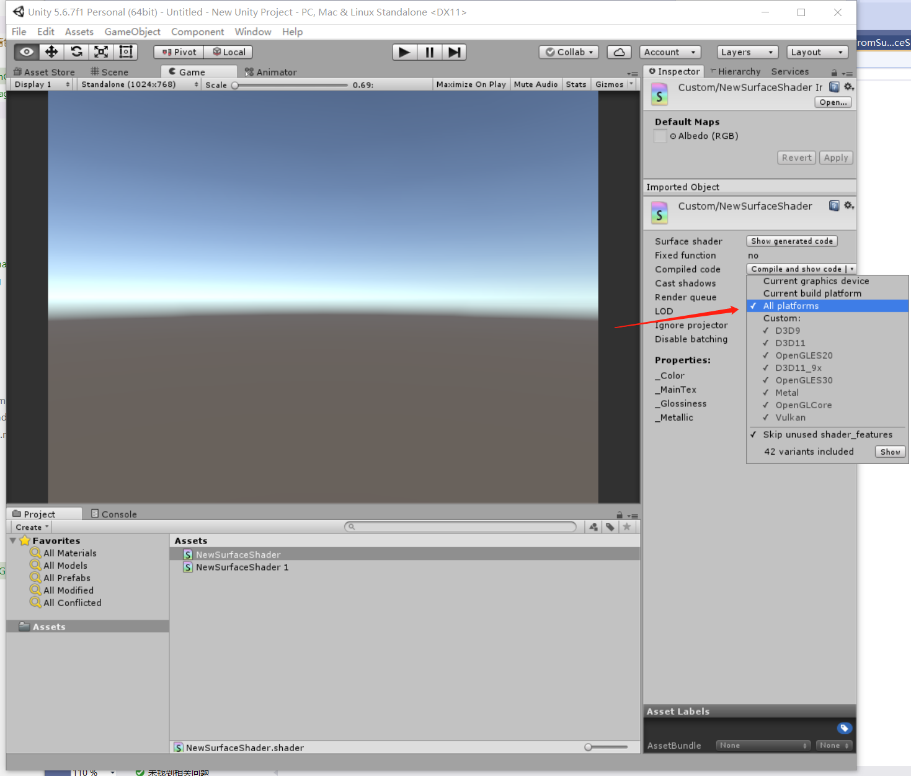

##4.2 Unity Shader和OpenGL Shader

上一节提到，OpenGL Shader是配套出现的， Vertex Shader(顶点着色器)、Fragment Shader(片段着色器)，两者缺一不可。

但是我用了20年Unity都没有见过类似的代码，这是咋回事，Unity跳过OpenGL自己实现了图形库吗？

###1. Unity Shader类型

打开Unity，新建Shader。



在Unity中，可以创建4种Shader。

1. Standard Surface Shader
2. Unlit Shader
3. Image Effect Shader
4. Compute Shader

这4种Shader，是对一套特定功能的Vertex Shader、Fragment Shader组合，取的名字。

以C语言为例，我们编写多个C语言代码，可以编译出各种程序，如收银台程序、聊天程序、游戏程序，每一种程序都针对特定功能。

用编写的Vertex Shader、Fragment Shader，也可以编译得到各种程序，如无光照的GPU程序、有光照的GPU程序、特效程序，每一种程序都针对特定功能。

Unity中可选的4种Shader，每一种都是针对特定功能，每一种都是由不同的Vertex Shader、Fragment Shader组成。

###2. Unity Shader代码

上面说，Unity Shader是由Vertex Shader、Fragment Shader组成，那就是说，Unity Shader里面的代码由Vertex Shader、Fragment Shader拼起来咯？

在 `3.绘制简单图形` 这一章的配套项目里，`ShaderSource.h` 就是由 Vertex Shader 和 Fragment Shader 拼起来的，那Unity Shader也是如此吗？

创建一个 `Standard Surface Shader`，观察代码，发现结构完全不一样，连 入口 `main` 函数都没有!

```cg
Shader "Custom/NewSurfaceShader" {
	Properties {
		_Color ("Color", Color) = (1,1,1,1)
		_MainTex ("Albedo (RGB)", 2D) = "white" {}
		_Glossiness ("Smoothness", Range(0,1)) = 0.5
		_Metallic ("Metallic", Range(0,1)) = 0.0
	}
	SubShader {
		Tags { "RenderType"="Opaque" }
		LOD 200
		
		CGPROGRAM
		// Physically based Standard lighting model, and enable shadows on all light types
		#pragma surface surf Standard fullforwardshadows

		// Use shader model 3.0 target, to get nicer looking lighting
		#pragma target 3.0

		sampler2D _MainTex;

		struct Input {
			float2 uv_MainTex;
		};

		half _Glossiness;
		half _Metallic;
		fixed4 _Color;

		// Add instancing support for this shader. You need to check 'Enable Instancing' on materials that use the shader.
		// See https://docs.unity3d.com/Manual/GPUInstancing.html for more information about instancing.
		// #pragma instancing_options assumeuniformscaling
		UNITY_INSTANCING_CBUFFER_START(Props)
			// put more per-instance properties here
		UNITY_INSTANCING_CBUFFER_END

		void surf (Input IN, inout SurfaceOutputStandard o) {
			// Albedo comes from a texture tinted by color
			fixed4 c = tex2D (_MainTex, IN.uv_MainTex) * _Color;
			o.Albedo = c.rgb;
			// Metallic and smoothness come from slider variables
			o.Metallic = _Metallic;
			o.Smoothness = _Glossiness;
			o.Alpha = c.a;
		}
		ENDCG
	}
	FallBack "Diffuse"
}

```

这是因为，我们在Unity中写的Shader代码，并不是标准的OpenGL Shader，而是NVIDIA开发的Cg语言。

Cg语言可以由工具，转换成OpenGL Shader，或者DX Shader，毕竟Unity是跨平台引擎，如果没有Cg语言，那每一种功能的Shader既要写OpenGL的，又要写DX的，要累死程序员了。

###3.Unity Shader转OpenGL Shader

Unity中选中创建的Shader，在Inspector里，打开Shader编译平台设置，修改为 `All platforms`。


点击`Compile and show code` 将Unity Cg Shader文件转为OpenGL Shader。

转换完成后自动打开，搜索 `glcore`，定位到转换后的代码。


这就是转换出来的Vertex Shader代码，看到入口 `main` 函数了。

