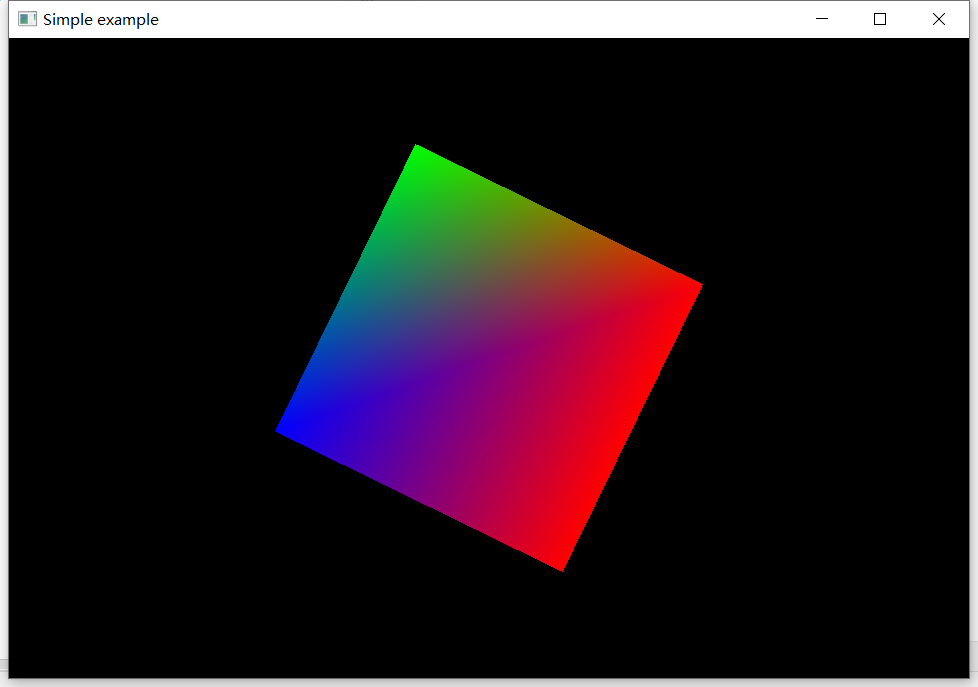
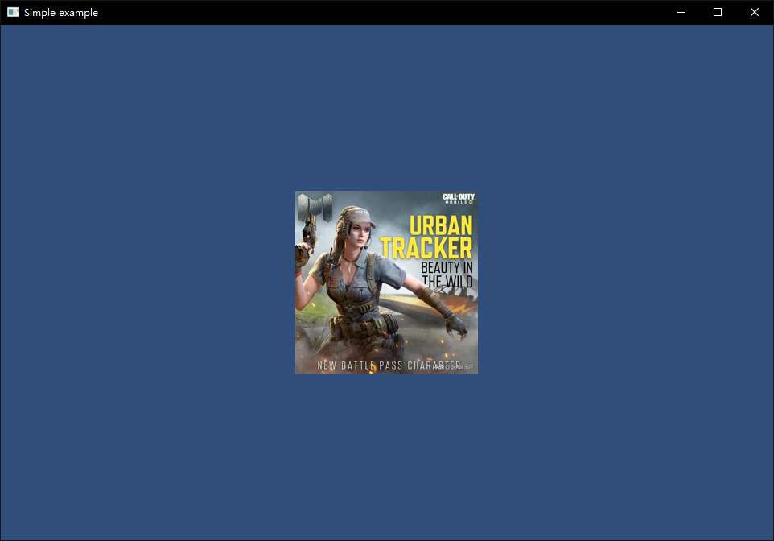

##5.1 颜色和贴图

在第3章-绘制简单图形里，分别绘制了彩色的三角形、四边形、立方体，这些多边形的颜色，来自于代码中指定的顶点颜色。

那既然可以指定顶点颜色，那我在代码中指定所有顶点颜色，不就可以绘制彩色模型，为什么还需要贴图呢？

###1.顶点色显示逻辑

在 `4.4 片段着色器`中提到，顶点颜色从顶点着色器输出，然后输入到片段着色器，是经过插值的。



上图是 `3.2 画个正方形` 的实例，左上角颜色是红色，右上角颜色是蓝色，可以看到中间颜色是由红色、蓝色插值混合而成。

那顶点色插值能做到下图的效果吗？



明显是做不到的。

###2.贴图显示逻辑
顶点色能做到的效果有限，所以有另一套机制:<font color=red>UV坐标</font>。

UV坐标指的是顶点对应在图片的哪个位置，仍旧拿上面的效果举例，4个顶点(左下、右下、右上、左上)分别和图片的4个角对应，那么UV坐标就是下面这样:

```c++
static const glm::vec3 Positions[6] =
{
    //第一个三角形
    { -1.0f, -1.0f,0.0f},//左下
    {  1.0f, -1.0f,0.0f},//右下
    {   1.0f,  1.0f,0.0f},//右上

    //第二个三角形
    {   1.0f,  1.0f,0.0f},//右上
    { -1.0f, -1.0f,0.0f},//左上
    { -1.0f,1.0f,0.0f}//左下
};

static const glm::vec2 UVs[6] = 
{
    //第一个三角形
    { -1.0f, -1.0f},//左下
    {  1.0f, -1.0f},//右下
    {  1.0f,  1.0f},//右上

    //第二个三角形
    {  1.0f,  1.0f},//右上
    { -1.0f, -1.0f},//左上
    { -1.0f,  1.0f}//左下
}
```

相信你也看出来了，UV坐标范围是[0,1]。

上面这种顶点坐标和图片对应起来的操作，一般叫做<font color=red>UV映射</font>。

想象一下贴手机膜，就是这种操作，贴上去，不然怎么叫贴图。