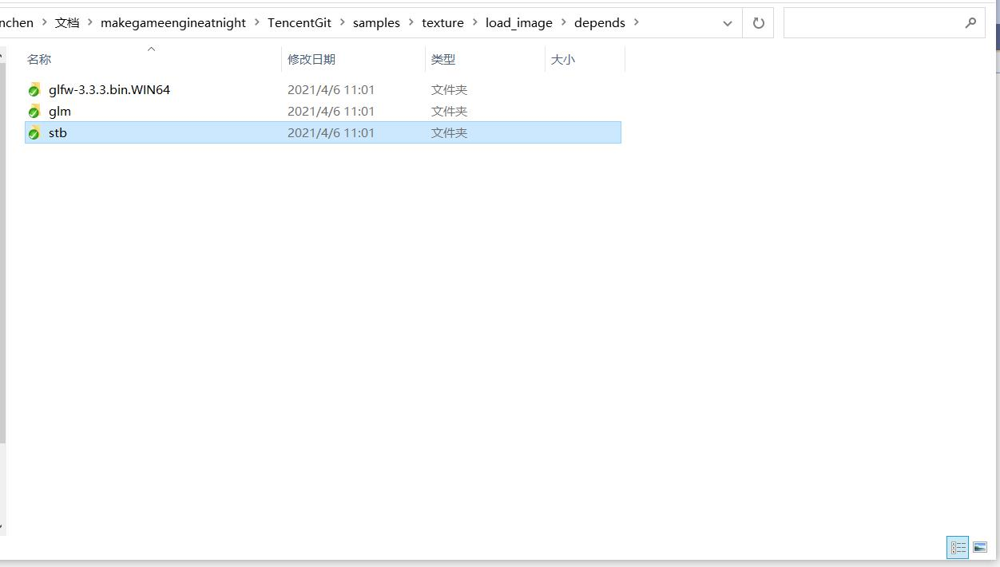
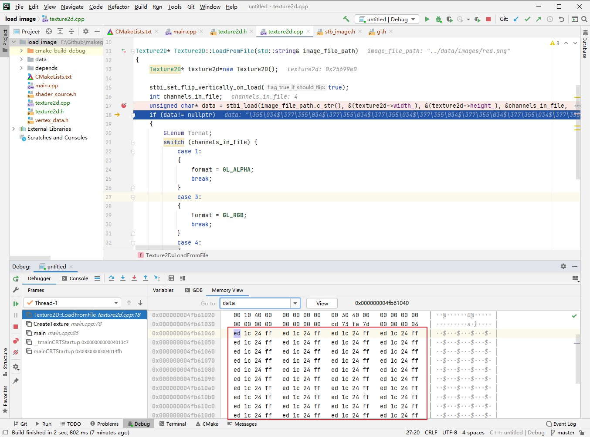
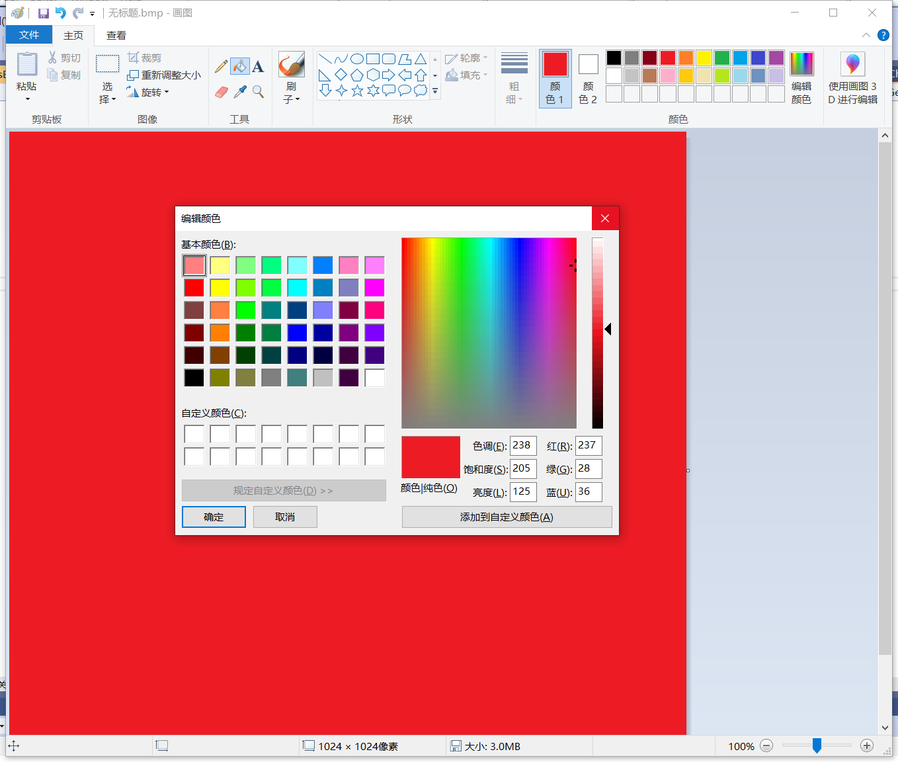

##5.4 使用stb_image解析图片

    CLion项目文件位于 samples\texture\load_image

前面介绍了`.png`、`.jpg`图片文件想要用于渲染，首先得加载到内存，然后解压得到RGB数据，然后才能将RGB数据上传到GPU用于渲染。

这一节来实现图片文件加载与解压。

###1. 开源的图片解析库
目前各大游戏引擎常用的图片解析库是 `FreeImage`，支持几乎所有的图片格式，官网地址：
    
    https://freeimage.sourceforge.io/index.html

支持图片格式多，意味着代码量大，我们暂时只需要加载 `.png`、`.jpg`，找个轻量的库就可以了。
一个绝佳的选择就是 `stb_image`。

    std是一个单头文件开源库，每个头文件实现一种功能，官网：https://github.com/nothings/stb


###2. 导入stb库
下载`stb`源代码，放到项目的`depends`目录下。


这样就可以在项目中使用了。

###3. 加载图片并解析
创建类`Texture2D`，管理图片相关接口。

在使用 `stb_image` 解析图片文件之前，先添加相关宏定义：

```c++
#define STB_IMAGE_IMPLEMENTATION
```


再导入头文件：
```c++
#include "stb/stb_image.h"
```


然后编写接口代码，加载图片文件:

```c++
Texture2D* Texture2D::LoadFromFile(std::string& image_file_path)
{
    Texture2D* texture2d=new Texture2D();

    stbi_set_flip_vertically_on_load(true);//翻转图片，解析出来的图片数据从左下角开始，这是因为OpenGL的纹理坐标起始点为左下角。
    int channels_in_file;//通道数
    unsigned char* data = stbi_load(image_file_path.c_str(), &(texture2d->width_), &(texture2d->height_), &channels_in_file, 0);
    if (data!= nullptr)
    {
        //根据颜色通道数，判断颜色格式。
        switch (channels_in_file) {
            case 1:
            {
                texture2d->gl_texture_format_ = GL_ALPHA;
                break;
            }
            case 3:
            {
                texture2d->gl_texture_format_ = GL_RGB;
                break;
            }
            case 4:
            {
                texture2d->gl_texture_format_ = GL_RGBA;
                break;
            }
        }
    }

    //释放图片文件内存
    stbi_image_free(data);

    return texture2d;
}
```

然后在`main.cpp` 中调用接口。

```c++
//创建Texture
void CreateTexture(std::string image_file_path)
{
    Texture2D* texture2d=Texture2D::LoadFromFile(image_file_path);
}

int main(void)
{
    init_opengl();

    CreateTexture("../data/images/red.png");

    compile_shader();

    ......
}
```

###4. 解析结果验证

调用`stbi_load`解析图片成功后，返回图像RGB数据(data)、宽、高、通道数。

查看data内存，如下图：


可以看到都是重复的 `ed 1c 24 ff`，转换到十进制就是`237 28 36 255`，这正是上一节创建的红色图片的像素颜色值。



这说明已经成功解析了`.png`格式图片，获取到了原始的RGB数据，下一步就可以上传到GPU中进行渲染。