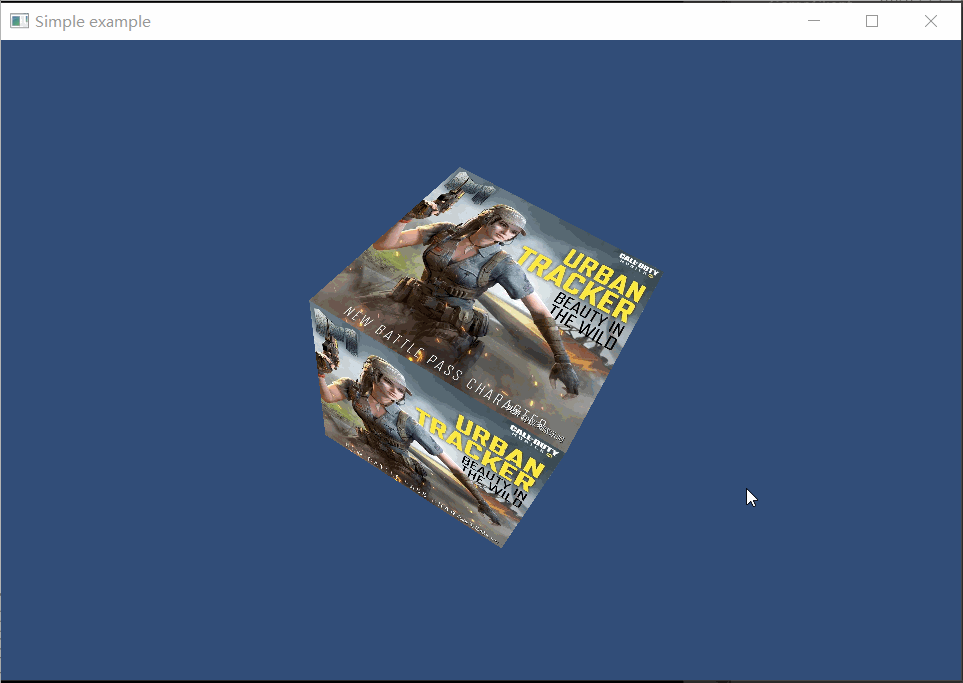

##5.5 绘制带贴图的立方体盒子

    CLion项目文件位于 samples\texture\draw_cube_texture

上一节已经解析了图片，得到RGB数据，这一节将数据上传到显卡并渲染。

###1. 上传RGB数据到显卡

在 `texture2d.h` 中，添加成员变量`gl_texture_id_`存储GPU创建纹理的唯一ID。
```c++
GLuint gl_texture_id_;//纹理ID
```

解析图片成功后，将图片RGB数据上传到GPU。

```c++
Texture2D* Texture2D::LoadFromFile(std::string& image_file_path)
{
    Texture2D* texture2d=new Texture2D();

    stbi_set_flip_vertically_on_load(true);//翻转图片，解析出来的图片数据从左下角开始，这是因为OpenGL的纹理坐标起始点为左下角。
    int channels_in_file;//通道数
    unsigned char* data = stbi_load(image_file_path.c_str(), &(texture2d->width_), &(texture2d->height_), &channels_in_file, 0);
    if (data!= nullptr)
    {
        //根据颜色通道数，判断颜色格式。
        ......
    }

    //1. 通知显卡创建纹理对象，返回句柄;
    glGenTextures(1, &(texture2d->gl_texture_id_));

    //2. 将纹理绑定到特定纹理目标;
    glBindTexture(GL_TEXTURE_2D, texture2d->gl_texture_id_);

    //3. 将图片rgb数据上传到GPU;
    glTexImage2D(GL_TEXTURE_2D, 0, GL_RGB, texture2d->width_, texture2d->height_, 0, texture2d->gl_texture_format_, GL_UNSIGNED_BYTE, data);

    //4. 指定放大，缩小滤波方式，线性滤波，即放大缩小的插值方式;
    glTexParameteri(GL_TEXTURE_2D, GL_TEXTURE_MAG_FILTER, GL_LINEAR);
    glTexParameteri(GL_TEXTURE_2D, GL_TEXTURE_MIN_FILTER, GL_LINEAR);

    //释放图片文件内存
    stbi_image_free(data);

    return texture2d;
}
```
这样，RGB数据就上传到显卡中了。
数据上传后，返回纹理句柄供后续使用。

下面来看看在Shader中如何从纹理上获取颜色数据。

###2. Shader中使用纹理
在片段Shader中使用，GLSL提供函数 `texture` ，在纹理的指定坐标上，取出颜色值。

    gvec4  texture(gsampler{2,3}D sampler, vec{2,3} P [, float bias]); 

参数sampler就是纹理数据。
参数p就是UV坐标。

下面就是完整的片段Shader。
```glsl
#version 330
uniform sampler2D u_diffuse_texture;
in vec4 v_color;
in vec2 v_uv;
layout(location = 0) out vec4 o_fragColor;
void main()
{
    o_fragColor = texture(u_diffuse_texture,v_uv);
};
```

主要是调用`texture`函数，从纹理 `u_diffuse_texture` 中，以 `v_uv` 为UV坐标，取出颜色值，赋值给 `o_fragColor`作为颜色输出。

UV坐标，在 `5.1 颜色和贴图` 这一节简单介绍过，注意看上面的片段Shader代码：
```glsl
in vec2 v_uv;
```
变量`v_uv`被 `in` 修饰，说明UV坐标是从顶点Shader传递过来的，数据经过插值。

顶点Shader代码如下：
```glsl
#version 330

uniform mat4 u_mvp;

layout(location = 0) in  vec3 a_pos;
layout(location = 1) in  vec4 a_color;
layout(location = 2) in  vec2 a_uv;

out vec4 v_color;
out vec2 v_uv;

void main()
{
    gl_Position = u_mvp * vec4(a_pos, 1.0);
    v_color = a_color;
    v_uv = a_uv;
};
```

介绍完了纹理的使用过程，下面就传入UV坐标和纹理到Shader中进行渲染。

###3. 上传UV坐标
UV坐标和顶点坐标也是一一对应，且取值范围是[0,1]。
立方体有6个面，每个面2个三角形，对应UV坐标数据如下：
```c++
static const glm::vec2 kUvs[36] =
{
        //Front
        glm::vec2(0.0f, 0.0f),
        glm::vec2(1.0f, 0.0f),
        glm::vec2(1.0f, 1.0f),

        glm::vec2(0.0f, 0.0f),
        glm::vec2(1.0f, 1.0f),
        glm::vec2(0.0f, 1.0f),

        //back
        glm::vec2(0.0f, 0.0f),
        glm::vec2(1.0f, 0.0f),
        glm::vec2(1.0f, 1.0f),

        glm::vec2(0.0f, 0.0f),
        glm::vec2(1.0f, 1.0f),
        glm::vec2(0.0f, 1.0f),

        //left
        glm::vec2(0.0f, 0.0f),
        glm::vec2(1.0f, 0.0f),
        glm::vec2(1.0f, 1.0f),

        glm::vec2(0.0f, 0.0f),
        glm::vec2(1.0f, 1.0f),
        glm::vec2(0.0f, 1.0f),

        //right
        glm::vec2(0.0f, 0.0f),
        glm::vec2(1.0f, 0.0f),
        glm::vec2(1.0f, 1.0f),

        glm::vec2(0.0f, 0.0f),
        glm::vec2(1.0f, 1.0f),
        glm::vec2(0.0f, 1.0f),

        //up
        glm::vec2(0.0f, 0.0f),
        glm::vec2(1.0f, 0.0f),
        glm::vec2(1.0f, 1.0f),

        glm::vec2(0.0f, 0.0f),
        glm::vec2(1.0f, 1.0f),
        glm::vec2(0.0f, 1.0f),

        //down
        glm::vec2(0.0f, 0.0f),
        glm::vec2(1.0f, 0.0f),
        glm::vec2(1.0f, 1.0f),

        glm::vec2(0.0f, 0.0f),
        glm::vec2(1.0f, 1.0f),
        glm::vec2(0.0f, 1.0f),
};
```

然后获取顶点Shader中的UV变量：

```c++
a_uv_location = glGetAttribLocation(program, "a_uv");
```

启用顶点Shader属性(a_uv)：
```c++
glEnableVertexAttribArray(a_uv_location);
```

联顶点UV数据：
```c++
//关联顶点UV数据
glVertexAttribPointer(a_uv_location, 2, GL_FLOAT, false, sizeof(glm::vec2), kUvs);
```

###5.指定纹理渲染
上面已经上传了图片RGB到GPU中，并且声称了纹理，拿到了纹理句柄。但是仍然需要将纹理句柄传入到Shader，下面就来做这个事情。

```c++
//指定GPU程序(就是指定顶点着色器、片段着色器)
glUseProgram(program);
    ......

    //贴图设置
    //激活纹理单元0
    glActiveTexture(GL_TEXTURE0);
    //将加载的图片纹理句柄，绑定到纹理单元0的Texture2D上。
    glBindTexture(GL_TEXTURE_2D,texture2d->gl_texture_id_);
    //设置Shader程序从纹理单元0读取颜色数据
    glUniform1i(u_diffuse_texture_location,GL_TEXTURE0);

    //void glDrawArrays(GLenum mode,GLint first,GLsizei count);
    glDrawArrays(GL_TRIANGLES, 0, 6*6);//表示从第0个顶点开始画，总共画6个面，每个面6个顶点。

glUseProgram(-1);
```

代码很简单，不过逻辑很绕，这里需要解释一下。

我们并不直接将纹理句柄指定给片段Shader，而是通过`纹理单元`进行中转。

    纹理单元可以看做是纹理句柄的容器。

首先激活纹理单元，然后将纹理句柄绑定到纹理单元，然后将纹理单元指定给片段Shader。

最终运行效果：
