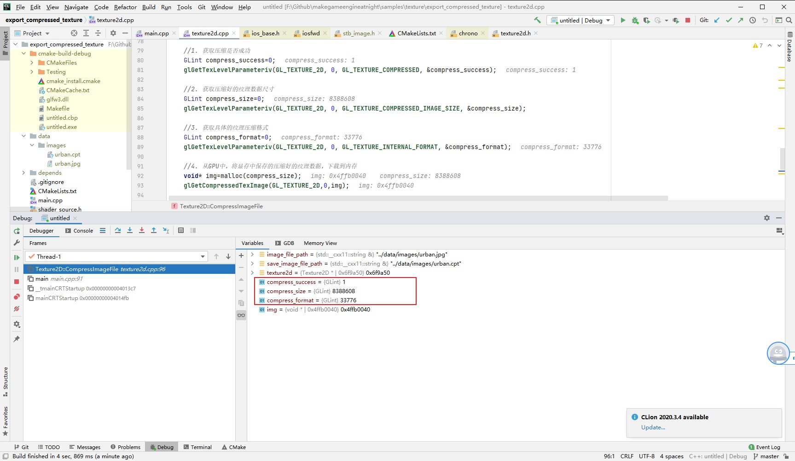
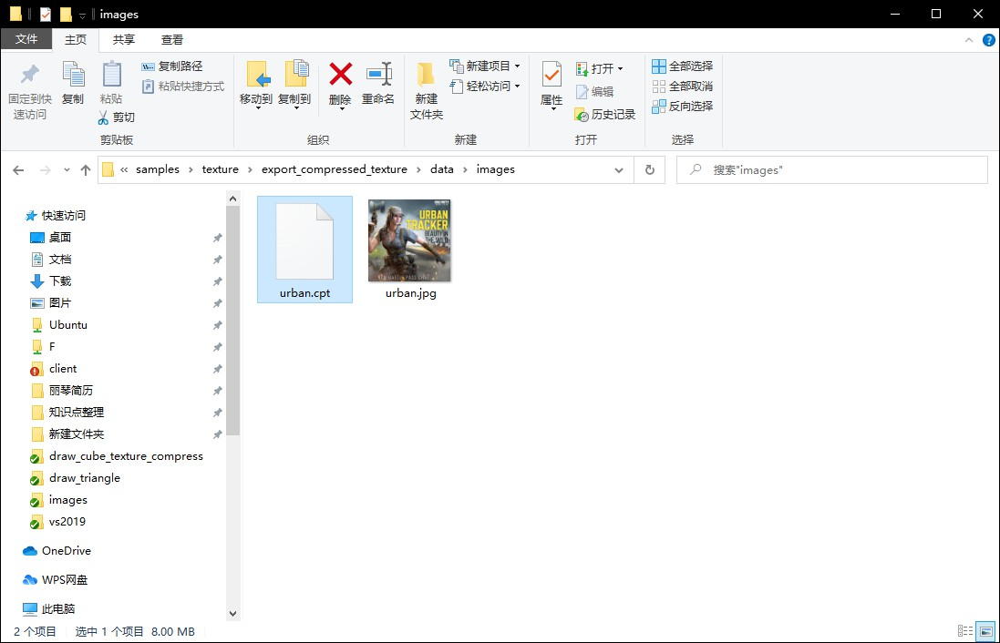
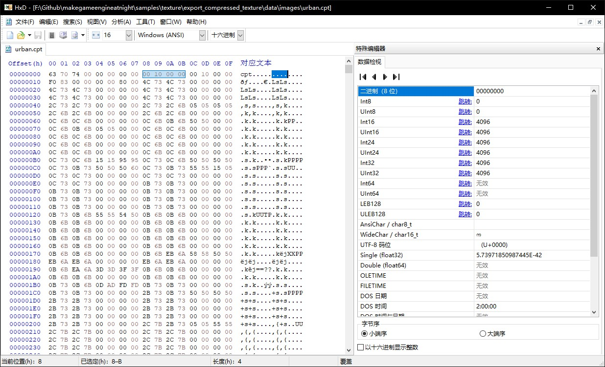

##5.7 图片压缩工具

    CLion项目文件位于 samples\texture\export_compressed_texture

上一节了解了压缩纹理的优势 以及需要进行优化的点，这一节就来实现优化所需的图片压缩工具。

GPU将上传的RGB数据进行压缩保存之后，我们可以借助OpenGL提供的接口`glGetCompressedTexImage`，将GPU中压缩好的纹理数据，从显存下载到内存，下面就来实践。

###1. 从GPU下载压缩好的纹理数据

在`texture2d.cpp`添加函数 `CompressImageFile` ，代码如下：

```c++
void Texture2D::CompressImageFile(std::string& image_file_path,std::string& save_image_file_path) {

    Texture2D* texture2d=LoadFromFile(image_file_path);

    //1. 获取压缩是否成功
    GLint compress_success=0;
    glGetTexLevelParameteriv(GL_TEXTURE_2D, 0, GL_TEXTURE_COMPRESSED, &compress_success);

    //2. 获取压缩好的纹理数据尺寸
    GLint compress_size=0;
    glGetTexLevelParameteriv(GL_TEXTURE_2D, 0, GL_TEXTURE_COMPRESSED_IMAGE_SIZE, &compress_size);

    //3. 获取具体的纹理压缩格式
    GLint compress_format=0;
    glGetTexLevelParameteriv(GL_TEXTURE_2D, 0, GL_TEXTURE_INTERNAL_FORMAT, &compress_format);

    //4. 从GPU中，将显存中保存的压缩好的纹理数据，下载到内存
    void* img=malloc(compress_size);
    glGetCompressedTexImage(GL_TEXTURE_2D,0,img);
}
```

相关接口定义如下：
```c++
/** 
 * @brief 获取指定mipmap层级纹理的相关信息;
 * @param target 目标纹理，GL_TEXTURE_2D(2D纹理)
 * @param level 当图片数据是包含多个mipmap层级时，指定使用mipmap层级。
 * @param pname 想获得什么信息？GL_TEXTURE_COMPRESSED(纹理压缩是否成功) GL_TEXTURE_COMPRESSED_IMAGE_SIZE(纹理压缩后的大小) GL_TEXTURE_INTERNAL_FORMAT(纹理压缩后的格式)
 * @param params 用来接收查询结果的指针
 * @return
 */
void glGetTexLevelParameteriv(GLenum   target, GLint   level, GLenum   pname, GLint  * params);

/** 
 * @brief 下载指定mipmap层级压缩纹理数据;
 * @param target 目标纹理，GL_TEXTURE_2D(2D纹理)
 * @param level 当图片数据是包含多个mipmap层级时，指定使用mipmap层级。
 * @param img 用来保存纹理数据的内存块指针
 * @return
 */
void glGetCompressedTexImage(GLenum   target, GLint   level, void * img);
```


然后在`main`函数中进行调用。
```c++
int main(void)
{
    init_opengl();

    //从GPU中，将显存中保存的压缩好的纹理数据，下载到内存，并保存到硬盘。
    std::string src_image_file_path("../data/images/urban.jpg");
    std::string cpt_file_path("../data/images/urban.cpt");
    Texture2D::CompressImageFile(src_image_file_path,cpt_file_path);

    ......
}
```

运行项目测试，断点查看，数据已经从GPU下载到内存中，数据大小为8388608字节。


###2. 将纹理数据保存为文件
上面只是将GPU中压缩好的纹理数据，从显存下载到内存，现在来进行最后一步，保存为文件。
在函数 `CompressImageFile` 添加保存文件的代码。

```c++
void Texture2D::CompressImageFile(std::string& image_file_path,std::string& save_image_file_path) {
    ....

    //4. 保存为文件
    ofstream output_file_stream(save_image_file_path,ios::out | ios::binary);
    output_file_stream.write((char*)img,compress_size);
    output_file_stream.close();
}
```

运行项目，可以看到纹理数据被保存到文件 `urban.cpt` 中。


    cpt 是我取自`compressed texture`的缩写。

###3. 添加文件头

压缩纹理数据已经从GPU下载到内存，并保存为`.cpt`文件，但是文件仍然不是完全体，还需要进化。

在调用OpenGL提供的接口，上传图片数据到GPU时，除了需要传入图片数据，还需要传入图片mipmap层级、宽、高、压缩纹理格式等信息，现在`.cpt` 文件里面只有图片数据，所以还需要将其他的参数写入到`.cpt` 文件。

因为这些数据要在读取`.cpt`文件最开始的时候读取，所以将其作为文件头写入。

可以用一个文件头结构体来组织这些信息，在 `texture2d.h` 定义结构体`TpcFileHead`:
```c++
//tcp文件头
struct TpcFileHead
{
    char type_[3];
    int mipmap_level_;
    int width_;
    int height_;
    int gl_texture_format_;
    int compress_size_;
};
```

在函数 `CompressImageFile` 添加写入文件头的代码。

```c++
void Texture2D::CompressImageFile(std::string& image_file_path,std::string& save_image_file_path) {
    ....

    //5. 保存为文件
    ofstream output_file_stream(save_image_file_path,ios::out | ios::binary);

    TpcFileHead tcp_file_head;
    tcp_file_head.type_[0]='c';
    tcp_file_head.type_[1]='p';
    tcp_file_head.type_[2]='t';
    tcp_file_head.mipmap_level_=texture2d->mipmap_level_;
    tcp_file_head.width_=texture2d->width_;
    tcp_file_head.height_=texture2d->height_;
    tcp_file_head.gl_texture_format_=compress_format;
    tcp_file_head.compress_size_=compress_size;

    output_file_stream.write((char*)&tcp_file_head,sizeof(TpcFileHead));
    output_file_stream.write((char*)img,compress_size);
    output_file_stream.close();
}
```

再次运行项目测试，并用十六进制编辑器打开`urban.cpt`文件，查看文件头是否正常写入。


下一步，就可以直接加载`urban.cpt`文件进行渲染。