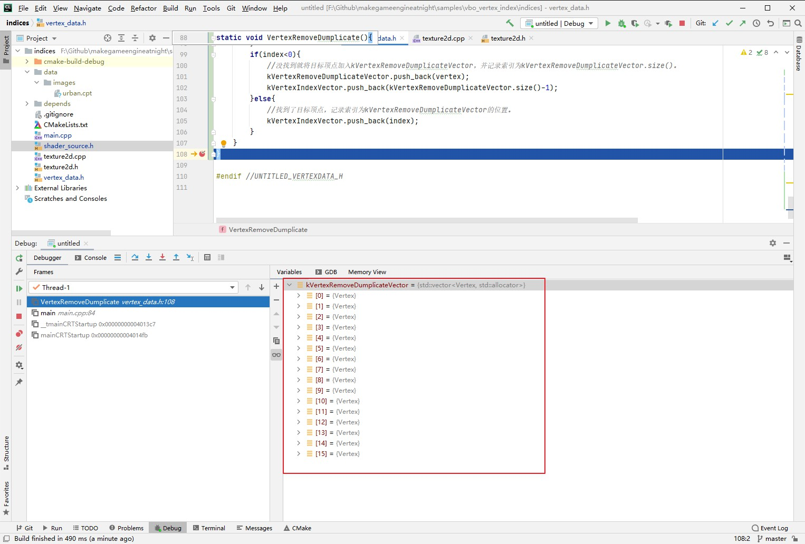
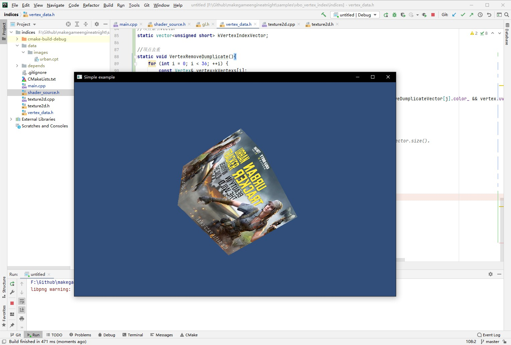

##6.1 顶点索引


回顾`3.2 画个正方形` 这一章的实例，绘制一个正方形，需要上传6个顶点数据到GPU。
但是我们都知道，实际上只有4个顶点数据。只是为了凑成2个三角形，将这4个顶点分为了 3 3 两份。

重复的顶点不仅增加了上传到GPU的数据量，也增加了GPU顶点着色器的执行次数(每个顶点执行一次)。

OpenGL提供了新的机制 - `顶点索引`，来进行优化。

###1. 何为顶点索引
从实例代码中也可以看到，顶点坐标数据一个个数组，那么顶点索引就是这个数组的index。
以正方形的顶点坐标数据为例：
```c++
static const glm::vec3 Positions[6] =
{
    //第一个三角形
    { -1.0f, -1.0f, 0.0f},//左下
    {  1.0f, -1.0f, 0.0f},//右下
    {  1.0f,  1.0f, 0.0f},//右上

    //第二个三角形
    {  1.0f,  1.0f, 0.0f},//右上
    { -1.0f, -1.0f, 0.0f},//左上
    { -1.0f,  1.0f, 0.0f}//左下
};
```

去掉重复，实际上只有4个顶点：
```c++
static const glm::vec3 Positions[4] =
{
    { -1.0f, -1.0f, 0.0f},//左下
    {  1.0f, -1.0f, 0.0f},//右下
    {  1.0f,  1.0f, 0.0f},//右上
    { -1.0f, -1.0f, 0.0f},//左上
};
```

这4个顶点，要怎么组成2个三角形呢？
去重后顶点坐标数据不可以重复，但是可以新建一个数组，存储重复的顶点索引。
```c++
static const glm::vec3 indices[6] =
{
    //第一个三角形
    0,1,2,
    //第二个三角形
    2,3,1
};
```

借助顶点索引数组，间接地组成了2个三角形。

###2. 何为顶点？

    本段落CLion项目文件位于 samples\vertex_index_and_buffer\vertex

上面说了，将顶点坐标去重，然后新建数组存储下标，那么顶点颜色和UV坐标怎么处理呢？

这里我们要明确一个概念 -- <font color=blue>顶点是什么？
一个顶点，包含了顶点坐标、顶点颜色、UV坐标这三个数据。</font>

三者任意之一不同，那么就是2个不同的顶点。
所以使用顶点索引需要进行去重，是去掉三者完全相同的顶点。

为了更深入理解顶点概念，对`vertex_data.h`进行修改，引入`struct  Vertex`，并将之前的顶点坐标(kPositions)、顶点颜色(kColors)、UV坐标(kUvs)这三个数据合并为顶点(kVertexs)。


```c++
//顶点
struct  Vertex
{
    glm::vec3 pos_;
    glm::vec4 color_;
    glm::vec2 uv_;
};

static const Vertex kVertexs[36] ={
    //Front
    glm::vec3(-1.0f, -1.0f, 1.0f), glm::vec4(1.0f,1.0f,1.0f,1.0f),   glm::vec2(0.0f, 0.0f),
    glm::vec3( 1.0f, -1.0f, 1.0f), glm::vec4(1.0f,1.0f,1.0f,1.0f),   glm::vec2(1.0f, 0.0f),
    glm::vec3( 1.0f,  1.0f, 1.0f), glm::vec4(1.0f,1.0f,1.0f,1.0f),   glm::vec2(1.0f, 1.0f),

    glm::vec3(-1.0f, -1.0f, 1.0f), glm::vec4(1.0f,1.0f,1.0f,1.0f),   glm::vec2(0.0f, 0.0f),
    glm::vec3( 1.0f,  1.0f, 1.0f), glm::vec4(1.0f,1.0f,1.0f,1.0f),   glm::vec2(1.0f, 1.0f),
    glm::vec3(-1.0f,  1.0f, 1.0f), glm::vec4(1.0f,1.0f,1.0f,1.0f),   glm::vec2(0.0f, 1.0f),

    //back
    glm::vec3(-1.0f, -1.0f, -1.0f), glm::vec4(1.0f,1.0f,1.0f,1.0f),   glm::vec2(0.0f, 0.0f),
    ......
};
```

然后在将顶点数据与顶点Shader属性进行关联时，需要加上指针偏移，代码如下：

```c++
//main.cpp

//启用顶点Shader属性(a_pos)，指定与顶点坐标数据进行关联
glEnableVertexAttribArray(vpos_location);
glVertexAttribPointer(vpos_location, 3, GL_FLOAT, false, sizeof(Vertex), kVertexs);

//启用顶点Shader属性(a_color)，指定与顶点颜色数据进行关联
glEnableVertexAttribArray(vcol_location);
glVertexAttribPointer(vcol_location, 4, GL_FLOAT, false, sizeof(Vertex), ((float*)kVertexs) + 3);

//启用顶点Shader属性(a_uv)，指定与顶点UV数据进行关联
glEnableVertexAttribArray(a_uv_location);
glVertexAttribPointer(a_uv_location, 2, GL_FLOAT, false, sizeof(Vertex), ((float*)kVertexs) + 3 + 4);
```

代码修改后，模糊掉了顶点坐标、顶点颜色、UV坐标这三个数据，面对的就是顶点这个整体。


###3. 使用顶点索引绘制立方体
下面就在上一段落的实例项目基础之上，使用顶点索引绘制立方体。

    CLion项目文件位于 samples\vertex_index_and_buffer\indices

####3.1 去除重复顶点

上一段落的实例项目，存有36个顶点在`kVertexs[36]`中，首先编写代码将顶点数据去重：
```c++ 
//vertex_data.h

//去重的顶点Vector
static vector<Vertex> kVertexRemoveDumplicateVector;
//顶点索引Vector
static vector<unsigned short> kVertexIndexVector;

//顶点去重
static void VertexRemoveDumplicate(){
    for (int i = 0; i < 36; ++i) {
        const Vertex& vertex=kVertexs[i];
        //判断顶点是否存在
        ......
    }
}

```

断点调试，发现顶点去重后只剩下16个，节省了一大半内存。




后续渲染就使用去重后的顶点数据(kVertexRemoveDumplicateVector) 和 顶点索引(kVertexIndexVector)。

####3.2 使用顶点索引绘制

首先将去重后的顶点数据(kVertexRemoveDumplicateVector)与Shader属性进行绑定:
```c++
//启用顶点Shader属性(a_pos)，指定与顶点坐标数据进行关联
glVertexAttribPointer(vpos_location, 3, GL_FLOAT, false, sizeof(Vertex), (float*)(&kVertexRemoveDumplicateVector[0]));
//启用顶点Shader属性(a_color)，指定与顶点颜色数据进行关联
glVertexAttribPointer(vcol_location, 4, GL_FLOAT, false, sizeof(Vertex), ((float*)(&kVertexRemoveDumplicateVector[0]) + 3));
//顶启用顶点Shader属性(a_uv)，指定与点UV数据进行关联
glVertexAttribPointer(a_uv_location, 2, GL_FLOAT, false, sizeof(Vertex), ((float*)(&kVertexRemoveDumplicateVector[0]) + 3 + 4));
```


然后使用顶点索引(kVertexIndexVector)进行绘制，需要引入新的API - `glDrawElements`。

    void glDrawElements(GLenum mode,GLsizei count,GLenum type,const void * indices);

    参数解析：
    mode    几何图元类型，可选 GL_POINT(点)、GL_LINE(线)、GL_TRIANGLES(三角形)
    count   几何图元数量
    type    索引数据类型
    indices 索引数组


将原来的代码修改为：

```c++
//glDrawArrays(GL_TRIANGLES, 0, 6*6);//表示从第0个顶点开始画，总共画6个面，每个面6个顶点。
glDrawElements(GL_TRIANGLES,36,GL_UNSIGNED_SHORT,(float*)(&kVertexIndexVector[0]));//使用顶点索引进行绘制。
```

再次编译运行，结果正常：

