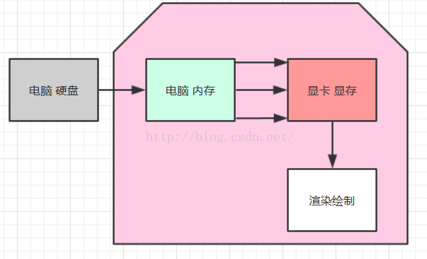
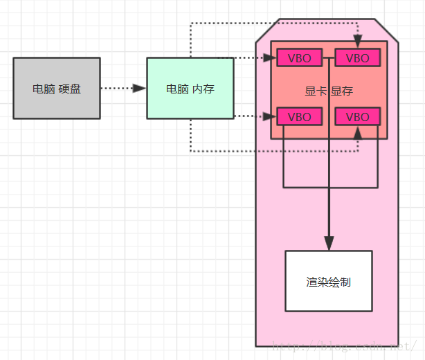
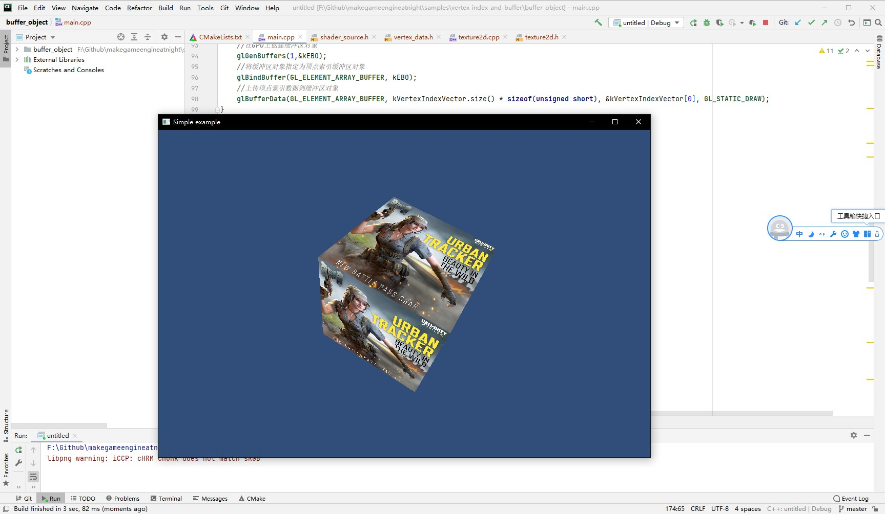

##6.2 缓冲区对象

    CLion项目文件位于 samples\vertex_index_and_buffer\vbo

上一节使用 `glDrawElements` 通过顶点索引进行绘制，大幅度减少了上传到GPU的数据，但是仍然是每一帧都上传一次。
是否可以将数据缓存在GPU，这样只需要上传一次即可？

OpenGL引入了`Buffer Object`，即缓冲区对象。

在之前的例子，顶点数据和顶点索引的流向如下图：


从硬盘读取模型数据，拷贝到内存中，然后每次绘制的时候上传到显卡。
平时玩游戏的时候，每过一个场景，都会打开一个 Loading 界面，在Loading 界面出现的时候，就是从硬盘中读取顶点数据到设备内存中。
当要渲染的时候，就直接从内存中把顶点数据读取出来，然后上传到显卡的显存中。

使用缓冲区对象之后，如下图：


顶点数据上传到GPU之后，就缓存起来，后续渲染直接从显存获取。

使用缓冲区对象进行绘制分为以下步骤：
1. 创建VBO(顶点缓冲区对象) 和 EBO(索引缓冲区对象)，并上传数据
2. 将Shader变量和缓冲区对象进行关联
3. 使用EBO绘制

下面一一来看。

###1. 创建VBO和EBO，并上传数据
```c++
//main.cpp

//创建VBO和EBO
void GeneratorBufferObject()
{
    //在GPU上创建缓冲区对象
    glGenBuffers(1,&kVBO);
    //将缓冲区对象指定为顶点缓冲区对象
    glBindBuffer(GL_ARRAY_BUFFER, kVBO);
    //上传顶点数据到缓冲区对象
    glBufferData(GL_ARRAY_BUFFER, kVertexRemoveDumplicateVector.size() * sizeof(Vertex), &kVertexRemoveDumplicateVector[0], GL_STATIC_DRAW);

    //在GPU上创建缓冲区对象
    glGenBuffers(1,&kEBO);
    //将缓冲区对象指定为顶点索引缓冲区对象
    glBindBuffer(GL_ELEMENT_ARRAY_BUFFER, kEBO);
    //上传顶点索引数据到缓冲区对象
    glBufferData(GL_ELEMENT_ARRAY_BUFFER, kVertexIndexVector.size() * sizeof(unsigned short), &kVertexIndexVector[0], GL_STATIC_DRAW);
}
```

在GPU上创建对象，都是分三步，调用3个API：
1. glGenxxxx 在GPU上进行创建xx对象
2. glBindxxx 将xx对象指定为类型
3. glxxxxxxx 上传数据

与创建纹理对象进行对比：
<table>
<tr bgcolor="AliceBlue"><td><b>步骤</td><td><b>纹理</td><td><b></td><td><b>VBO</td><td><b></td></tr>
<tr><td>1</td><td>glGenTextures</td><td>通知显卡创建纹理对象</td><td>glGenBuffers</td><td>在GPU创建缓冲区对象</td></tr>
<tr><td>2</td><td>glBindTexture</td><td>将纹理绑定到特定纹理目标</td><td>glBindBuffer</td><td>将缓冲区对象指定为顶点索引缓冲区对象</td></tr>
<tr><td>3</td><td>glTexImage2D</td><td>将图片rgb数据上传到GPU;</td><td>glBufferData</td><td>上传顶点索引数据到缓冲区对象</td></tr>
</table>

简单介绍这3个API：
```c++
/**
*@brief 在GPU上创建缓冲区对象
*@param n 创建个数
*@param buffers 缓冲区句柄
*/
void glGenBuffers(GLsizei   n, GLuint  * buffers);
```

```c++
/**
*@brief 将缓冲区对象指定为特定目标
*@param target 目标，常用GL_ARRAY_BUFFER(顶点属性缓冲区) GL_ELEMENT_ARRAY_BUFFER(顶点索引缓冲区)
*@param buffers 缓冲区句柄
*/
void glBindBuffer(GLenum   target, GLuint   buffer);
```

```c++
/**
*@brief 将缓冲区对象指定为特定目标
*@param target 目标，常用GL_ARRAY_BUFFER(顶点属性缓冲区) GL_ELEMENT_ARRAY_BUFFER(顶点索引缓冲区)
*@param size 顶点索引数据size
*@param data 顶点索引数组
*@param usage 缓冲区使用方式，常用GL_STATIC_DRAW(仅修改一次后重复使用)
*/
void glBufferData(GLenum   target, GLsizeiptr   size, const void * data, GLenum   usage);
```

###2. 将Shader变量和缓冲区对象进行关联

之前是直接将顶点属性数据和Shader变量进行关联，代码如下：
```c++
//启用顶点Shader属性(a_pos)，指定与顶点坐标数据进行关联
glVertexAttribPointer(vpos_location, 3, GL_FLOAT, false, sizeof(glm::vec3), kPositions);
//顶启用顶点Shader属性(a_uv)，指定与点UV数据进行关联
glVertexAttribPointer(a_uv_location, 2, GL_FLOAT, false, sizeof(glm::vec2), kUvs);
```

现在数据都上传到VBO了，那么就需要将Shader变量和缓冲区对象句柄进行关联，代码修改如下：
```c++
//指定当前使用的VBO
glBindBuffer(GL_ARRAY_BUFFER, kVBO);
//将Shader变量(a_pos)和顶点坐标VBO句柄进行关联，最后的0表示数据偏移量。
glVertexAttribPointer(vpos_location, 3, GL_FLOAT, false, sizeof(Vertex), 0);
//启用顶点Shader属性(a_color)，指定与顶点颜色数据进行关联
glVertexAttribPointer(vcol_location, 4, GL_FLOAT, false, sizeof(Vertex), (void*)(sizeof(float)*3));
//将Shader变量(a_uv)和顶点UV坐标VBO句柄进行关联，最后的0表示数据偏移量。
glVertexAttribPointer(a_uv_location, 2, GL_FLOAT, false, sizeof(Vertex), (void*)(sizeof(float)*(3+4)));
```

函数`glVertexAttribPointer` 最后的参数由顶点属性数组变为了数据偏移量。

数据关联好之后，就可以进行绘制了。

###3. 绘制

上一节使用顶点索引进行绘制时，需要在`glDrawElements`中传入顶点索引数据，每Draw一次都上传一次索引到GPU。

```c++
glDrawElements(GL_TRIANGLES,36,GL_UNSIGNED_SHORT,kIndices);//使用顶点索引进行绘制。
```

现在顶点索引数据都上传到EBO了，就只需要指定当前使用的EBO，然后直接绘制。

```c++
//指定当前使用的顶点索引缓冲区对象
glBindBuffer(GL_ELEMENT_ARRAY_BUFFER, kEBO);
glDrawElements(GL_TRIANGLES,36,GL_UNSIGNED_SHORT,0);//使用顶点索引进行绘制，最后的0表示数据偏移量。
```

编译运行，效果正确：

