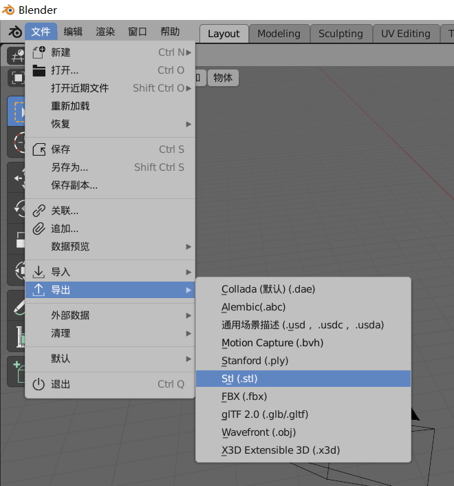

#6. 静态模型的制作与导出

一般来说，模型就是指Mesh，就是静态模型。
不过在客户端程序眼里，静态模型和动画都叫模型，所以这里为了区分，就用静态模型来单指不带动画的模型。

##6.1 静态模型格式

在Blender中，点击文件 导出，就可以看到Blender所支持的导出模型格式。

市面上有多种可供传播的静态模型格式，最常用的：`.obj` `.fbx`。

在3d制作行业，Autodesk处于垄断地位，所以我们在项目中接触到的99%都是fbx。

`fbx`是Autodesk公司的私有模型格式，非开源，开发人员只能通过fbx sdk来获取fbx文件的顶点数据，而fbx sdk只支持个别操作系统，所以fbx是不能直接用于游戏引擎的，引擎开发人员需要编写插件导出fbx数据，存储为引擎的独有模型格式。

    我们把fbx拖到unity中，unity会读取fbx的数据，保存为独有的格式，存储在library目录。

`obj`是一种文本文件格式，可以直接编辑，可以直接用于引擎。

##6.2 模型制作软件

3d行业一般都是Autodesk全家桶，但是Autodesk贵，作为程序员，我们可以选择Blender。

    Blender官网：https://www.blender.org/

Blender是一款开源免费的3D制作软件，极易上手，且极具极客思维，对程序员极其友好，流浪地球电影就由Blender完成制作。

后面的模型制作以及导出，都在Blender中进行。