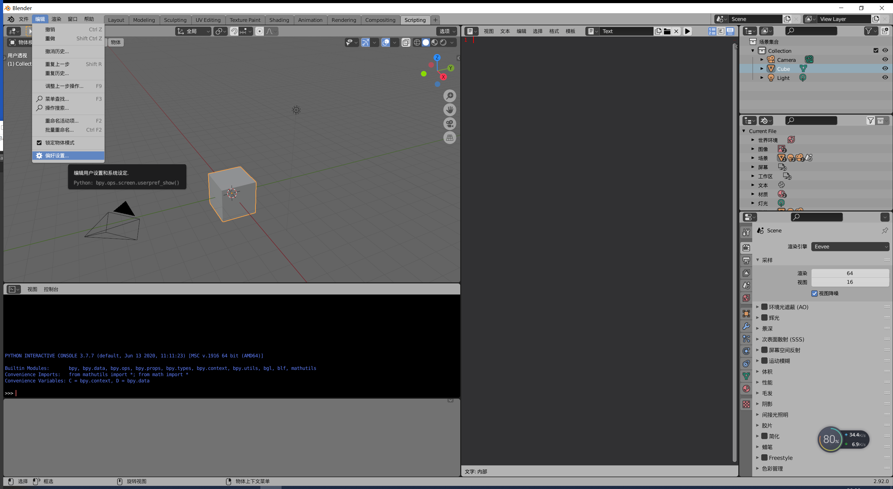
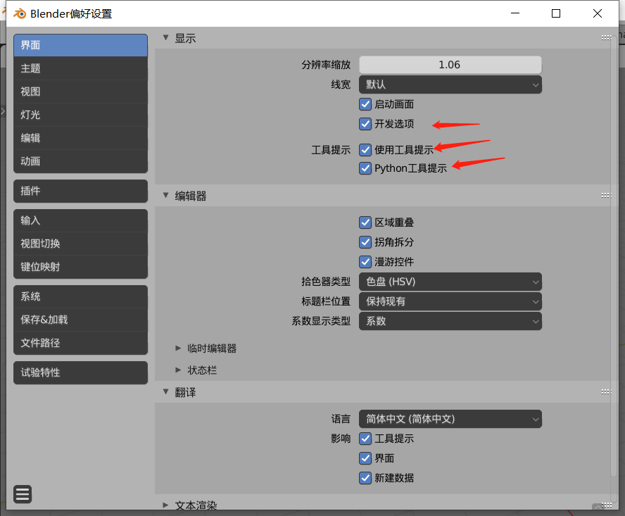
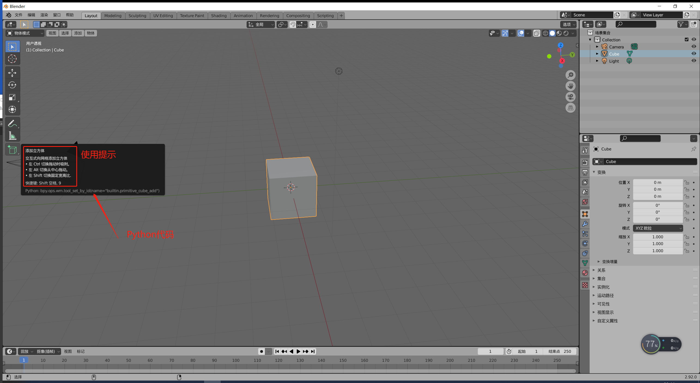
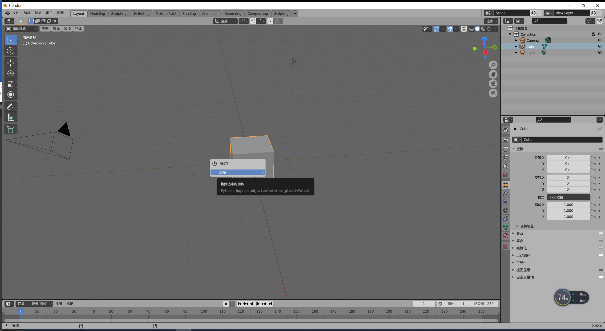
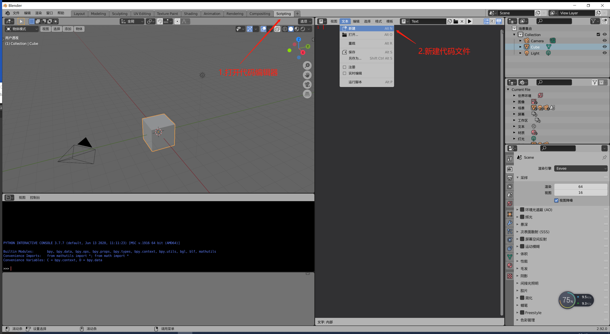
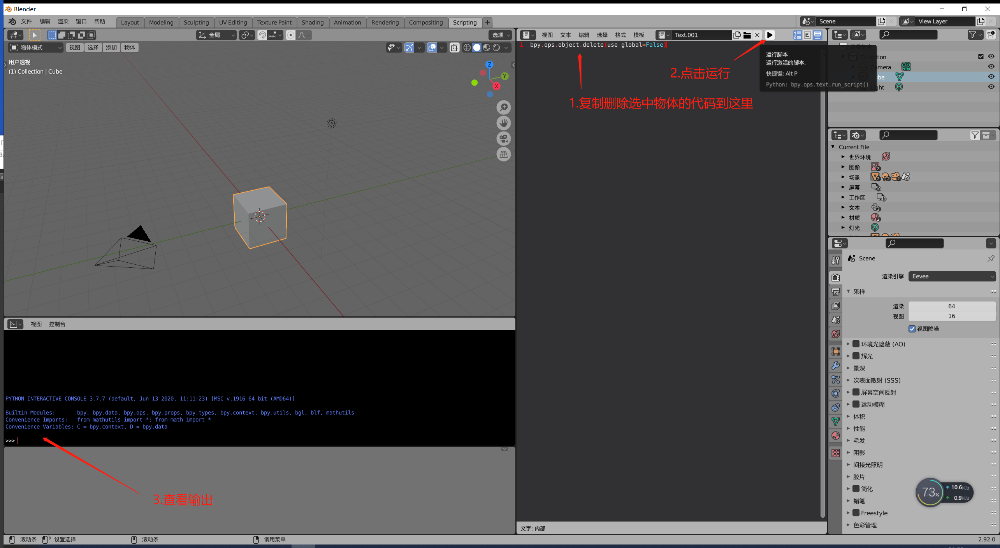
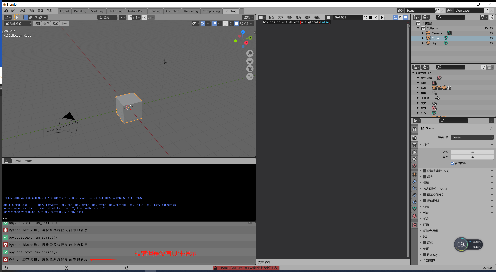
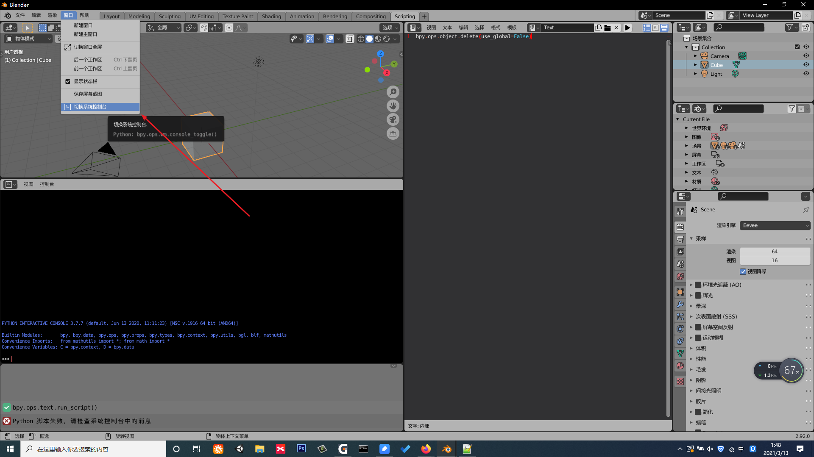
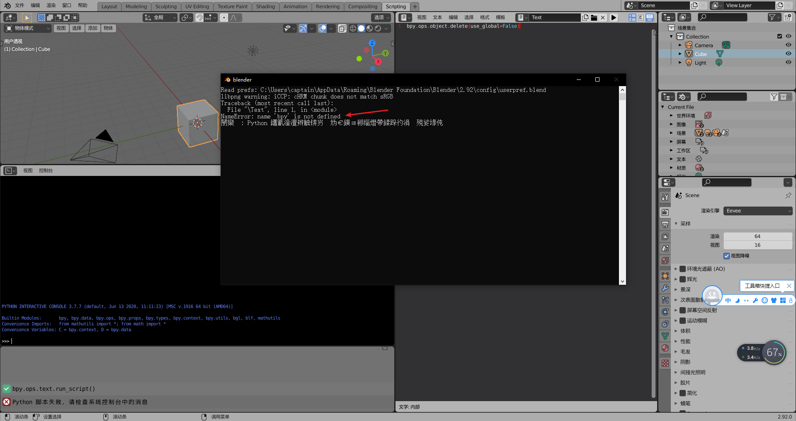
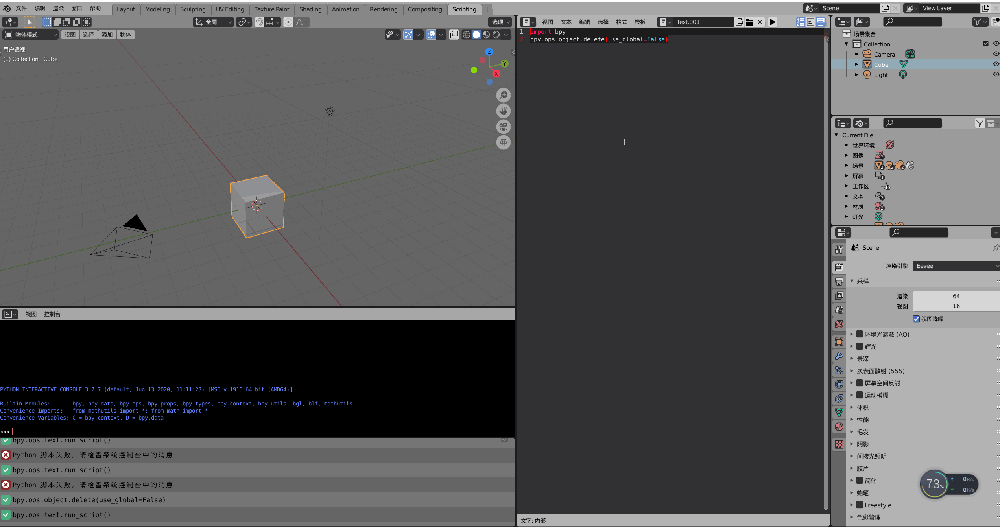

##6.3 Blender Python设置开发环境

###1.开启代码提示

点击菜单 编辑 偏好设置，打开设置界面。





勾选
开发选项
使用工具提示
Python工具提示 

保存后，鼠标放到按钮上，就会有使用提示，以及最重要的 Python代码提示了。



后续写插件，有哪个操作不会，就鼠标移动到按钮上，然后 `Ctrl+C` 就可以这一行Python代码了。

再比如删除选中物体



###2.编写第一行代码

切换到 Scripting 页面，打开代码编辑器，新建代码文件



复制上面的删除 选中物体的代码。
粘贴到代码编辑器中。
点击运行按钮。





出错了，提示到系统控制台中查看错误。

菜单栏 点击窗口--切换系统控制台。






就看到提示，`bpy`没有定义。

在Python里面，调用API必须得先`import`，所以修改代码如下：

```python
import bpy
bpy.ops.object.delete(use_global=False)
```

再次运行，场景中选中的立方体被删除了。

