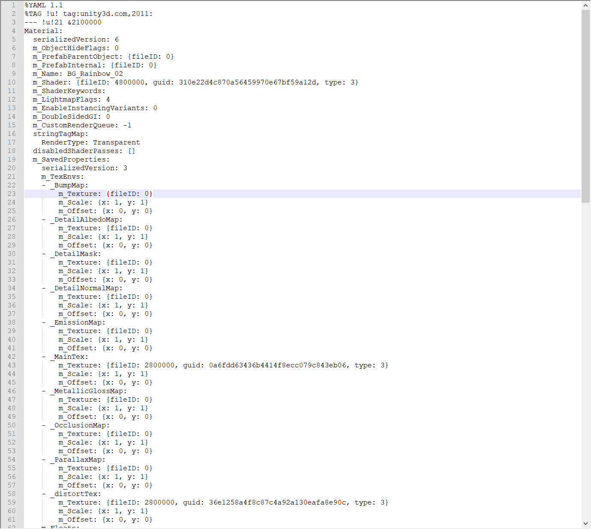

##7. 材质

模型离不开贴图和材质，我们已经学会了绘制贴图，那么材质是什么？

<b>材质是什么？</b>

在Unity里面可以创建一个材质，然后选择Shader，就可以在编辑器里修改Shader里面的字段值、拖图片到材质里。

材质，本质上就是一个文本文件，里面记录了以下信息：

    OpenGL参数
    Shader名字
    Shader参数对应值(int、float、纹理)

下图是Unity的材质文件。




每个游戏引擎使用的格式都不一样。
下面手写一个 Unlit 材质(body.json)：

```json
{
  "blend_method": "OPAQUE",
  "vertex_shader": "unlit.vs",
  "frag_shader": "unlit.fs",
  "tint_color": "0.800000011920929,0.800000011920929,0.800000011920929,1.0",
  "image_paths": [
    "Diffuse_FishSoup_Pot_1.jpg"
  ]
}
```

随着Shader的复杂度增加，材质里面需要填写的参数也随之增多。

在之前的章节，我们实现了绘制带贴图的立方体，在章节实例中，顶点、Shader、图片这几个要素都写死在代码中。
这一章就将他们拆开分类，将顶点保存在Mesh文件中，将Shader、图片等组织到材质中。