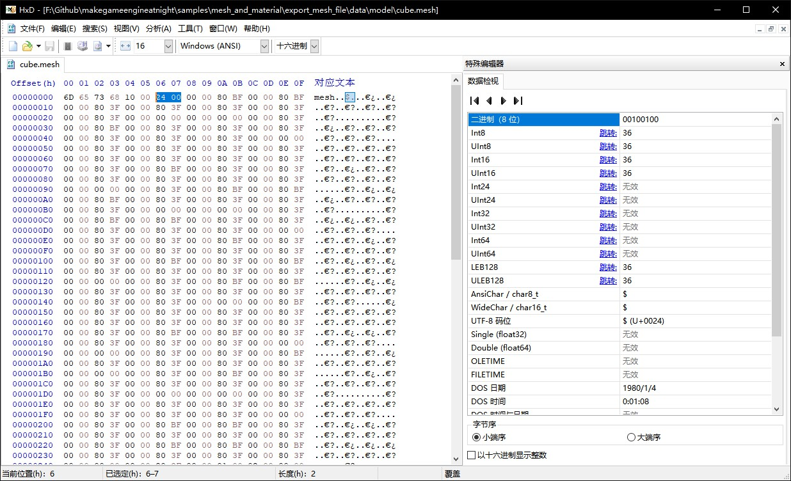

##7.1 导出Mesh文件

    CLion项目文件位于 samples\mesh_and_material\export_mesh_file

这一节将写死在`vertex_data.h`中的立方体顶点数据，存放到自定义格式的`.mesh`文件中。

###1. Mesh文件格式

`.mesh`文件格式如下：

<table><tr>
<td>文件头</td>
<td>顶点个数</td>
<td>索引个数</td>
<td>顶点数据</td>
<td>索引数据</td>
</tr></table>

###2. 导出文件
按照上面的Mesh文件格式，在`vertex_data.h`中新增函数`ExportMesh`导出立方体的顶点数据和索引数据。
```c++
//vertex_data.h

//Mesh文件头
struct MeshFileHead{
    char type_[4];
    int vertex_num_;//顶点个数
    int vertex_index_num_;//索引个数
};

//导出Mesh文件
static void ExportMesh(string save_path){
    ofstream output_file_stream(save_path,ios::out | ios::binary);

    MeshFileHead mesh_file_head;
    mesh_file_head.type_[0]='m';
    mesh_file_head.type_[1]='e';
    mesh_file_head.type_[2]='s';
    mesh_file_head.type_[3]='h';
    mesh_file_head.vertex_num_=kVertexRemoveDumplicateVector.size();
    mesh_file_head.vertex_index_num_=kVertexIndexVector.size();
    //写入文件头
    output_file_stream.write((char*)&mesh_file_head, sizeof(mesh_file_head));
    //写入顶点数据
    output_file_stream.write((char*)&kVertexRemoveDumplicateVector[0],kVertexRemoveDumplicateVector.size()*sizeof(Vertex));
    //写入索引数据
    output_file_stream.write((char*)&kVertexIndexVector[0],kVertexIndexVector.size()*sizeof(unsigned short));
    output_file_stream.close();
}
```

在`main.cpp`中调用：

```c++
int main(void)
{
    VertexRemoveDumplicate();

    ExportMesh("../data/model/cube.mesh");

    return 0;
    ......
}
```

编译运行，生成了文件`cube.mesh`，拖到十六进制编辑器中查看：
