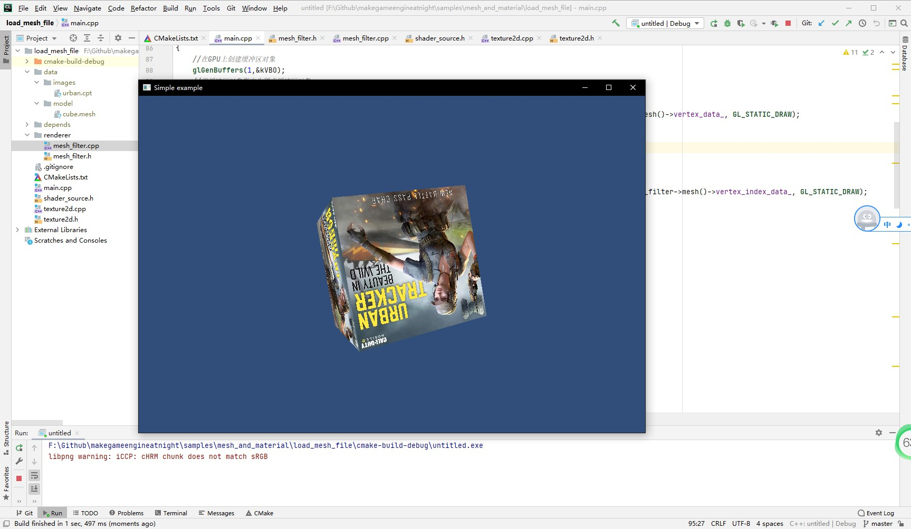

##7.2 使用Mesh文件

    CLion项目文件位于 samples\mesh_and_material\export_mesh_file

顶点数据和索引数据已经存放在`.mesh`文件中，`vertex_data.h`可以删除了。
现在需要做的是，编写代码将`cube.mesh`加载到内存，然后用于渲染。

###1. 加载Mesh
这里参考Unity的命名，创建类 `MeshFilter`负责Mesh的加载与管理，代码文件是`mesh_filter.h`。
将加载Mesh文件的数据存放在名为`Mesh`的结构体中。
```c++
//Mesh数据
struct Mesh{
    unsigned short vertex_num_;//顶点个数
    unsigned short vertex_index_num_;//索引个数
    Vertex* vertex_data_;//顶点数据
    unsigned short* vertex_index_data_;//顶点索引数据
};
```

加载Mesh文件代码如下：
```c++
//mesh_filter.cpp

void MeshFilter::LoadMesh(string mesh_file_path) {
    //读取 Mesh文件头
    ifstream input_file_stream(mesh_file_path,ios::in | ios::binary);
    MeshFileHead mesh_file_head;
    input_file_stream.read((char*)&mesh_file_head,sizeof(mesh_file_head));
    //读取顶点数据
    unsigned char* vertex_data =(unsigned char*)malloc(mesh_file_head.vertex_num_*sizeof(Vertex));
    input_file_stream.read((char*)vertex_data,mesh_file_head.vertex_num_*sizeof(Vertex));
    //读取顶点索引数据
    unsigned short* vertex_index_data=(unsigned short*)malloc(mesh_file_head.vertex_index_num_*sizeof(unsigned short));
    input_file_stream.read((char*)vertex_index_data,mesh_file_head.vertex_index_num_*sizeof(unsigned short));
    input_file_stream.close();

    mesh_=new Mesh();
    mesh_->vertex_num_=mesh_file_head.vertex_num_;
    mesh_->vertex_index_num_=mesh_file_head.vertex_index_num_;
    mesh_->vertex_data_=(Vertex*)vertex_data;
    mesh_->vertex_index_data_=vertex_index_data;
}
```
成功加载后，顶点数据和索引数据就存放在成员变量`mesh_`中，后续只需要调用接口`mesh()`就可以获得。
```c++
//mesh_filter.h

Mesh* mesh(){return mesh_;};//Mesh对象
```

###2. 使用Mesh渲染

只需要在创建缓冲区对象时，指定为Mesh数据即可。
```c++
//main.cpp

//创建VBO和EBO
void GeneratorBufferObject()
{
    //在GPU上创建缓冲区对象
    glGenBuffers(1,&kVBO);
    //将缓冲区对象指定为顶点缓冲区对象
    glBindBuffer(GL_ARRAY_BUFFER, kVBO);
    //上传顶点数据到缓冲区对象
    glBufferData(GL_ARRAY_BUFFER, mesh_filter->mesh()->vertex_num_ * sizeof(MeshFilter::Vertex), mesh_filter->mesh()->vertex_data_, GL_STATIC_DRAW);

    //在GPU上创建缓冲区对象
    glGenBuffers(1,&kEBO);
    //将缓冲区对象指定为顶点索引缓冲区对象
    glBindBuffer(GL_ELEMENT_ARRAY_BUFFER, kEBO);
    //上传顶点索引数据到缓冲区对象
    glBufferData(GL_ELEMENT_ARRAY_BUFFER, mesh_filter->mesh()->vertex_index_num_ * sizeof(unsigned short), mesh_filter->mesh()->vertex_index_data_, GL_STATIC_DRAW);
}
```

编译运行，一切正常:

