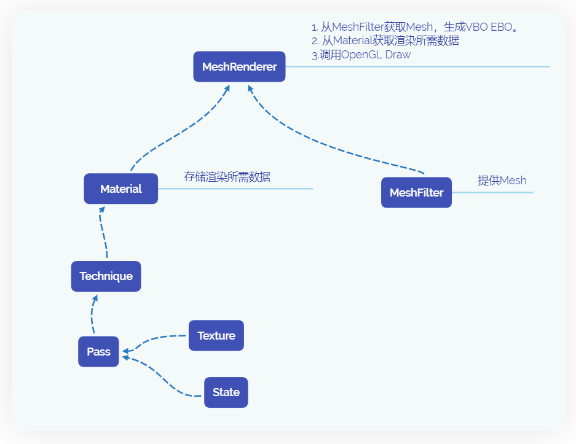
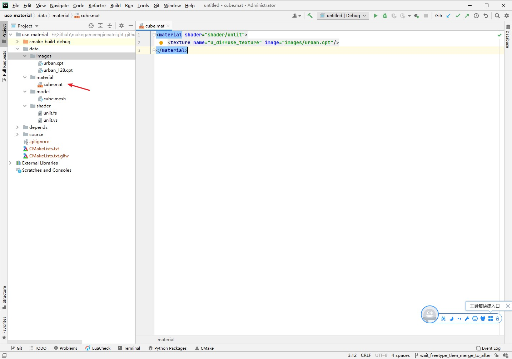

##7.4 材质

模型离不开贴图和材质，我们已经学会了绘制贴图，那么材质是什么？

<b>材质是什么？</b>

在Unity里面可以创建一个材质，然后选择Shader，就可以在编辑器里修改Shader里面的字段值、拖图片到材质里。

材质，本质上就是一个文本文件，里面记录了以下信息：

    OpenGL参数
    Shader名字
    Shader参数对应值(int、float、纹理)

下图是Unity的材质文件。


每个游戏引擎使用的格式都不一样，本节教程使用下面格式的材质文件。

```xml
<material>
    <technique lod="0">
        <pass name="base" shader="shader/unlit">
            <texture name="u_diffuse_texture" image="images/urban.cpt"/>
        </pass>
    </technique>
    <technique lod="1">
        <pass name="base" shader="shader/unlit">
            <texture name="u_diffuse_texture" image="images/urban_128.cpt"/>
        </pass>
    </technique>
</material>
```

这其实是一个`xml`文件，最外层以`material`作为节点，标志这是一个材质文件。
随后是2个`technique`子节点，每个`technique`节点表示一种渲染效果。
`technique`节点下面是多个`pass`节点，每个`pass`存储一次绘制所需要的Shader、图片等资源。

多个`technique`是在不同的`lod`下可以切换，但是同一时刻只有一个`technique`生效
多个`pass`是为了得到更复杂的效果，例如，第一个Pass关闭深度进行绘制，第二个Pass正常绘制，就能得到遮挡半透的效果。

在整个立方体的渲染里，material所处位置如下图：



将上面的内容保存为`cube.mat`，现在资源目录如下：


