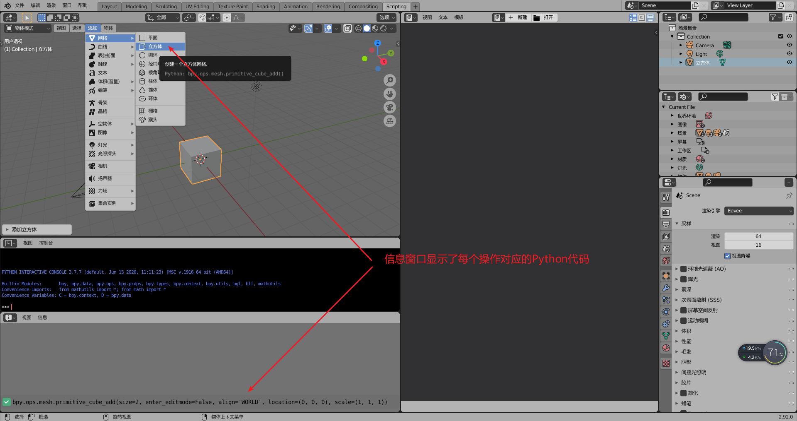
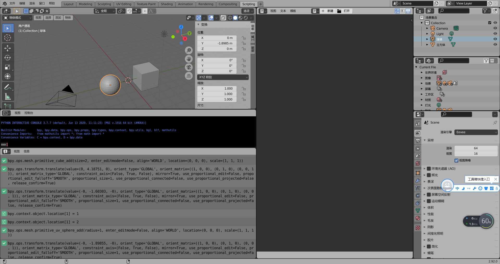
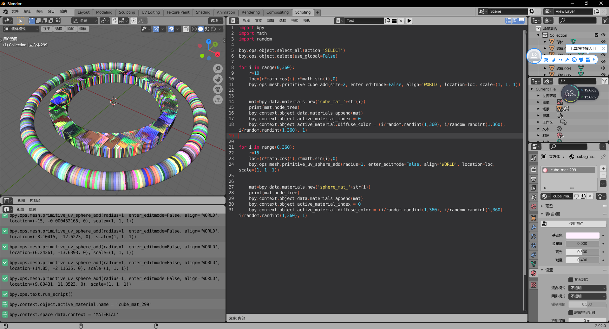

##6.4 Blender Python 创建物体

在Blender中，只要鼠标放到操作按钮上，就会弹出提示，按Ctrl+C就可以复制代码。
基于这种设定，我们可以很方便的搬运代码来实现功能。

那么这次就先来做一些东西，然后再搬运代码来自动化制作。


###1.手动创建多个物体

切换到 Script 界面，在 `信息窗口` 显示了每个操作 对应的 Python 代码。(如下图)



鼠标单击 这行代码，`Ctrl+C`就可以复制下来，真是程序员的好朋友！！

下面创建一个立方体 和 一个球体。
并移动物体。



信息窗口已经显示对应的代码了。

###2.代码创建物体

各种复制粘贴，凑出下面的代码。

```python
import bpy
import math
import random
    
bpy.ops.object.select_all(action='SELECT')
bpy.ops.object.delete(use_global=False)

for i in range(0,360):
    r=10
    loc=(r*math.cos(i),r*math.sin(i),0)
    bpy.ops.mesh.primitive_cube_add(size=2, enter_editmode=False, align='WORLD', location=loc, scale=(1, 1, 1))
    

    mat=bpy.data.materials.new('cube_mat_'+str(i))
    print(mat.node_tree)
    bpy.context.object.data.materials.append(mat)
    bpy.context.object.active_material_index = 0
    bpy.context.object.active_material.diffuse_color = (i/random.randint(1,360), i/random.randint(1,360), i/random.randint(1,360), 1)


for i in range(0,360):
    r=15
    loc=(r*math.cos(i),r*math.sin(i),0)
    bpy.ops.mesh.primitive_uv_sphere_add(radius=1, enter_editmode=False, align='WORLD', location=loc, scale=(1, 1, 1))
    

    mat=bpy.data.materials.new('sphere_mat_'+str(i))
    print(mat.node_tree)
    bpy.context.object.data.materials.append(mat)
    bpy.context.object.active_material_index = 0
    bpy.context.object.active_material.diffuse_color = (i/random.randint(1,360), i/random.randint(1,360), i/random.randint(1,360), 1)

```

运行,效果如下图：

