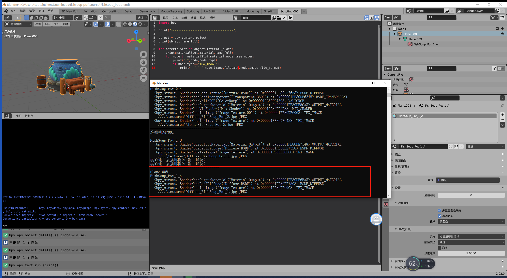

##6.6 Blender Python导出材质和贴图

模型离不开贴图和材质，这一节就从Blender中导出贴图和部分材质属性。

###1.精美模型下载

简单的立方体已经无感了，需要精美的模型才能让人坚持往下学习。

sketchfab就是一个3d模型交流网站，上面提供了付费、免费的模型下载。

    https://sketchfab.com


sketchfab上下载一个 Blender 模型

    https://sketchfab.com/3d-models/fishsoup-pot-5a39e8c683f946b1aeb848dd2e88deb8


下载过来，贴图拖一下，修改为透明。

###2.导出材质和贴图

Blender中的材质，使用了槽+节点的概念。
添加一个新的材质，在Blender界面操作就会提示 添加一个材质槽。

每个材质槽里面又可以添加多个属性节点。



在鱼缸模型里，使用了一个材质，有多个节点。

其中一个就是纹理节点，从纹理节点中可以获取图片文件的信息。

下面的代码 导出这个材质以及图片。

```python
#export_material.py
import bpy
import json
import os
from shutil import copyfile

print("----COLLECT-----------------------------------")

object = bpy.context.object
print("Object:",object.name_full)

for materialSlot in object.material_slots:
    material=materialSlot.material
    print("Material:",material.name_full)
    
    print(" ","Params:")
    print(" ","blend_method:",material.blend_method)
    print(" ","diffuse_color:",material.diffuse_color[0],material.diffuse_color[1],material.diffuse_color[2],material.diffuse_color[3])
    print(" ","metallic:",material.metallic)
    print(" ","pass_index:",material.pass_index)
    print(" ","line_color:",material.line_color[0],material.line_color[1],material.line_color[2],material.line_color[3])
    print(" ","line_priority:",material.line_priority)
    print(" ","roughness:",material.roughness)
    print(" ","shadow_method:",material.shadow_method)
    print(" ","specular_color:",material.specular_color)
    print(" ","specular_intensity:",material.specular_intensity)
    print(" ","use_backface_culling:",material.use_backface_culling)
    print(" ","use_nodes:",material.use_nodes)
    print(" ","use_screen_refraction:",material.use_screen_refraction)
    print(" ","use_sss_translucency:",material.use_sss_translucency)
    
    

    print("Nodes:")
    for node in material.node_tree.nodes:
        print(" ",node,node.type)
        if node.type=="TEX_IMAGE":
            print(" "," ",node.image.filepath,node.image.file_format)
            
print("----EXPORT-----------------------------------")

if os.path.exists("export")==False:
    os.mkdir("export")
    
dir_path="export/"+object.name_full

if os.path.exists(dir_path)==False:
    os.mkdir(dir_path)
    


for materialSlot in object.material_slots:
    material=materialSlot.material
    print("Material:",material.name_full)
    
    export_material={
        "blend_method":material.blend_method,
        "diffuse_color":"{},{},{},{}".format(material.diffuse_color[0],material.diffuse_color[1],material.diffuse_color[2],material.diffuse_color[3]),
        "metallic":material.metallic,
        "roughness":material.roughness,
        "specular_color":"{},{},{}".format(material.specular_color.r,material.specular_color.g,material.specular_color.b),
        "specular_intensity":material.specular_intensity,
        "image_paths":[]
    }
    
    for node in material.node_tree.nodes:
        if node.type=="TEX_IMAGE":
            imgpath=node.image.filepath
            imgpath=imgpath.replace("//","").replace("\\","/")
            
            
            copyfile(imgpath,dir_path+"/"+os.path.split(imgpath)[1])
            export_material["image_paths"].append(os.path.split(imgpath)[1])
            
    print(json.dumps(export_material,indent=2))
    
    with open(dir_path+"/"+material.name_full+'.json', 'w') as f:
        json.dump(export_material, f,indent=2)
        
print("----SUCCESS-----------------------------------")

```


[工程下载](../../files/blender_export_material_mesh_texture/fishsoup-pot.zip)


相关参考：

    https://docs.blender.org/api/current/bpy.types.Material.html#bpy.types.Material.bl_rna_get_subclass
    https://docs.blender.org/api/current/bpy.types.TexPaintSlot.html#bpy.types.TexPaintSlot
    https://docs.blender.org/api/current/bpy.types.Image.html#bpy.types.Image