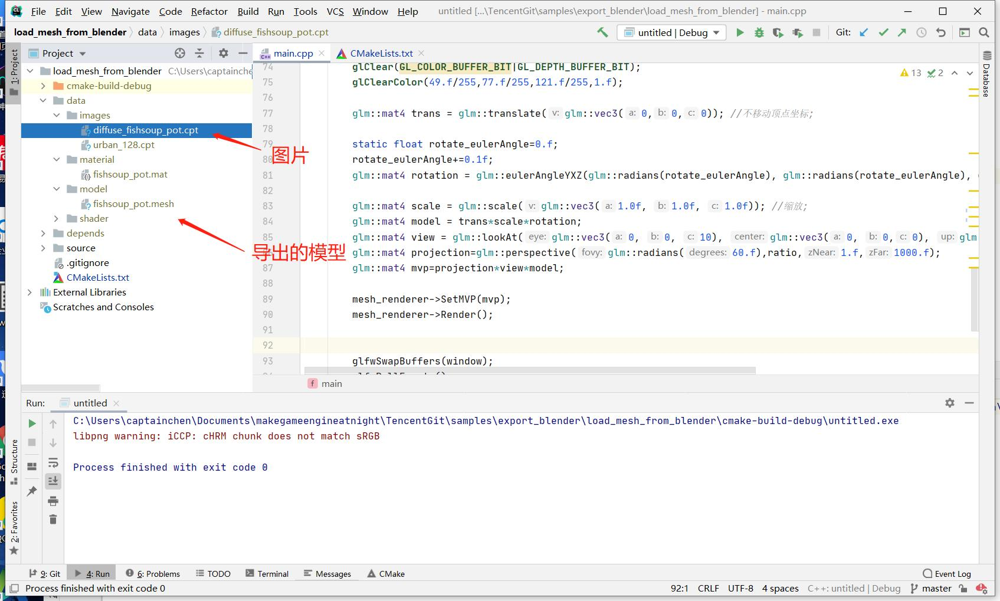
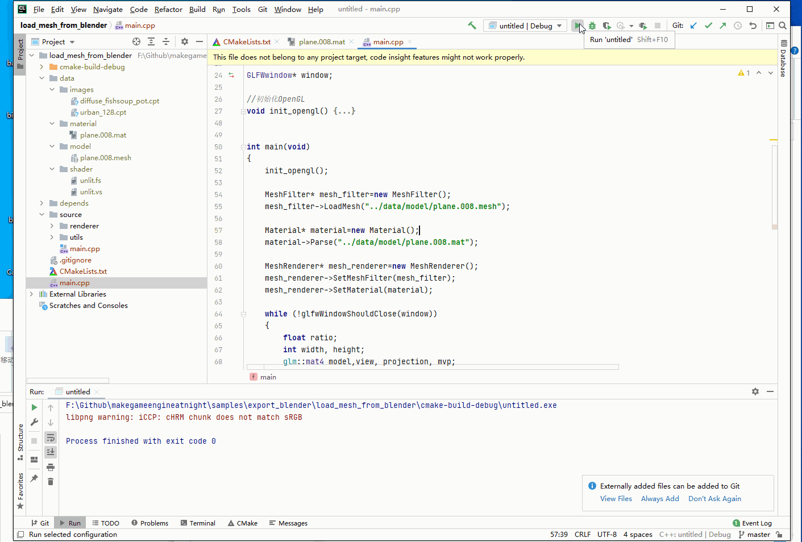

##8.6 加载导出的Mesh

    CLion项目文件位于 samples\export_blender\load_mesh_from_blender

上一节从网上下载了精美模型，并导出了Mesh文件，这一节将它渲染出来。

###1. 编辑材质文件

上一节导出的模型改名为`fishsoup_pot.mesh`和图片文件 已经复制到项目中，打开CLion项目，资源视图如下：



从下载的Blender项目(带了图片)，可以导出`.mesh` 文件和`.cpt`，现在就还差`.mat`材质文件，材质文件就自己编辑一个吧，从之前项目复制然后改下`texture`节点就可以了(如上图)。

###2. 运行测试

只需要修改`main.cpp`中，加载的`.mesh` 文件和`.mat`材质文件路径即可。

```c++
int main(void)
{
    init_opengl();

    MeshFilter* mesh_filter=new MeshFilter();
    mesh_filter->LoadMesh("../data/model/fishsoup_pot.mesh");

    Material* material=new Material();
    material->Parse("../data/model/fishsoup_pot.mat");

    ......
}
```

运行测试。



正常渲染出来了。