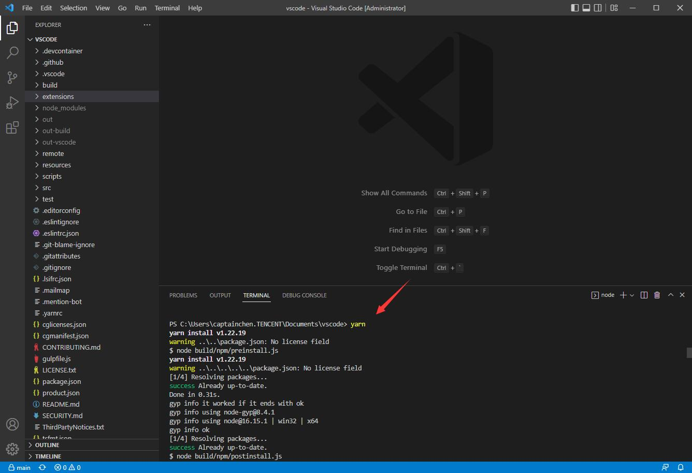
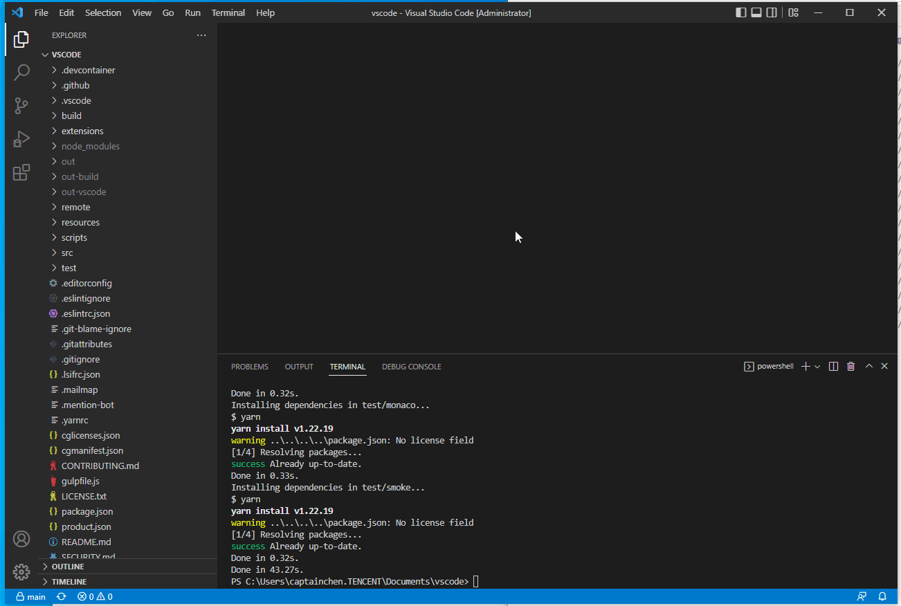
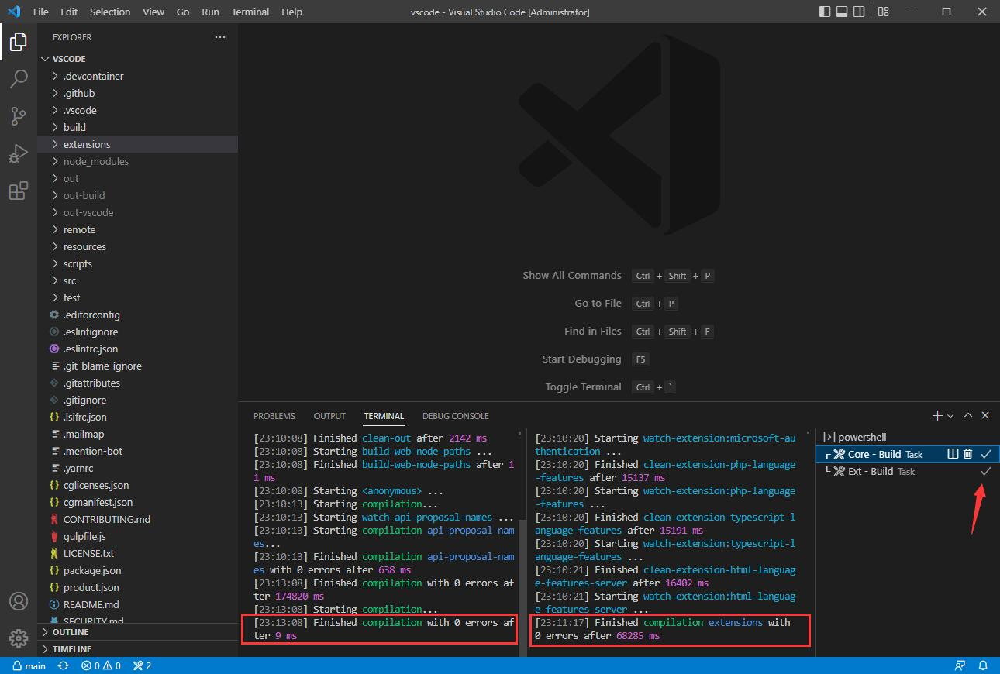
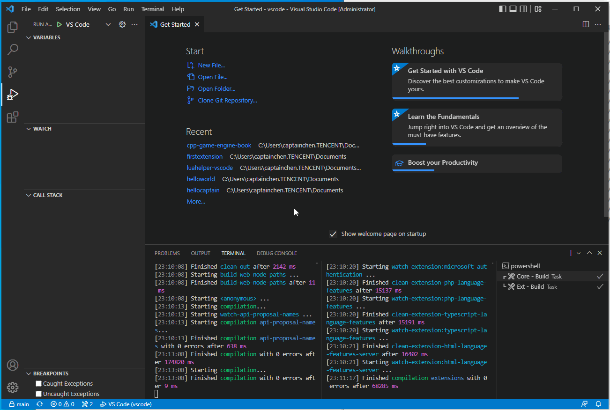
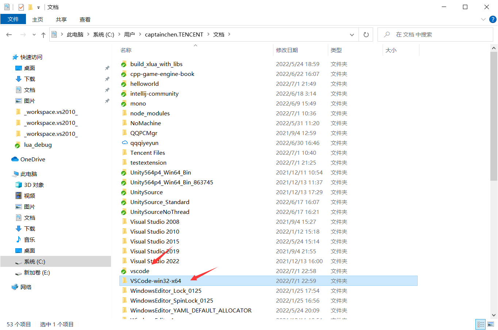
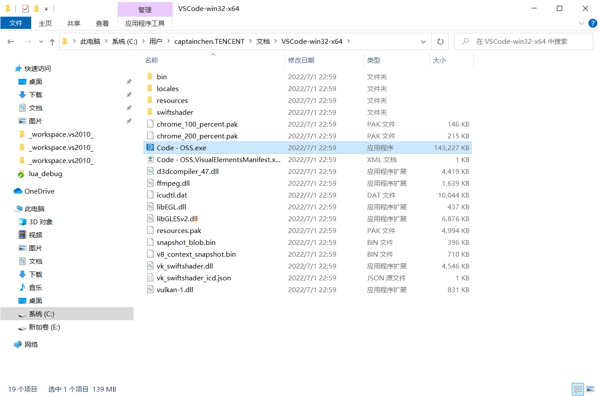
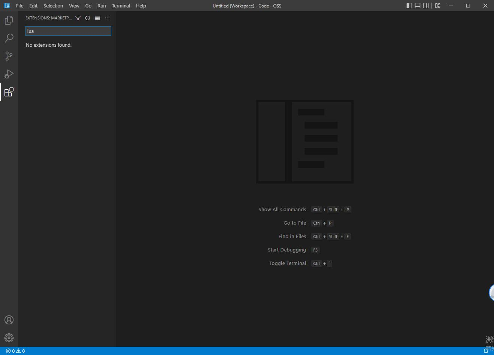

## 88.2 从源码编译VSCode

微软和谷歌采用相同的开源策略，我们日常使用的VSCode/Chrome/Android不是一个开源的产品，但是他们都有对应的开源项目。

|   商业| 开源  |
|---|---|
|  Chrome | Chromium  |
|Android|AOSP|
|VSCode|Code-OSS|

那么，这一节就来介绍，从源码，编译出 VSCode 的开源项目 <b>Code-OSS</b> 。

主要参考官方编译教程：`https://github.com/microsoft/vscode/wiki/How-to-Contribute`

### 1. 获取源码

从官方Github仓库 fork 一份到自己的账户下：`https://github.com/microsoft/vscode`。

然后再 Clone 到本地。


### 2. 配置开发环境

按照上一小节 88.1 第一个VSCode扩展程序 配置开发环境 即可。


### 3. 编译运行

用VSCode打开源码文件夹。

在 Terminal 输入命令 `yarn` 下载依赖包。



然后 `ctrl + shift + b` 编译项目。



需要编译几分钟，然后看到右边不转圈圈了，显示一个√，就说明编译好了。



然后 F5 开始调试。



可以看到新的VSCode程序启动了，标题是 Code - OSS ，表示这是VSCode的开源版本。

### 4. 打包

在Terminal 输入下面命令打包：

```bash
yarn gulp vscode-win32-x64
```

打包完成后的文件夹，存放在源码同级目录。





打开 Code - OSS 。



使用起来和VSCode没什么差别，只是扩展程序商店不能使用。

那现在把 VSCode-win32-x64 这个文件夹打包给别人，他们就能用上你定制的VSCode了。