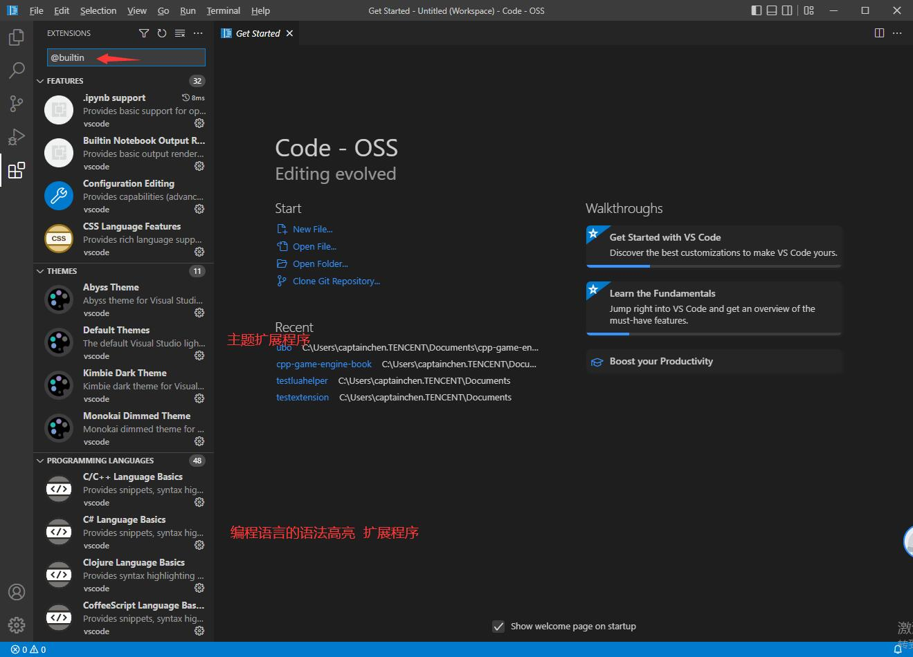
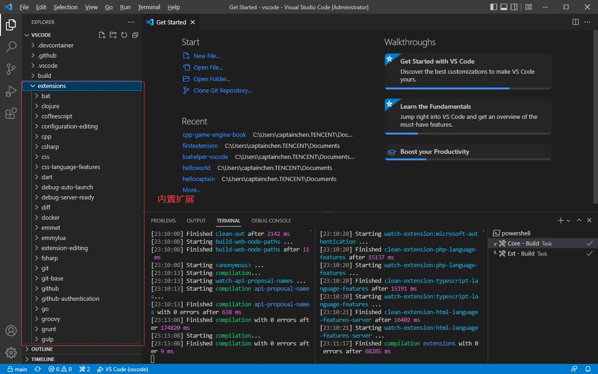
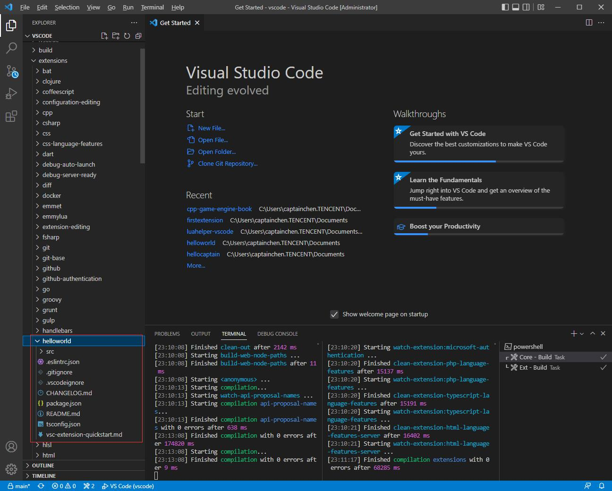
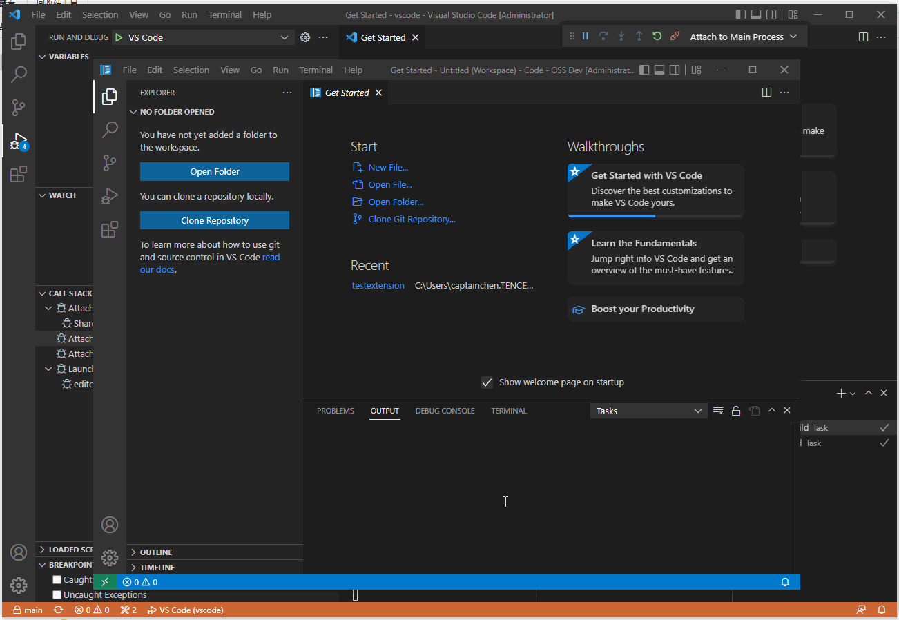
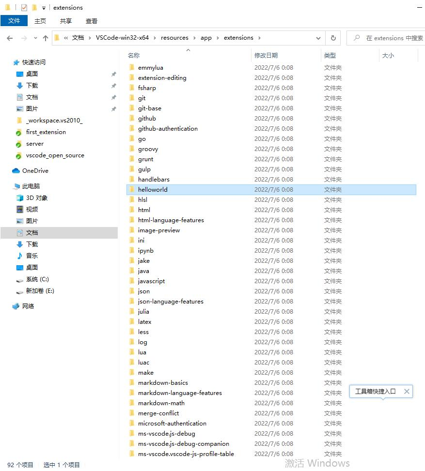

## 88.3 打包VSCode内置扩展

打开 Code - OSS ，发现扩展列表是空的。


这是因为VSCode是一个商业产品，并不是开源的项目。

VSCode扩展商城也是一个商业产品。

那么开源的 Code - OSS 自然就不会支持VSCode扩展商城。

给 Code - OSS 添加扩展有2种形式：

1. 安装扩展程序文件
2. 将扩展程序作为内置扩展打包。

本小节，将前面制作的 HelloWorld 扩展，和VSCode打包到一起，来向大家介绍如何打包VSCode内置扩展。

### 1. 自带的扩展程序

Code - OSS 其实已经自带了多个扩展程序。

在扩展里，输入 `@builtin ` 就会列出内置的扩展程序。



在VSCode源码项目里，有个 extensions 文件夹，内置的扩展程序就在这里。



### 2. 添加内置扩展

将 HelloWorld 扩展程序项目文件夹，复制到 extensions 里。

删除 node_modules 、out 文件夹。

删除 package-lock.json 文件。



在 *build\gulpfile.extensions.js* 里，添加 `'helloworld/tsconfig.json'` 。

在 *build\npm\dirs.js* 里，添加 `'extensions/helloworld'` 。

然后 `yarn` 下载依赖包，再  `ctrl + shift + b` 编译项目。

然后 F5 启动调试，测试是否有 Hello World 命令。



### 3. 打包Code-OSS

在Terminal 输入下面命令打包Code-OSS：

```bash
yarn gulp vscode-win32-x64
```

HelloWorld 扩展程序就会打包到一起。



打开 Code - OSS ，再次测试，是否有 Hello World 命令。


