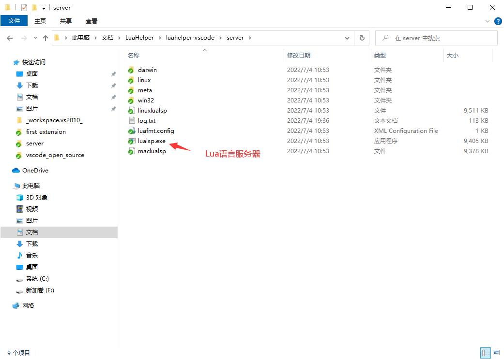
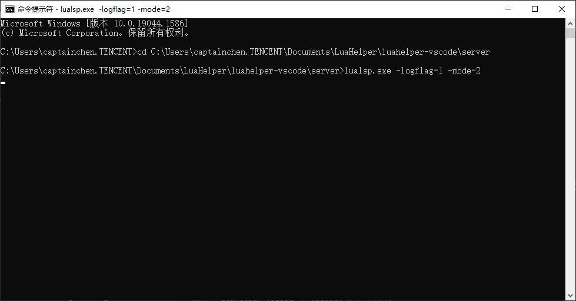
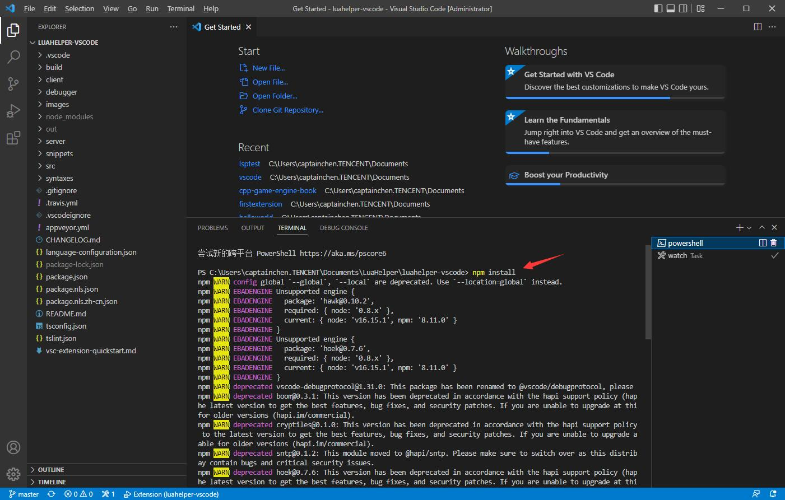
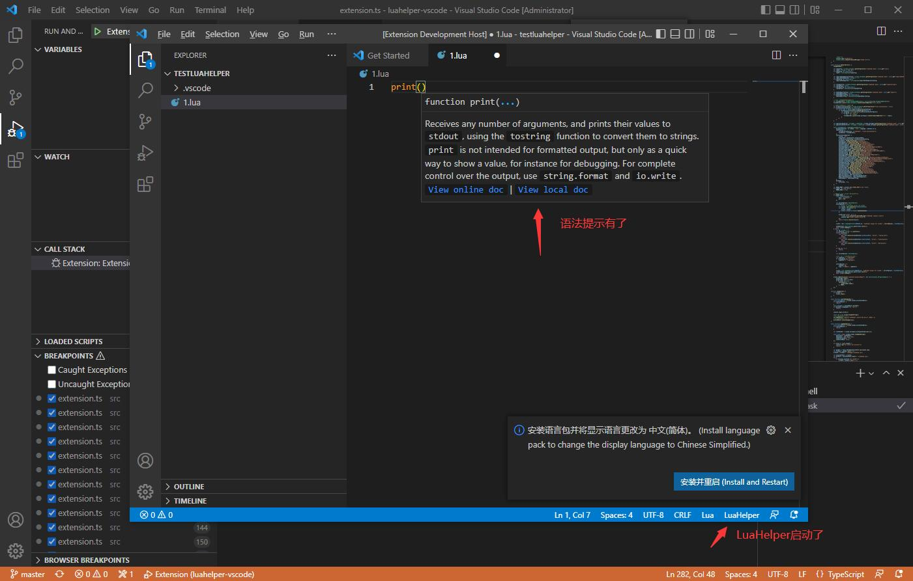
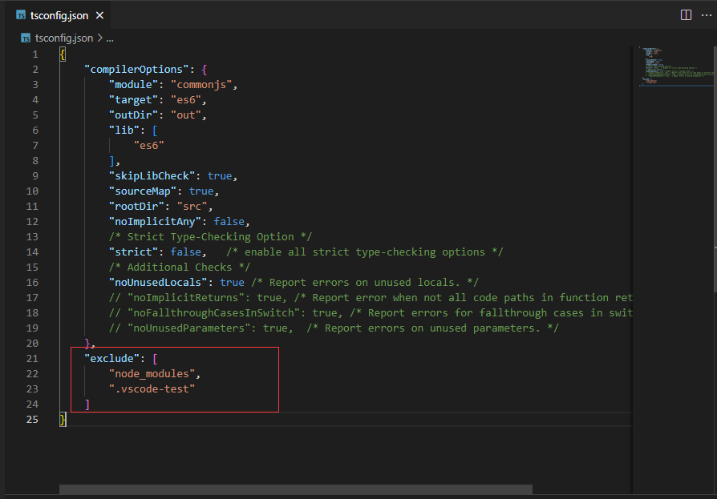
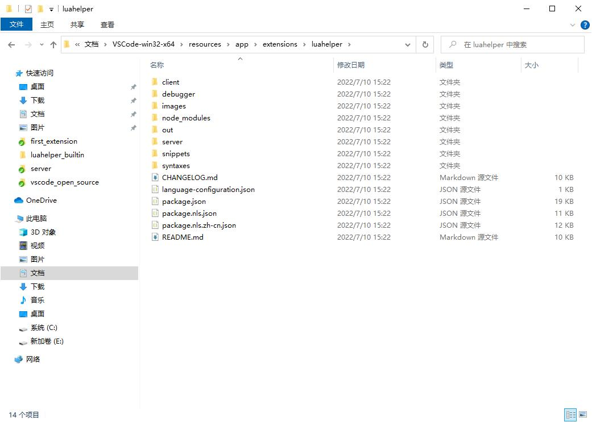
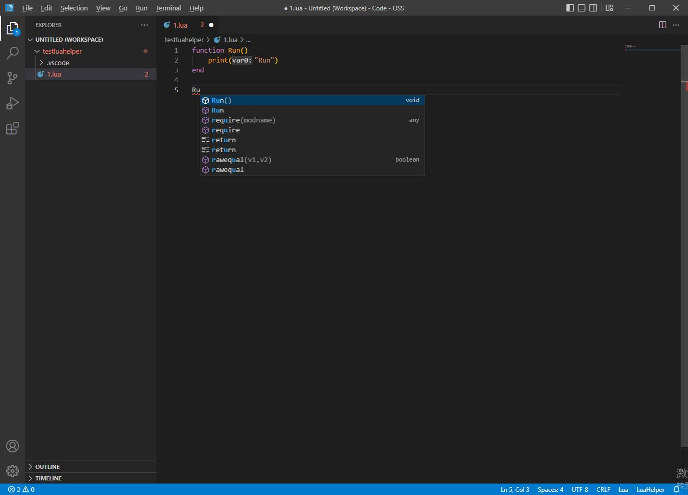

## 88.4 打包LuaHelper到Code-OSS

### 1. 获取源码

从Github官方 Fork一份到自己名下，然后Clone到本地。

Github官方地址：`https://github.com/Tencent/LuaHelper.git`

### 2. 项目结构


与之前创建的 Hello World 扩展程序不同，LuaHelper包括了Lua语法高亮、自动提示、断点调试等多项功能。

VSCode自身只是一个编辑器，自动提示、断点调试这些功能都是放到单独的语言服务器程序(lsp)进行分析执行，VSCode与 语言服务器程序 以Socket进行通信。

LuaHelper使用Go开发Lua语言服务器(lsp)。

*luahelper-lsp* 是Lua语言服务器源码。

*luahelper-vscode* 是VSCode扩展程序项目。



*luahelper-vscode\server* 目录里存放的就是Lua语言服务器程序。

### 3. 调试

先启动lsp。

```bash
lualsp.exe -logflag=1 -mode=2
```



VSCode打开 *luahelper-vscode* 文件夹。

在 Terminal 执行 `npm install` 安装依赖包。



然后 `ctrl + shift +b` 编译，然后 F5 启动调试。



### 4. 打包为内置扩展

将 *luahelper-vscode* 复制到 VSCode 源码 extensions 文件夹里，改名为 **luahelper**。

删除 node_modules 、out 文件夹。

删除 package-lock.json 文件。

删除 tsconfig.json 中的 **exclude** 段。



在 *build\gulpfile.extensions.js* 里，添加 `'luahelper/tsconfig.json'` 。

在 *build\npm\dirs.js* 里，添加 `'extensions/luahelper'` 。

然后 `yarn` 下载依赖包，再  `ctrl + shift + b` 编译项目。

然后 F5 启动调试，测试是否OK。

在Terminal 输入下面命令打包Code-OSS：

```bash
yarn gulp vscode-win32-x64
```

LuaHelper 扩展程序就会打包到一起。



打开 Code - OSS ，再写两行Lua代码测试下。

