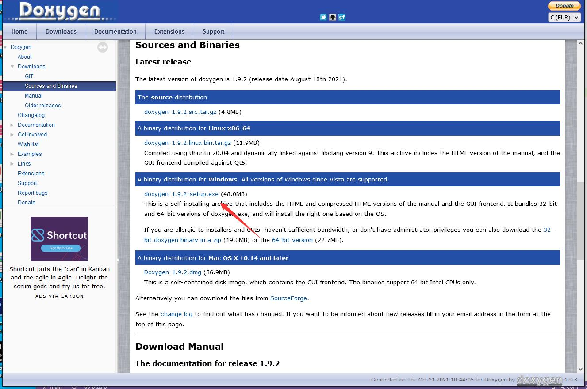
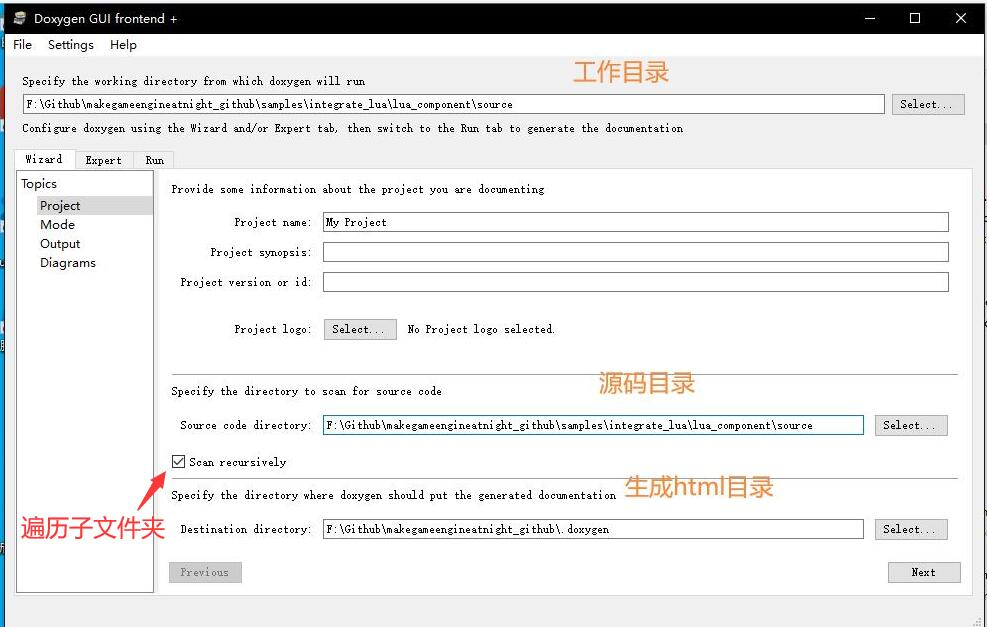
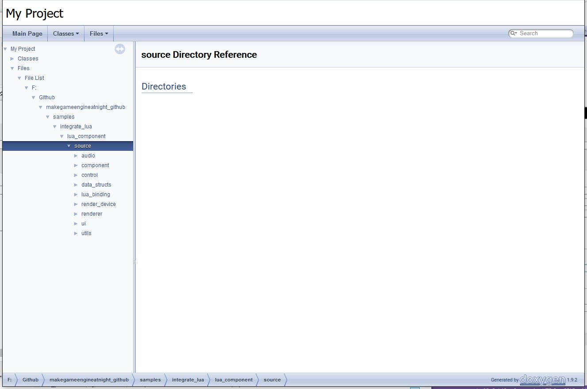
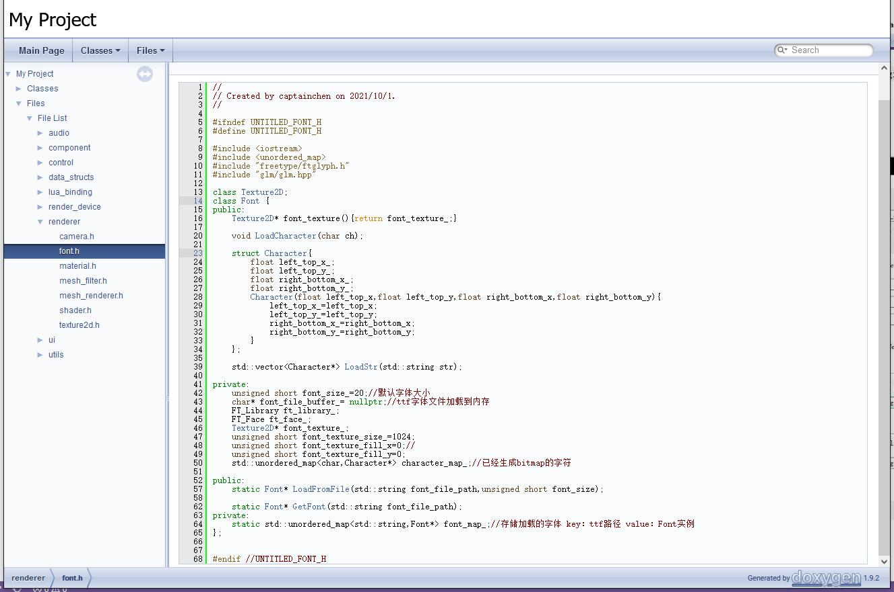
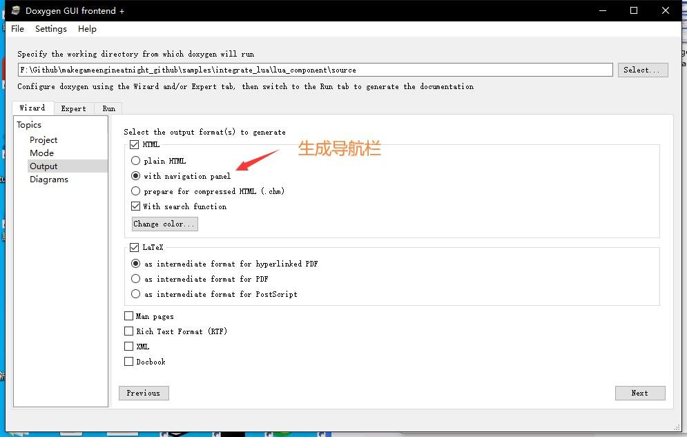
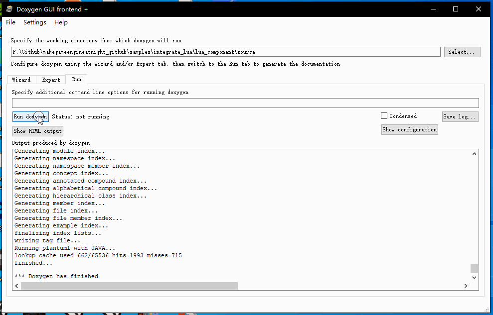
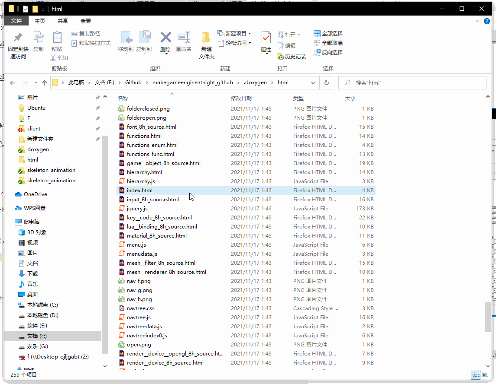
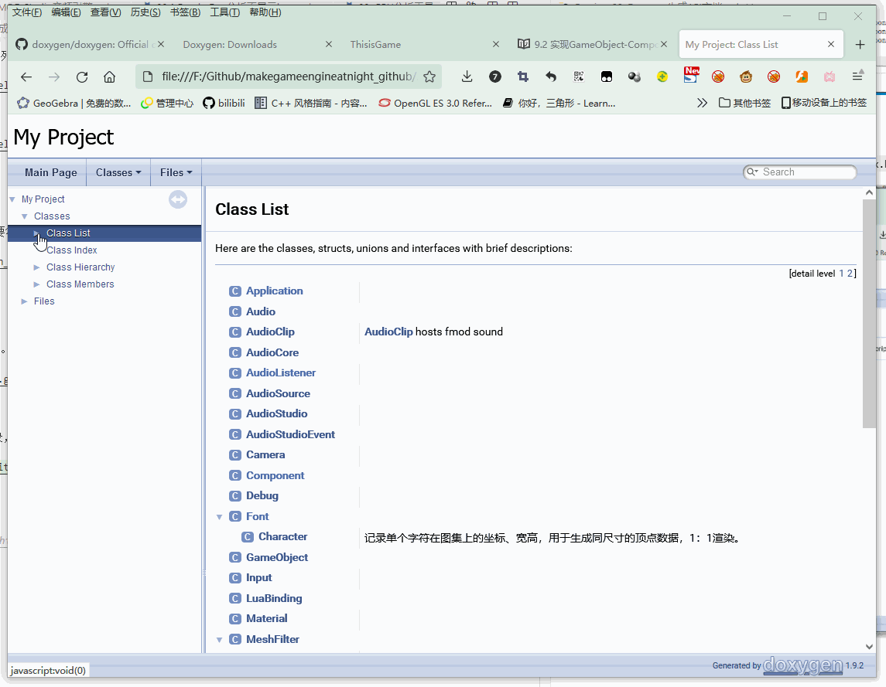

## 89. Doxygen生成API文档

`Doxygen`可以根据我们对C++代码添加的注释，生成一份API文档出来，这样就不用手写API文档了。

支持`C++` 、`Java` 、`C#`等语言，支持导出 `HTML`、`CHM`等文档格式。

下面这些知名开源项目都使用`Doxygen`：
1. Doxygen官网：https://www.doxygen.nl/index.html
1. Cocos2d-x：https://docs.cocos2d-x.org/api-ref/cplusplus/v4x/index.html

CLion里在函数上面输入 `///` 然后按回车，就会生成函数注释,如下面的函数。

```c++
/// 加载一个字体文件并解析
/// \param image_file_path ttf字体文件路径
/// \param font_size 默认文字尺寸
/// \return
static Font* LoadFromFile(std::string font_file_path,unsigned short font_size);
```

这种格式的注释是被`Doxygen`支持的。

### 1. 安装

官网下载：`https://www.doxygen.nl/download.html#srcbin`



也可以下载源码自己编译，Github地址：`https://github.com/doxygen/doxygen`

### 2. 使用Doxygen生成html

安装完成之后，打开`Doxywizard`。

#### 2.1 配置目录。

第一步配置项目名、Logo、目录信息。



源码目录：就是C++代码所在目录,一定勾选遍历子文件夹。

工作目录：要和源码目录配置为同一个，不然生成的导航栏里就会带有磁盘目录信息。

如下图配置错误的工作目录后，生成的文件列表带了多个层级的目录，影响体验：



正确配置后如下图：



设置好之后，直接下一步，再下一步。

#### 2.2 配置生成网页内容

在`Output`页面配置生成网页内容，这里要勾选`with navigation panel`，生成网页左侧的导航栏。



一直下一步。

#### 2.3 生成

在`Run`标签页，点击`Run doxygen`生成。



### 3. 浏览html

生成完毕后，打开之前配置的生成html目录，找到`index.html`用浏览器打开。






参考文章：
```c
Doxygen快速入门: https://zhuanlan.zhihu.com/p/100223113
```