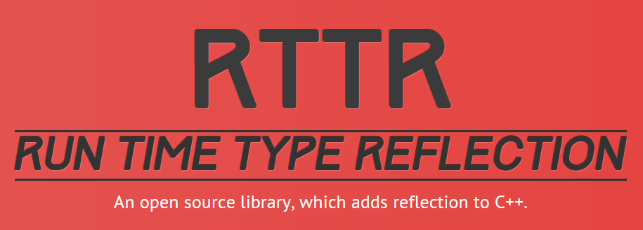
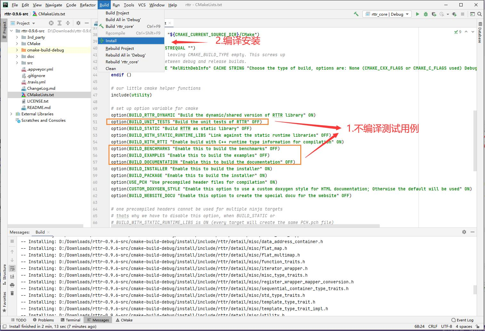
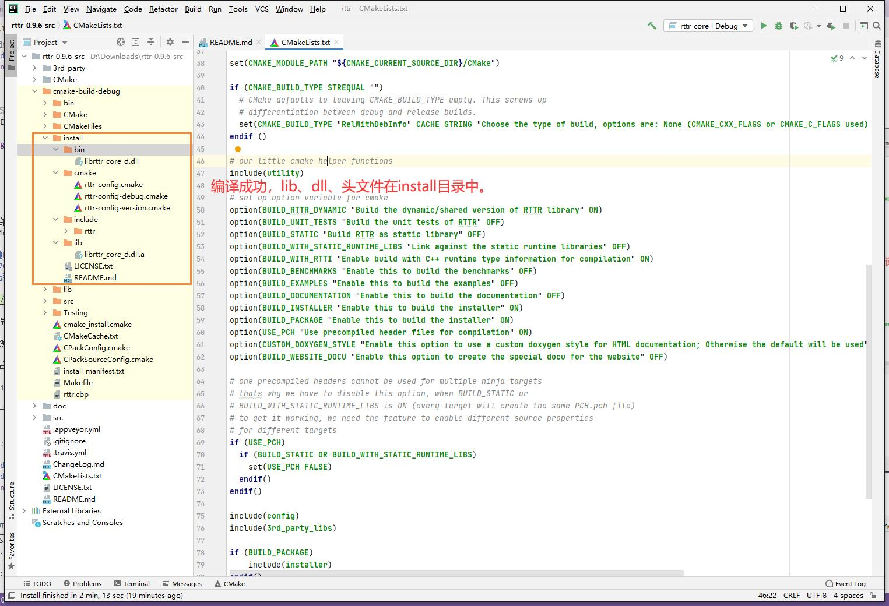
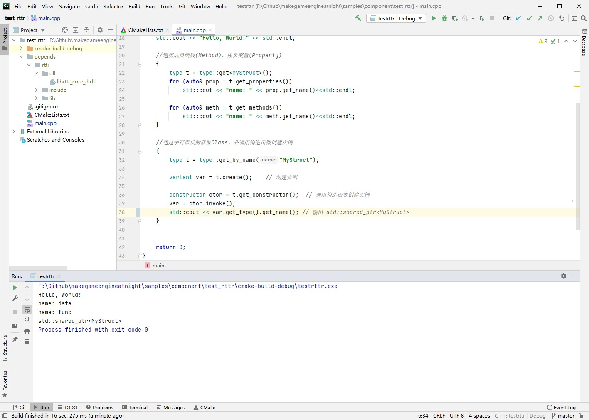

## 9.1 基于RTTR实现反射

回顾Unity开发流程：创建`Monobehaviour`，然后在编辑器中搜索类名(即脚本名)添加到`GameObject`。
习以为常的操作，追究下去却没有这么简单！有以下问题需要解决：
1. 搜索类名，添加脚本到GameObject --> 实际上是通过类名，创建类实例。
2. 类的成员变量，可以在编辑器中进行修改 --> 实际上是通过变量名，访问类实例的成员变量。

总结就是两个字：`反射`。
对C#而言，这都不是问题，语言规范就支持反射。
但是C++是不支持反射的，只能手动将类名、成员变量名映射到Class、Property上面。然而实现映射功能，对于C++初学者是个巨大挑战。
幸好有许多开源的绑定实现可以使用，在Github上比较火的就是`RTTR`。

### 1. RTTR介绍


官网:`https://www.rttr.org/`

RTTR提供了运行时类型反射功能，仅需要数行代码就可以将Class、Method、Property与其名字进行映射，下面例子使用RTTR进行映射：

```c++
#include <rttr/registration>
using namespace rttr;

struct MyStruct { MyStruct() {}; void func(double) {}; int data; };

///使用RTTR 对MyStruct的 Class、Method、Property与其名字进行映射。
RTTR_REGISTRATION
{
    registration::class_<MyStruct>("MyStruct")
         .constructor<>()
         .property("data", &MyStruct::data)
         .method("func", &MyStruct::func);
}
```

### 2. 编译RTTR
使用CLion编译RTTR格外简单。

1. 右键RTTR文件夹，使用CLion打开，并等待CMake进度条走完。
2. 修改CMakeLists.txt，关闭其他无关项目。
3. 点击菜单 Build-->Install。

如下图操作：



编译完成后，在 install 目录中找到lib、dll、头文件。



具体流程我录制了视频在B站：`https://www.bilibili.com/video/BV1L64y1d7hY/`

<iframe 
    width="800" 
    height="450" 
    src="https://player.bilibili.com/player.html?aid=758619539&bvid=BV1L64y1d7hY&cid=355304502&page=1" 
    frameborder="0"  
    allowfullscreen> 
</iframe>

```c
如果要编译静态库，修改CMakeLists.txt配置如下：
option(BUILD_RTTR_DYNAMIC "Build the dynamic/shared version of RTTR library" OFF)
option(BUILD_STATIC "Build RTTR as static library" ON)
```

### 3. 测试RTTR    

视频最后创建了RTTR测试项目，介绍了如何使用RTTR。

```c
CLion工程位于 samples\component\test_rttr
```

这里贴一下代码及注释，方便查看：

```c++
//file:samples/component/test_rttr/main.cpp

#include <iostream>
#include <rttr/registration>
using namespace rttr;

struct MyStruct { MyStruct() {}; void func(double) {}; int data; };

//使用RTTR 对MyStruct的 Class、Method、Property与其名字进行映射。
RTTR_REGISTRATION
{
    registration::class_<MyStruct>("MyStruct")
            .constructor<>()
            .property("data", &MyStruct::data)
            .method("func", &MyStruct::func);
}

int main() {
    std::cout << "Hello, World!" << std::endl;

    //遍历成员函数(Method)、成员变量(Property)
    {
        type t = type::get<MyStruct>();
        for (auto& prop : t.get_properties())
            std::cout << "name: " << prop.get_name()<<std::endl;

        for (auto& meth : t.get_methods())
            std::cout << "name: " << meth.get_name()<<std::endl;
    }

    //通过字符串反射获取Class，并调用构造函数创建实例
    {
        type t = type::get_by_name("MyStruct");

        variant var = t.create();    // 创建实例

        constructor ctor = t.get_constructor();  // 调用构造函数创建实例
        var = ctor.invoke();
        std::cout << var.get_type().get_name(); // 输出 std::shared_ptr<MyStruct>
    }

    return 0;
}
```

运行结果如下图：

