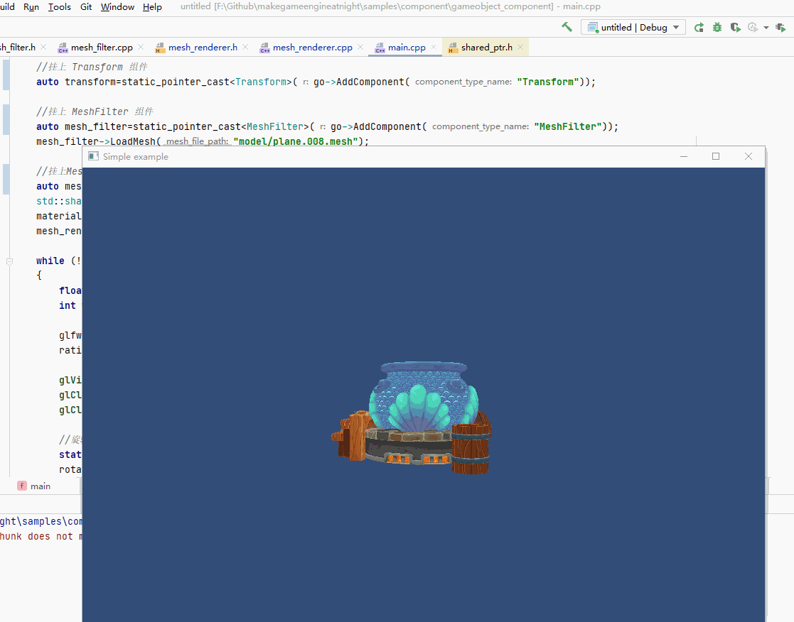

##9.2 实现GameObject-Component

    CLion项目文件位于 samples\component\gameobject_component

上一节验证了RTTR反射功能之后，就可以制定基于组件开发的具体方案了，参照Unity的GameObject-Component结构，具体如下：
1. 实现GameObject。
2. 实现Component，其他组件(如 Transform)都继承自Component。
3. 通过组件类名，实例化组件，存储到GameObject的容器中。

落实到具体，分别创建了以下代码文件:
1. 框架基础：game_object.h、component.h
2. 自定义组件：transform.h

下面逐个介绍代码实现。

###1.框架基础实现
####1.1 GameObject
大家都知道人是一个东西，但是东西是一种虚拟的描述，它需要附加实实在在的东西。
想让人被看见，就需要附加肌肉外形。
想让人运动，就需要附加骨架。
想让人漂亮，就需要附加衣服。
想让人有内涵，就需要附加AI。

我常将GameObject比喻为人，他可以附加各种具体的组件，来实现它的百变。
附加上Transform，就可以设置位置。
附加上MeshRenderer和MeshFilter，就可以显示出各种形状。
附加上SkinnedMeshRenderer，就可以动起来。
附加上CharacterController，就可以控制它移动。

组件既可以添加，也可以随时被移除，而且同名组件可以添加多个，因此用下面的容器来存储组件：
```c++
///file:source/component/game_object.h line:41

std::unordered_map<std::string,std::vector<Component*>> component_type_instance_map_;
```

新增以下API用来对组件列表进行读写：
```c++
///file:source/component/game_object.h line:27

/// 添加组件
/// \param component_type_name 组件类名
/// \return
Component* AddComponent(std::string component_type_name);

/// 获取组件
/// \param component_type_name 组件类名
/// \return
Component* GetComponent(std::string component_type_name);
```

在`AddComponent()`，根据组件名，调用RTTR反射获取组件构造函数，创建组件实例。
```c++
///file:source/component/game_object.cpp line:23

Component* GameObject::AddComponent(std::string component_type_name) {
    type t = type::get_by_name(component_type_name);
    variant var = t.create();    // 创建实例
    Component* component=var.get_value<Component*>();
    component->set_game_object(this);
    ......
    
    return component;
}
```

####1.2 Component
Component是所有组件的基类，只需要保存对GameObject的引用即可,具体的功能都由子类实现。
```c++
///file:source/component/component.h line:12

class Component {
public:
    Component();
    ~Component();

    GameObject* game_object(){return game_object_;}
    void set_game_object(GameObject* game_object){game_object_=game_object;}
private:
    GameObject* game_object_;
};
```

###2.自定义组件Transform实现
Transform负责坐标、旋转、缩放这3个基础属性，代码如下：
```c++
///file:source/component/transform.h line:11

class Transform : public Component{
public:
    Transform();
    ~Transform();

    glm::vec3 position() const {return position_;}
    glm::vec3 rotation() const {return rotation_;}
    glm::vec3 scale() const {return scale_;}

    void set_position(glm::vec3 position){position_=position;}
    void set_rotation(glm::vec3 rotation){rotation_=rotation;}
    void set_scale(glm::vec3 scale){scale_=scale;}

private:
    glm::vec3 position_;
    glm::vec3 rotation_;
    glm::vec3 scale_;
};
```

需要注意的是，Transform是一个组件，它的实例化是通过`go->AddComponent("Transform")`挂在到Gameobject上，通过类名创建类实例，所以Transform需要进行RTTR注册反射。

```c++
///file:source/component/transform.cpp line:8

using namespace rttr;
RTTR_REGISTRATION//注册反射
{
    registration::class_<Transform>("Transform")
            .constructor<>()(rttr::policy::ctor::as_raw_ptr)
            .property("position", &Transform::position, &Transform::set_position)
            .property("rotation", &Transform::rotation, &Transform::set_rotation)
            .property("scale", &Transform::scale, &Transform::set_scale);
}

Transform::Transform() {
}

Transform::~Transform() {
}
```

###3.改造MeshFilter、MeshRenderer
MeshFilter 加载Mesh文件，向MeshRenderer提供顶点数据。
MeshRenderer 从MeshFilter拿到顶点数据上传GPU生成VBO用于渲染。

在之前的章节实例中，需要向MeshRenderer指定MeshFilter，并且需要在外部计算好MVP矩阵，才能在Renderer()函数中上传GPU渲染：

```c++
///file: samples/export_blender/load_mesh_from_blender/source/main.cpp line:50

int main(void)
{
    ......

    MeshFilter* mesh_filter=new MeshFilter();
    mesh_filter->LoadMesh("model/fishsoup_pot.mesh");
    ......

    MeshRenderer* mesh_renderer=new MeshRenderer();
    mesh_renderer->SetMeshFilter(mesh_filter);//向MeshRenderer指定MeshFilter：
    ......

    while (!glfwWindowShouldClose(window))
    {
        ......

        glm::mat4 trans = glm::translate(glm::vec3(0,0,0));

        static float rotate_eulerAngle=0.f;
        rotate_eulerAngle+=0.1f;
        glm::mat4 rotation = glm::eulerAngleYXZ(glm::radians(rotate_eulerAngle), glm::radians(0.f), glm::radians(0.f)); 

        glm::mat4 scale = glm::scale(glm::vec3(1.0f, 1.0f, 1.0f));
        glm::mat4 model = trans*scale*rotation;
        glm::mat4 view = glm::lookAt(glm::vec3(0, 0, 10), glm::vec3(0, 0,0), glm::vec3(0, 1, 0));
        glm::mat4 projection=glm::perspective(glm::radians(60.f),ratio,1.f,1000.f);
        glm::mat4 mvp=projection*view*model;

        mesh_renderer->SetMVP(mvp);//外部计算好MVP矩阵
        mesh_renderer->Render();
        ......
    }
    ......
}
```
组件化之后，坐标、旋转、缩放信息都存在Transform组件中，以及组件形式存在的MeshFilter，都可以由MeshRenderer向GameObject主动获取。
来看具体逻辑。

####3.1 向RTTR注册
两者都需要向RTTR注册，才能通过类名 创建实例。

####3.2 MeshRenderer主动获取Transform && MeshFilter

MeshFilter和MeshRenderer是同一个GameObject上的组件，通过`GetComponent`就可以获取。

```c++
///file:source/renderer/mesh_renderer.cpp line:39

void MeshRenderer::Render() {
    //主动获取 Transform 组件，计算mvp。
    auto component_transform=game_object()->GetComponent("Transform");
    auto transform=dynamic_cast<Transform*>(component_transform);
    if(!transform){
        return;
    }
    glm::mat4 trans = glm::translate(transform->position());
    auto rotation=transform->rotation();
    glm::mat4 eulerAngleYXZ = glm::eulerAngleYXZ(glm::radians(rotation.y), glm::radians(rotation.x), glm::radians(rotation.z));
    glm::mat4 scale = glm::scale(transform->scale()); //缩放;
    glm::mat4 model = trans*scale*eulerAngleYXZ;
    glm::mat4 mvp=projection_*view_*model;

    //主动获取 MeshFilter 组件
    auto component_meshfilter=game_object()->GetComponent("MeshFilter");
    auto mesh_filter=dynamic_cast<MeshFilter*>(component_meshfilter);
    if(!mesh_filter){
        return;
    }
    if (vertex_buffer_object==-1){
        //在GPU上创建缓冲区对象
        glGenBuffers(1,&vertex_buffer_object);
        //将缓冲区对象指定为顶点缓冲区对象
        glBindBuffer(GL_ARRAY_BUFFER, vertex_buffer_object);
        //上传顶点数据到缓冲区对象
        glBufferData(GL_ARRAY_BUFFER, mesh_filter->mesh()->vertex_num_ * sizeof(MeshFilter::Vertex), mesh_filter->mesh()->vertex_data_, GL_STATIC_DRAW);
    }
}
```

###4. 使用GameObject-Component
组件不能直接`new`了，必须通过`AddComponent`的形式挂到GameObject上。
修改`main.cpp`，将原来通过`new`实例化的代码，修改为组件形式。

```c++
///file:source/main.cpp line:54

int main(void)
{
    ......

    //创建GameObject
    GameObject* go=new GameObject("something");

    //挂上 Transform 组件
    auto transform=dynamic_cast<Transform*>(go->AddComponent("Transform"));

    //挂上 MeshFilter 组件
    auto mesh_filter=dynamic_cast<MeshFilter*>(go->AddComponent("MeshFilter"));
    mesh_filter->LoadMesh("model/fishsoup_pot.mesh");

    //挂上MeshRenderer 组件
    auto mesh_renderer=dynamic_cast<MeshRenderer*>(go->AddComponent("MeshRenderer"));
    Material* material=new Material();//设置材质
    material->Parse("material/fishsoup_pot.mat");
    mesh_renderer->SetMaterial(material);

    while (!glfwWindowShouldClose(window))
    {
        ......

        glm::mat4 view = glm::lookAt(glm::vec3(0, 0, 10), glm::vec3(0, 0,0), glm::vec3(0, 1, 0));
        glm::mat4 projection=glm::perspective(glm::radians(60.f),ratio,1.f,1000.f);

        mesh_renderer->SetView(view);
        mesh_renderer->SetProjection(projection);
        mesh_renderer->Render();
        ......
    }
    ......
}

```

###5.测试
将项目组件化之后，再来运行测试一下，看看是否正常。


没啥问题！