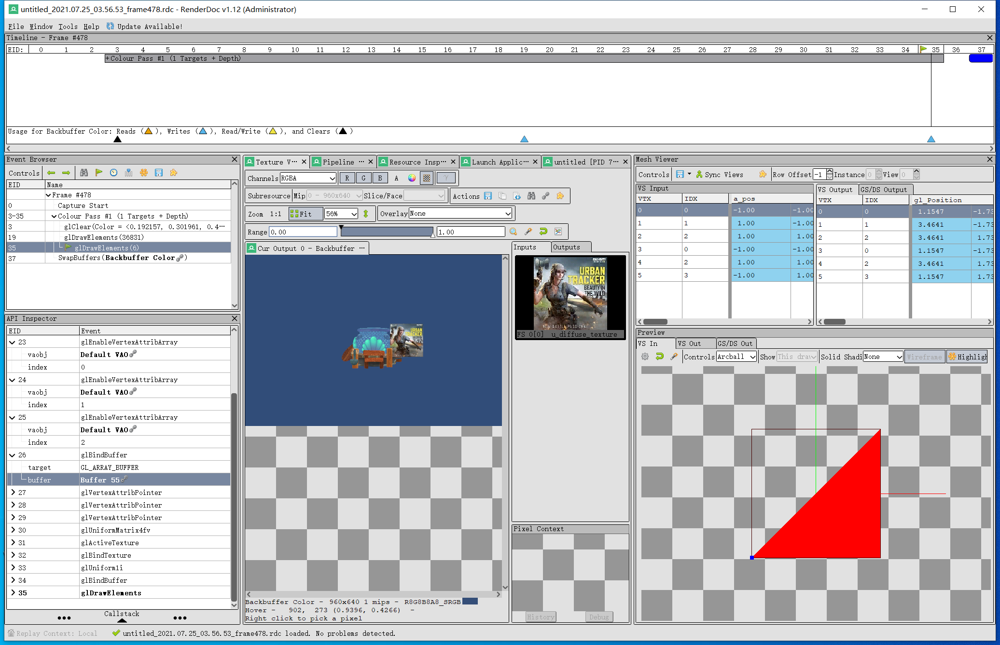

##98. GPU分析工具

日常在写代码遇到问题时，可以借助调试工具，来判断问题所在。

对于面向OpenGL编程，也有对应的分析工具，可以将每一帧的OpenGL API调用列出来，并且可以对每一次API调用进行详细分析，可以查看上传的顶点、纹理、属性值设置。

RenderDoc是我用的比较多的，它不仅可以直接分析OpenGL应用程序，而且也直接集成到了Unity、UE的编辑器中，十分方便。

    官网：https://renderdoc.org/

工作界面如下。

本章使用RenderDoc解决项目遇到的问题和一些需求，来实际讲解RenderDoc的入门使用。