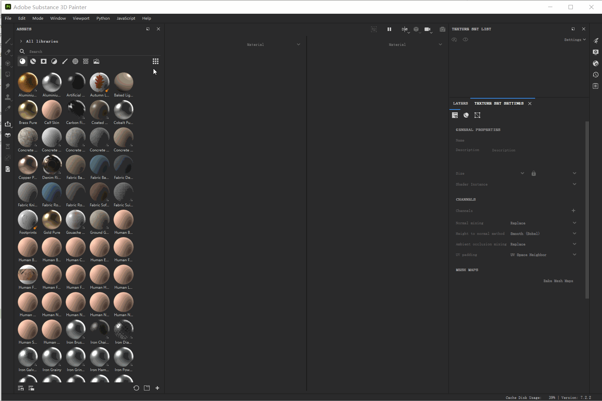
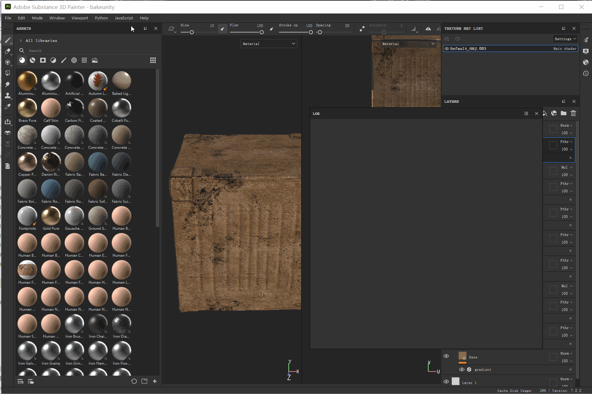
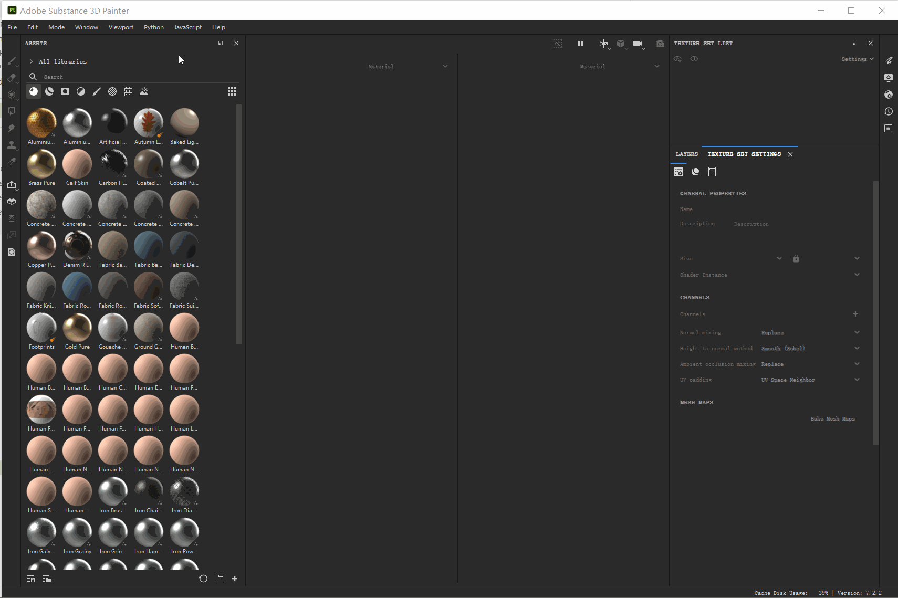
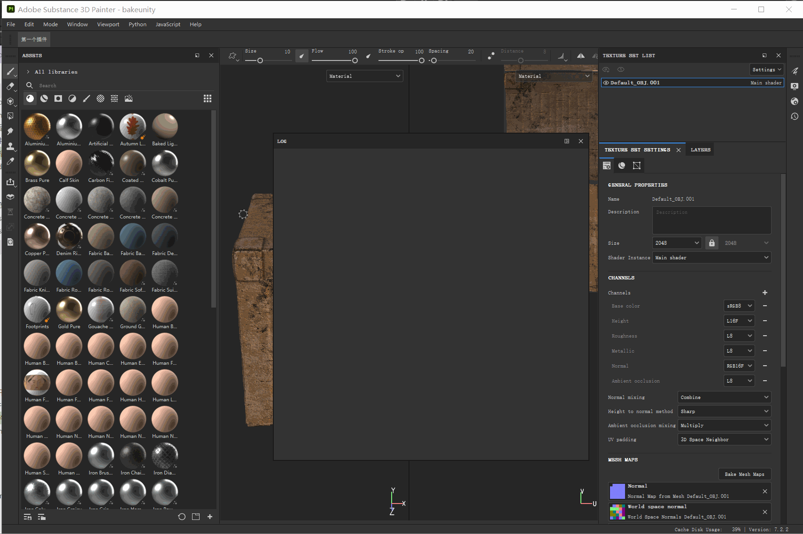

## 98.1 SubstancePainter插件开发环境

SP可以使用JavaScript+QtQuick/Python开发插件，不过尝试Python后发现，官方文档例子都是错的，所以还是选择JavaScript开发。

### 1.打开日志窗口

点击菜单`Window`-`Views`-`Log`,打开日志窗口，方便插件打log做调试。




### 2.插件目录

点击菜单 `JavaScript` - `Plugin Folder` 打开插件目录。



### 2.编写第一个插件

SP的JavaScript插件，是以文件夹为单位的，文件夹名就是插件名。

在 plugins 插件目录，新建我们的第一个插件目录`helloworld`,并创建文件`toolbar.qml`、`main.qml`。

`toolbar.qml`描述了自定义按钮的属性，代码如下：

```js
import QtQuick 2.7
import AlgWidgets 2.0
import AlgWidgets.Style 2.0

AlgButton
{
	tooltip: "这是一个按钮，点击会在log窗口输出helloworld"
	iconName: ""
	text: "第一个插件"
}
```
`main.qml` 将`toolbar.qml`描述的自定义按钮，添加到工具栏，并指定按钮点击事件，代码如下：

```js
import QtQuick 2.7
import Painter 1.0

// Root object for the plugin
PainterPlugin
{
	// Disable update and server settings
	// since we don't need them
	tickIntervalMS: -1 // Disabled Tick
	jsonServerPort: -1 // Disabled JSON server

	// 插件加载完毕回调
	Component.onCompleted:
	{
		// 将 toolbar.qml 描述的按钮，添加到工具栏
		var InterfaceButton = alg.ui.addToolBarWidget("toolbar.qml");

		// 给按钮加事件
		if( InterfaceButton )
		{
			InterfaceButton.clicked.connect( SayHello );
		}
	}

	function SayHello()
	{
		alg.log.info( "hello world")
	}
}
```


### 3.启用插件

SP的插件写好后，并不会立即显示到菜单中，需要先刷新插件列表。

点击菜单 `JavaScript`-`Reload Plugins Folder`刷新插件列表，新编写的插件就会出现在 `JavaScript` 的子菜单中，如下图：



插件默认被启用了，在工具栏就可以看到创建的自定义按钮，鼠标放上去，会弹出自定义tips，点击按钮会输出log。
点击插件菜单 `JavaScript`-`helloworld`里面的`enable` `disable`，就可以启用或禁用 `helloworld`插件了。




修改代码后，点击`reload`，就可以热重载插件。

