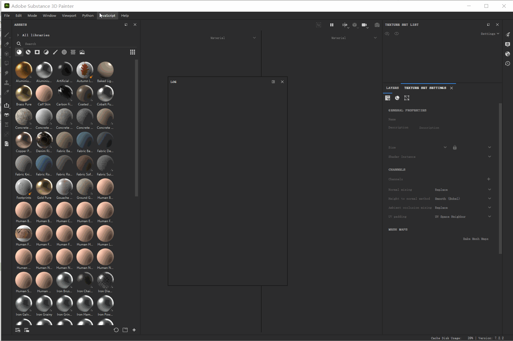

## 98.1 SubstancePainter插件开发环境

官方文档：https://substance3d.adobe.com/documentation/spdoc/creating-a-python-plugin-197427756.html

SP可以使用JavaScript+QtQuick/Python开发插件，相对来说我对Python比较熟悉，所以后续介绍Python对SP开发插件。

### 1.打开日志窗口

点击菜单`Window`-`Views`-`Log`,打开日志窗口，方便插件打log做调试。


### 2.插件目录

点击菜单 Python - Plugin Folder 打开Python插件目录。


### 2.编写第一个插件

在 plugins 插件目录，新建我们的第一个插件脚本 `helloworld.py`，在里面输出经典的`helloworld`。

代码如下：

```python
import os

def start_plugin():
	print("start_plugin helloworld")

def close_plugin():
	print("close_plugin helloworld")

if __name__ == "__main__":
	start_plugin()
```


### 3.启用插件

SP的插件写好后，并不会立即显示到菜单中，需要先刷新插件列表。

点击菜单 `Python`-`Reload Plugins Folder`刷新插件列表，新编写的插件就会出现在 `Python` 的子菜单中，如下图：


点击插件菜单 `Python`-`helloworld`，就可以启用或禁用 `helloworld`插件了，可以看到输出了log在日志窗口。

