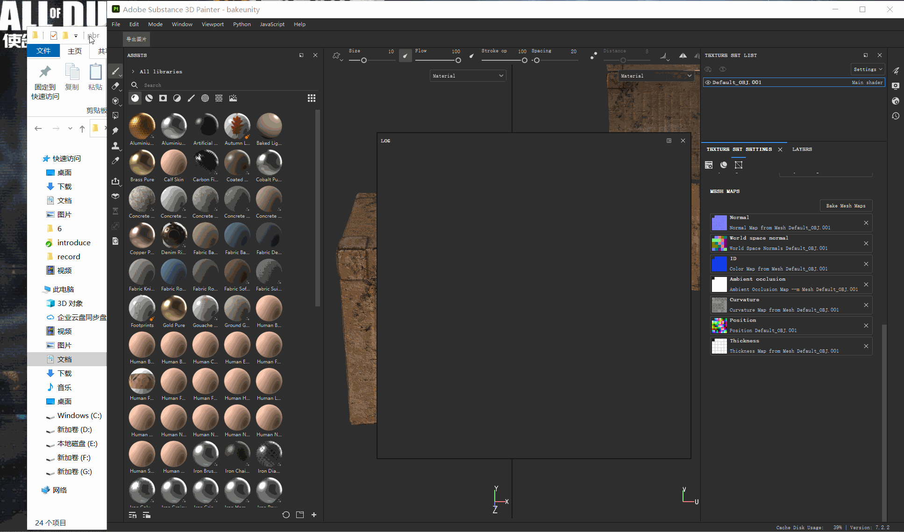

## 98.2 开发SP功能性插件

下面通过SP官网的自定义导出插件例子，来入门功能性插件开发，官网地址：

	https://substance3d.adobe.com/documentation/spdoc/creating-a-javascript-plugin-197427408.html

在上一节`helloworld`插件的基础上，将自定义按钮的点击事件，修改为导出图片的功能。

### 1.创建插件

复制`helloworld`插件文件夹，改名为` export-textures`，拷贝下面代码：
`toolbar.qml`描述了自定义按钮的属性，代码如下：

```js
import QtQuick 2.7
import AlgWidgets 2.0
import AlgWidgets.Style 2.0

AlgButton
{
	tooltip: "点击按钮导出图片"
	iconName: ""
	text: "导出图片"
}
```
`main.qml` 将`toolbar.qml`描述的自定义按钮，添加到工具栏，并指定按钮点击事件，代码如下：

```js
import QtQuick 2.7
import Painter 1.0

// Root object for the plugin
PainterPlugin
{
	// Disable update and server settings
	// since we don't need them
	tickIntervalMS: -1 // Disabled Tick
	jsonServerPort: -1 // Disabled JSON server

	// 插件加载完毕回调
	Component.onCompleted:
	{
		// 将 toolbar.qml 描述的按钮，添加到工具栏
		var InterfaceButton = alg.ui.addToolBarWidget("toolbar.qml");

		// 给按钮加事件
		if( InterfaceButton )
		{
			InterfaceButton.clicked.connect( exportTextures );
		}
	}
	
	function exportTextures()
	{
		try
		{ 
			// 没打开项目那就算了
			if( !alg.project.isOpen() )
			{
				return;
			}

			// 检索当前选择的纹理集和子堆栈
			var MaterialPath = alg.texturesets.getActiveTextureSet()
			var UseMaterialLayering = MaterialPath.length > 1
			var TextureSetName = MaterialPath[0]
			var StackName = ""

			if( UseMaterialLayering )
			{
				StackName = MaterialPath[1]
			}

			// Retrieve the Texture Set information
			var Documents = alg.mapexport.documentStructure()
			var Resolution = alg.mapexport.textureSetResolution( TextureSetName )
			var Channels = null

			for( var Index in Documents.materials )
			{
				var Material = Documents.materials[Index]

				if( TextureSetName == Material.name )
				{
					for( var SubIndex in Material.stacks )
					{
						if( StackName == Material.stacks[SubIndex].name )
						{
							Channels = Material.stacks[SubIndex].channels
							break
						}
					}
				}
			}

			// Create the export settings
			var Settings = {
				"padding":"Infinite",
				"dithering":"disbaled", // Hem, yes...
				"resolution": Resolution,
				"bitDepth": 16,
				"keepAlpha": false
			}

			// 导出后存放的目录
			var BasePath = alg.fileIO.urlToLocalFile( alg.project.url() )
			BasePath = BasePath.substring( 0, BasePath.lastIndexOf("/") );

			// Export the each channel
			for( var Index in Channels )
			{
				// Create the stack path, which defines the channel to export
				var Path = Array.from( MaterialPath )
				Path.push( Channels[Index] )

				// Build the filename for the texture to export
				var Filename = BasePath + "/" + TextureSetName

				if( UseMaterialLayering )
				{
					Filename += "_" + StackName
				}

				Filename += "_" + Channels[Index] + ".png"

				// Perform the export
				alg.mapexport.save( Path, Filename, Settings )
				alg.log.info( "Exported: " + Filename )
			}
		}
		catch( error )
		{
			// Print errors in the log window
			alg.log.exception( error )
		}
	}
}
```

### 2.测试插件

点击菜单 `JavaScript`-`Reload Plugins Folder`刷新插件列表，默认就会启用新创建的插件。
点击自定义的工具栏按钮，就会导出图片。



### 3.更多API

点击菜单 `Help`-`Scrpiting document`-`JavaScript API`打开本地API文档。

功能性插件主要关注两个API：
1. Javascript API
   包含SP所有功能开放的API，如项目管理、IO、shader。
2. AlgWidgets API
   包含界面制作的组件。