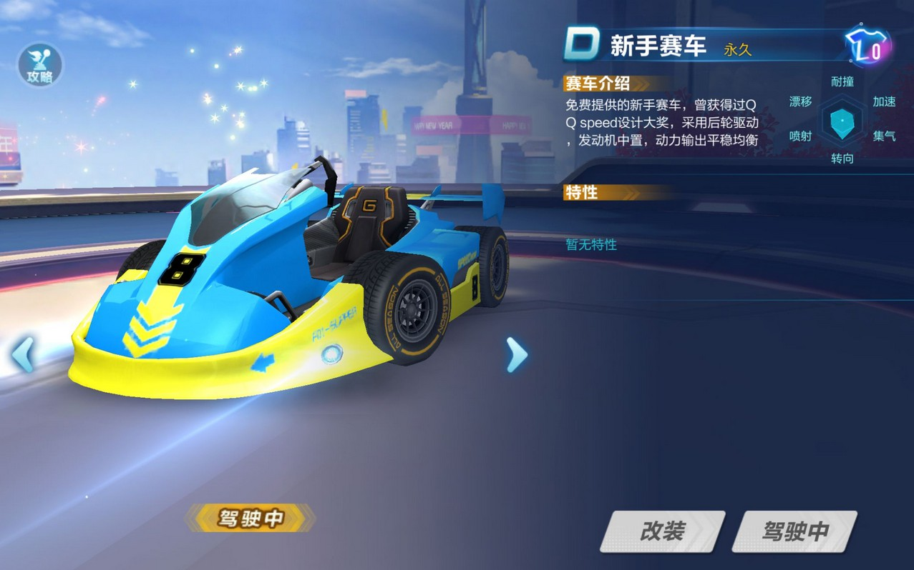

## 99. Toolbag插件开发

作为客户端开发，日常接触最多的就是游戏引擎，以游戏引擎为核心，将工作向前、向后延伸，就得到了整个游戏制作流水线。

这条线特别长，而这次要讲的Toolbag就处在这条流水线的末尾点--美宣。

Toolbag是一款实时渲染工具，用于展示或预览现有的场景，简单说就是给模型调材质、打灯、后期，然后渲染出图。

运营部门在制作美术宣发图时，需要拿游戏资源到Toolbag渲染出图用于参考。

以某赛车游戏举例，对于赛车的渲染，Toolbag可能参与以下2套流程：

1. 整车渲染

    新手板车，从建模软件生产出来后，就已经确定外形，仅贴图可更换。

    这种车直接放入Toolbag渲染。

    

2. 组装车渲染
   
   组装车，即可以更换配件的车，制作流程比较复杂。
   
   以轮胎来说，负责轮胎建模的同学，只负责做这个轮胎，然后放到模板车上，效果OK就算完成。
   
   轮胎在其他车上的效果，需要进入游戏进行组装才能查看。
   
   那么对于组装车，就需要从游戏引擎，将组装好的车进行导出，才能在Toolbag进行渲染。

   如果有100辆车需要组装，那么最好能够对Toolbag进行批量处理。

   

对于流程1，是建模人员与美术人员直接对接。

对于流程2，大批量的Toolbag渲染需求，就需要有程序编写代码进行批量化处理。

Toolbag 内嵌了Python环境，可以以插件形式执行Python代码，这对流程2提供了支持。