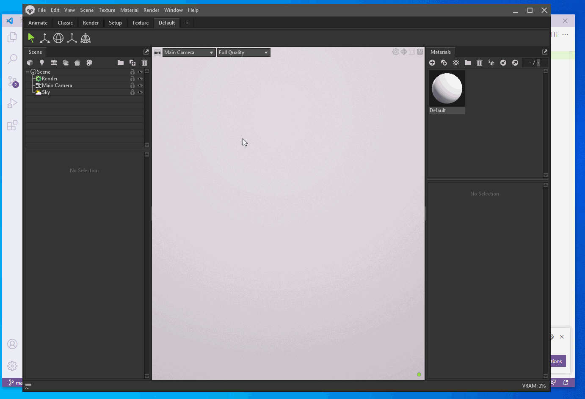
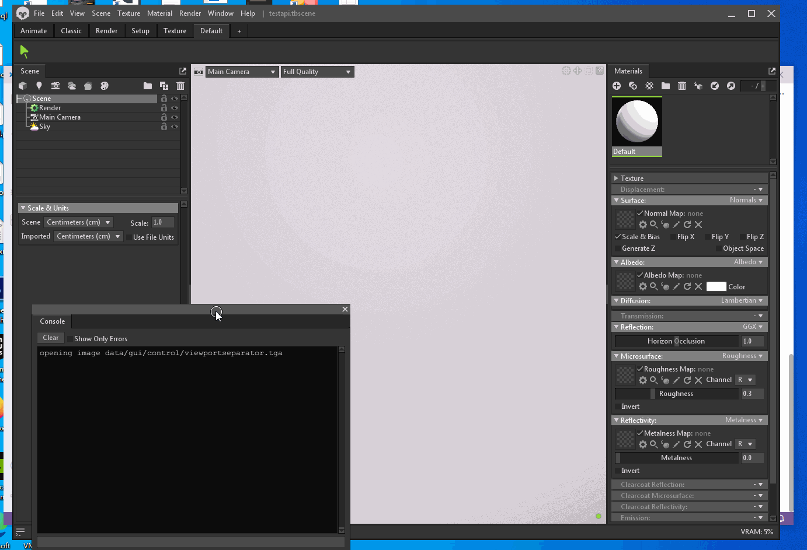
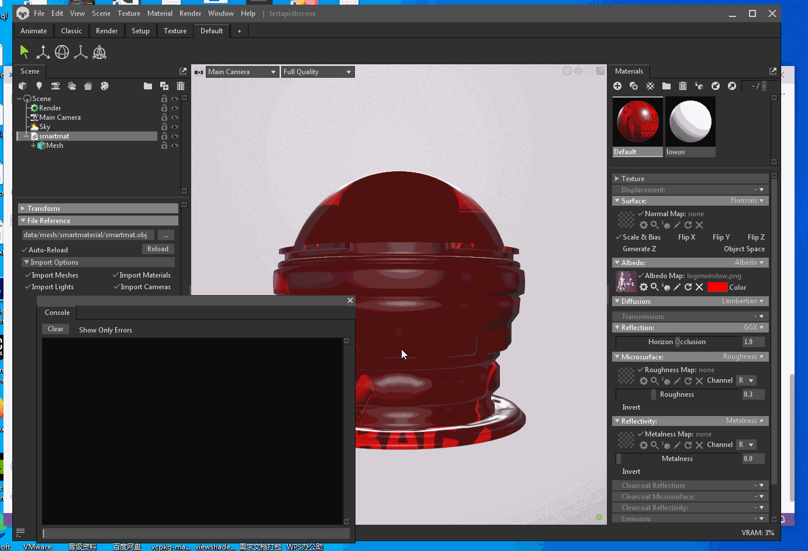

## 99.2 API介绍

官方文档：`https://marmoset.co/python/reference.html`

Shader subroutine fields：`https://gist.github.com/cecilemuller/8f090aebfb5897651416b5a4089dcb42`

官方文档比较全面，但是某些API可能并不详细，需要Google一下。

先通过下面几个例子来熟悉相关API吧。

<b>例1. 打印场景所有物体名称</b>

```python
import mset

# 获取场景中所有物体
sceneObjects = mset.getAllObjects()

print( "Scene Objects:" )
for object in sceneObjects:
   print( " - " + object.name )
```




<b>例2. 设置材质并渲染出图</b>

导入模型，赋予材质，并设置材质属性，然后渲染出图。

```python
import mset

#创建Texture
tex = mset.Texture("data/gui/title/loginwindow.png")
#查找材质
mat = mset.findMaterial("Default")
#设置Shader属性
mat.getSubroutine("albedo").setField("Albedo Map", tex)
mat.getSubroutine("albedo").setField("Color", [1.0,0.0,0.0])
#导入模型
model = mset.importModel("data/mesh/smartmaterial/smartmat.obj")
#将材质赋予模型
mat.assign(model)
#渲染出图
mset.renderCamera("output.jpg")
```



<b>例3. GUI编程</b>

```python
import mset

#创建 window
mywindow = mset.UIWindow("My Window")

#button 点击回调
def doSomething():
   print("You pressed a button!")
   mset.shutdownPlugin() # 关闭插件

#创建 button ，设置回调
mybutton = mset.UIButton("My Button")
mybutton.onClick = doSomething

#将 button 添加到window
mywindow.addElement( mybutton )
```




