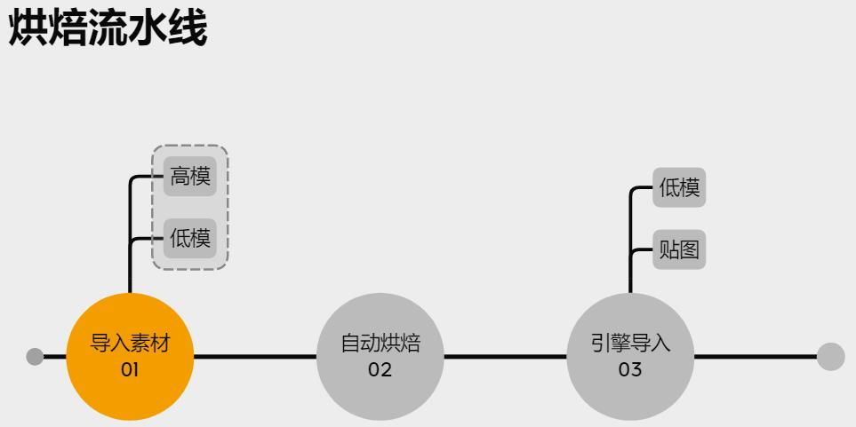
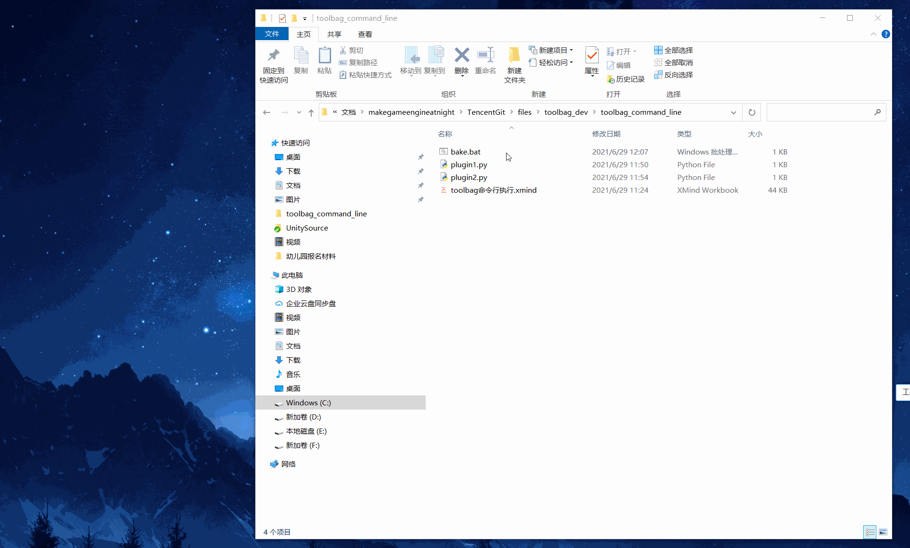

## 99.3 命令行调用Toolbag

以烘焙的操作为例，可以用下图流程解释：



每一个阶段，都用一个插件执行，完整流程需要多个插件顺序工作。

toolbag支持命令行调用，传入插件名即可执行插件，这就可以实现多插件串联。

下面通过简单例子来介绍。

<b>1. 插件准备</b>

首先准备2个插件，代码如下：

```python
#file:files\toolbag_dev\toolbag_command_line\plugin1.py
import sys
import mset

print("plugin1 run")
print("len(sys.argv):",len(sys.argv))
print("sys.argv:",sys.argv)

mset.quit()
```

```python
#file:files\toolbag_dev\toolbag_command_line\plugin2.py
import sys
import mset

print("plugin1 run")
print("len(sys.argv):",len(sys.argv))
print("sys.argv:",sys.argv)

mset.quit()
```

<b>2. 批处理调用</b>

然后用批处理调用toolbag 顺序执行2个插件：

```bat
::file:files\toolbag_dev\toolbag_command_line\bake.bat
"your toolbag.exe path" "git repository path\files\toolbag_dev\toolbag_command_line\plugin1.py" "param1"
"your toolbag.exe path" "git repository path\files\toolbag_dev\toolbag_command_line\plugin2.py" "param1"
pause
```

执行批处理，观察log，可以看到toolbag被打开关闭2次，并且输出了传入的参数。

