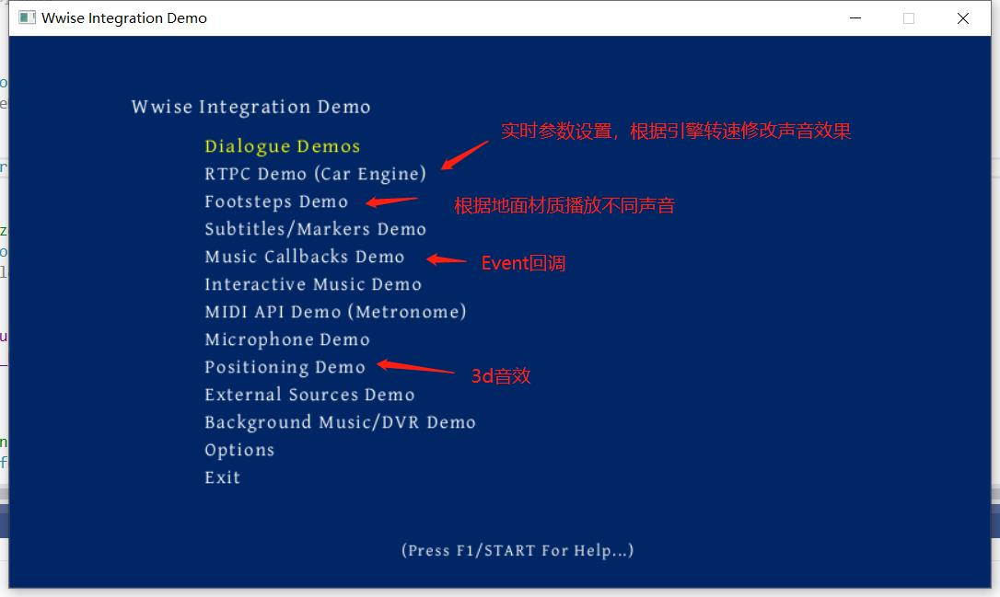
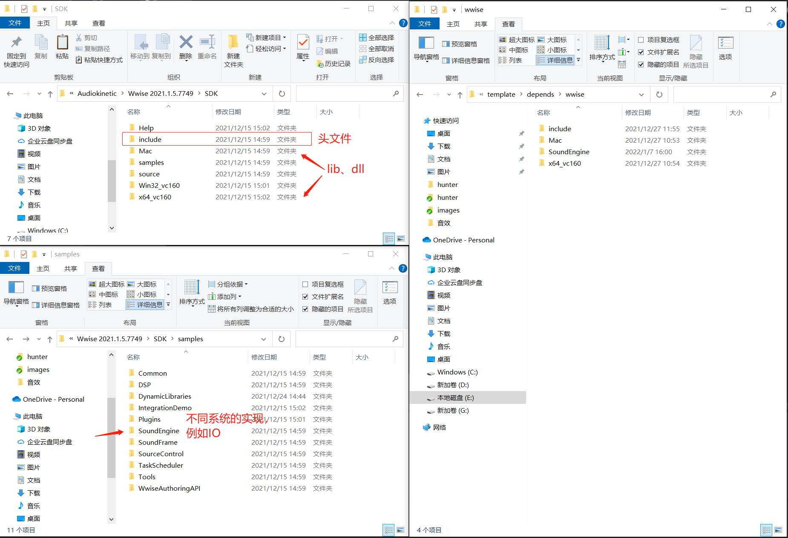
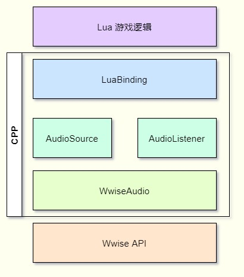

## 1.3 集成Wwise

```bash
CLion项目文件位于 samples\audio_wwise\integrate
```

集成之前，我建议先简单读一遍SDK的帮助文档，大概了解Wwise的一些名词，以及架构。

帮助文件位于：`安装磁盘\Audiokinetic\Wwise 2021.1.5.7749\SDK\Help\zh\`

然后单步调试一遍Wwise的Demo项目，熟悉Wwise的初始化与相关API，创建Event，播放、停止、设置3D坐标这些。

Demo项目位于：`安装磁盘\Audiokinetic\Wwise 2021.1.5.7749\SDK\samples\IntegrationDemo\Windows\`



当然，编辑器也是要学一下的，一定要自己做几个音效，然后导出一个SoundBank，来熟悉Wwise的整体设计。

那么本节教程，建议在你已经看了帮助文档，并且调试过一次Demo的基础之上，后面一些名词就不再解释了。

### 1. 剥离SDK

除了在SDK文件夹中的`include`以及各平台的库文件，在Demo项目中也发现`SoundEngine`这个文件夹里的代码，是不同平台对IO的实现。

将这几个东西放到一起，作为wwise的SDK，如下图所示。



### 2. 集成到项目

Wwise的SDK特别大，所以我把它压缩成 `wwise.7z` 了，在CLion第一次打开项目时去检查是否已解压，否则就解压出来。

主要流程是在CMake里调用了外部的bat批处理来解压。

```
execute_process(COMMAND cmd /c "..\\..\\..\\template\\depends\\extra.bat")
```

具体参照`CMakeLists.txt.Wwise`，以及`samples\template\depends\extra.bat`。

游戏对音频的要求，一般就是加载、播放、停止、暂停，我将Wwise提供的上述API，封装到 `source/audio/wwise/wwise_audio.cpp` 代码中，以Static函数提供调用。

下面就来看具体实现吧。

### 3. 初始化Wwise

Wwise的每个模块都对应一个Plugin，IO、内存管理、网络通信、声音、音乐、空间音频，这几个是比较常用的，在初始化Wwise的时候，将这几个模块Plugin都需要初始化。

```c++
//file:source/audio/wwise/wwise_audio.cpp line:29

void WwiseAudio::Init() {
    AkMemSettings memSettings;
    AkStreamMgrSettings streamMgrSettings;
    AkDeviceSettings deviceSettings;
    AkInitSettings initSettings;
    AkPlatformInitSettings platformInitSettings;
    AkMusicSettings musicInit;
    AkCommSettings commSettings;

    AK::MemoryMgr::GetDefaultSettings(memSettings);
    AK::StreamMgr::GetDefaultSettings(streamMgrSettings);
    AK::StreamMgr::GetDefaultDeviceSettings(deviceSettings);
#if defined(INTDEMO_DEFERRED_IO)
    deviceSettings.uSchedulerTypeFlags = AK_SCHEDULER_DEFERRED_LINED_UP;
#endif

    AK::SoundEngine::GetDefaultInitSettings(initSettings);
#if defined( INTEGRATIONDEMO_ASSERT_HOOK )
    m_initSettings.pfnAssertHook = INTEGRATIONDEMO_ASSERT_HOOK;
#endif // defined( INTEGRATIONDEMO_ASSERT_HOOK )

    AK::SoundEngine::GetDefaultPlatformInitSettings(platformInitSettings);
    AK::MusicEngine::GetDefaultInitSettings(musicInit);

#if !defined AK_OPTIMIZED && !defined INTEGRATIONDEMO_DISABLECOMM
    AK::Comm::GetDefaultInitSettings(commSettings);
#endif

    // 创建并初始化默认的内存管理器。注意，你可以使用自己的内存管理器覆盖默认的内存管理器。详细信息请参考SDK文档。
    AKRESULT res = AK::MemoryMgr::Init(&memSettings);
    if ( res != AK_Success ){
        DEBUG_LOG_ERROR("WwiseAudio::Init() AK::MemoryMgr::Init() failed,res:{}", res);
        return;
    }

    // 创建并初始化默认的流管理器。注意，你可以使用自己的流管理器覆盖默认的流管理器。详细信息请参考SDK文档。
    if (!AK::StreamMgr::Create( streamMgrSettings)){
        DEBUG_LOG_ERROR("WwiseAudio::Init() AK::StreamMgr::Create() failed");
        return;
    }

    // 创建一个流设备，并使用阻塞的低级I/O握手。注意，你可以使用自己的低级I/O模块覆盖默认的低级I/O模块。详细信息请参考SDK文档。
    // CAkFilePackageLowLevelIOBlocking::Init()创建了一个流设备，并将自己注册为文件位置解析器。
    deviceSettings.bUseStreamCache = true;
    CAkFilePackageLowLevelIODeferred* lowLevelIoDeferred= new CAkFilePackageLowLevelIODeferred();
    res = lowLevelIoDeferred->Init( deviceSettings );
    if ( res != AK_Success ){
        DEBUG_LOG_ERROR("m_lowLevelIO.Init() returned AKRESULT {}", res );
        return;
    }

    // 创建声音引擎，使用默认的初始化参数
    res = AK::SoundEngine::Init(&initSettings, &platformInitSettings);
    if ( res != AK_Success ){
        DEBUG_LOG_ERROR("AK::SoundEngine::Init() returned AKRESULT {}", res );
        return;
    }

    // 初始化音乐引擎，使用默认的初始化参数
    res = AK::MusicEngine::Init( &musicInit );
    if ( res != AK_Success ){
        DEBUG_LOG_ERROR("AK::MusicEngine::Init() returned AKRESULT {}", res );
        return;
    }

#if !defined AK_OPTIMIZED && !defined INTEGRATIONDEMO_DISABLECOMM
    // 初始化通信（非发布版本！）
    AKPLATFORM::SafeStrCpy(commSettings.szAppNetworkName, "Integration Demo", AK_COMM_SETTINGS_MAX_STRING_SIZE);
    res = AK::Comm::Init(commSettings);
    if ( res != AK_Success ){
        DEBUG_LOG_ERROR("AK::Comm::Init() returned AKRESULT {}. Communication between the Wwise authoring application and the game will not be possible.", res );
        return;
    }
#endif // AK_OPTIMIZED

    // 初始化音频空间
    AkSpatialAudioInitSettings settings;
    res = AK::SpatialAudio::Init(settings);
    if (res != AK_Success){
        DEBUG_LOG_ERROR("AK::SpatialAudio::Init() returned AKRESULT {}", res);
        return;
    }

    // 对于具有只读bank路径的平台，将可写文件夹添加到基本路径列表中。 当打开文件写入失败时，IO 将回退到此路径。
#if defined(WRITABLE_PATH)
    m_pLowLevelIO->AddBasePath(WRITABLE_PATH);
#endif

    // 最后设置 SoundBank 文件的路径。最后一个基本路径总是第一个查询文件。
    lowLevelIoDeferred->SetBasePath(GetSoundBanksPath(RELATIVE_PATH));

    // 设置全局语言。 低级 I/O 设备可以使用此字符串来查找特定于语言的资产。
    if (AK::StreamMgr::SetCurrentLanguage(AKTEXT("English(US)")) != AK_Success){
        DEBUG_LOG_ERROR("AK::StreamMgr::SetCurrentLanguage() failed");
        return;
    }

    AK::SoundEngine::RegisterResourceMonitorCallback(ResourceMonitorDataCallback);
}
```

这些代码在`IntegrationDemo`项目中抄过来就行。

唯一需要修改的是读取Bank的目录需要自己指定。

```c++
// file:source/audio/wwise/wwise_audio.cpp line:117

// 最后设置 SoundBank 文件的路径。最后一个基本路径总是第一个查询文件。
lowLevelIoDeferred->SetBasePath(GetSoundBanksPath(RELATIVE_PATH));
```

其中，`RELATIVE_PATH`在文件开头定义。

```c++
// file:source/audio/wwise/wwise_audio.cpp line:20

#define RELATIVE_PATH L"..\\data\\audio\\"
```

### 4. 加载Bank

Bank中是处理后的音频文件、Event集合。

要触发Event播放音效，首先要加载Bank。

在Wwise编辑器中导出Bank后，记得拷贝到项目中，缺失Bank，触发Event时会有错误提示。

```c++
//file:source/audio/wwise/wwise_audio.cpp line:161

/// 加载 bank文件
/// @param bank_name bank文件名
void WwiseAudio::LoadBank(const char *bank_name) {
    AkBankID bank_id;
    AKRESULT result=AK::SoundEngine::LoadBank(bank_name, bank_id);
    if ( result!= AK_Success){
        DEBUG_LOG_ERROR("Failed to load bank {},result:{}", bank_name,result);
        return;
    }
}
```

加载Bank之前一定要确保Bank读取目录设置正确。

### 5. 管理GameObjectID

在`22.1 Wwise名词概念`这一节介绍了GameObjectID，不论是触发Event播放音效，还是创建Listener，都需要指定一个GameObjectID作为主体。

这其实很像`GameObject - Component`机制。

我将GameObjectID设置为一个自增的ID。

```c++
//file:source/audio/wwise/wwise_audio.h line:60

private:
    static AkGameObjectID audio_object_id_next_;//下一个id
```

在后面的`AudioSource`、`AudioListener`实例化对象时，都调用`WwiseAudio::GeneratorGameObjectID() `自增1.

```c++
AkGameObjectID WwiseAudio::GeneratorGameObjectID() {
    return audio_object_id_next_++;
}
```

### 6. 触发Event播放音效

Wwise提供了接口 `AK::SoundEngine::PostEvent`来触发Event播放音效。

```c++
//file:source/audio/wwise/wwise_audio.cpp line:200

/// 触发Event播放音效
/// @param event_name Event名
/// @param audio_object_id 音频物体id
/// @param flags 哪些情况下需要回调
/// @param callback 回调
/// @param user_data 回调用户数据
/// @return 播放id
AkPlayingID WwiseAudio::PostEvent(const char *event_name, AkGameObjectID audio_object_id, AkUInt32 flags,
                           AkCallbackFunc callback, void *user_data) {
    AkPlayingID playing_id = AK::SoundEngine::PostEvent(event_name,audio_object_id,flags,callback,user_data);
    if(playing_id==AK_INVALID_PLAYING_ID){
        DEBUG_LOG_ERROR("AudioSource::Play() failed");
    }
    return playing_id;
}
```

如果需要监听音效停止的事件，那么需要在播放的时候就指定好回调函数 `AkCallbackFunc callback`。

<font color=red>注意：回调函数是在其他线程调用！！！</font>

`user_data`透传参数，一般是传入托管当前Event的`AudioSource`，这个下一小节介绍。

如果播放成功，则返回 `playing_id` 表示当前正在播放的Event，后续对Event执行操作需要传入它。

### 7. 停止播放

Wwise提供接口`AK::SoundEngine::ExecuteActionOnPlayingID`，来对指定的`PlayingID`执行一系列操作，停止、暂停等。

```c++
//file:source/audio/wwise/wwise_audio.cpp line:217

/// 停止Event播放音效
/// @param playing_id 播放id
void WwiseAudio::StopEvent(AkPlayingID playing_id) {
    AK::SoundEngine::ExecuteActionOnPlayingID(AK::SoundEngine::AkActionOnEventType::AkActionOnEventType_Stop,playing_id);
}
```

### 8. 设置坐标

如果需要制作3D音效，首先是在Wwise编辑器对Event设置为空间音频，然后就需要在代码中设置坐标。

Wwise提供接口`AK::SoundEngine::SetPosition`来设置GameObject的位置。

```c++
//file:source/audio/wwise/wwise_audio.cpp line:190

/// 设置物体位置
/// @param game_object_id 物体id
/// @param position 位置
/// @param front 前方
/// @param up 上方
void WwiseAudio::SetPosition(AkGameObjectID game_object_id, glm::vec3 position, glm::vec3 front, glm::vec3 up) {
    AkSoundPosition soundPos;
    AkVector akPosition={position.x,position.y,position.z};
    AkVector akFront={front.x,front.y,front.z};
    AkVector akUp={up.x,up.y,up.z};
    soundPos.Set(akPosition,akFront,akUp);

    AK::SoundEngine::SetPosition(game_object_id, soundPos);
}
```

### 9. 设置Listener

在Wwise中，Listener只是一个虚拟对象，只是一个坐标。

所以只需要一个GameObject，然后附加坐标就可以作为Listener。

Wwise提供接口`AK::SoundEngine::SetDefaultListeners`来设置默认Listener。

```c++
/// 设置默认Listener
/// @paran game_object_id Listener所在的Wwise GameObjectID
void WwiseAudio::SetDefaultListeners(const AkGameObjectID& game_object_id) {
    AKRESULT result=AK::SoundEngine::SetDefaultListeners(&game_object_id, 1);;
    if ( result!= AK_Success){
        DEBUG_LOG_ERROR("Failed to set default listeners,result:{}", result);
        return;
    }
}
```

### 10. 音频框架

暂时就用到这些API，就先介绍这些。

在游戏中不会直接使用Wwise提供的接口，而是以`AudioSource`、`AudioListener`的形式对其封装，形成组件。




下一节介绍`AudioSource`、`AudioListener`。