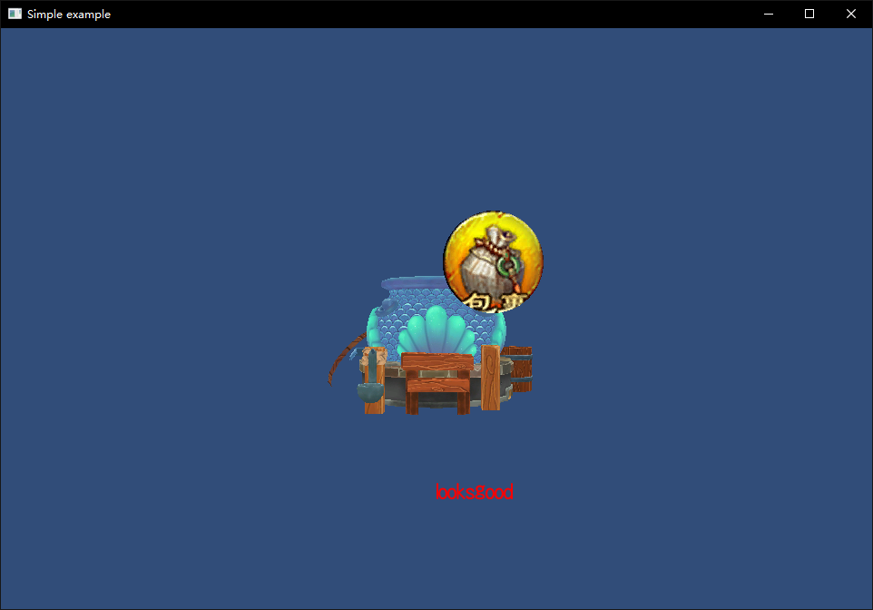

## 14.4 UIText

```bash
CLion项目文件位于 samples\gui\ui_text
```

上一章讲了如何解析`TrueType`字体，对字符生成图片，然后渲染。

`UIText`仅需在其基础上，做以下修改：

1. 将顶点坐标修改为字符生成图片的实际大小。
2. 合并Mesh

### 1. UIText实现

下面看下具体实现。

```c++
//file:source/ui/ui_text.h line:15

class UIText : public Component {
public:
    UIText();
    ~UIText();

    void set_font(Font* font){font_=font;}
    Font* font(){return font_;}

    void set_text(std::string text);
    std::string text(){return text_;}

    void set_color(glm::vec4 color){color_=color;}
    glm::vec4 color(){return color_;}
public:
    void Update() override;
    /// 渲染之前
    void OnPreRender() override;

    void OnPostRender() override;

private:
    Font* font_;
    std::string text_;
    bool dirty_;//是否变化需要重新生成Mesh
    glm::vec4 color_;//字体颜色
};
```

创建了成员变量保存`Font`，设置显示的文本，以及颜色。

`dirty_` 在文本变动的时候标志为`True`，然后在`Update`里会重新生成字符对应的图片，以及构建Mesh。

```c++
//file:source/ui/ui_text.cpp line:35

void UIText::Update() {
    Component::Update();

    if(font_== nullptr || font_->font_texture()== nullptr){
        return;
    }

    MeshFilter* mesh_filter=dynamic_cast<MeshFilter*>(game_object()->GetComponent("MeshFilter"));
    if(mesh_filter== nullptr){
        //挂上 MeshFilter 组件
        mesh_filter=dynamic_cast<MeshFilter*>(game_object()->AddComponent("MeshFilter"));

        //创建 Material
        auto material=new Material();//设置材质
        material->Parse("material/ui_text.mat");

        //挂上 MeshRenderer 组件
        auto mesh_renderer=dynamic_cast<MeshRenderer*>(game_object()->AddComponent("MeshRenderer"));
        mesh_renderer->SetMaterial(material);

        //使用文字贴图
        material->SetTexture("u_diffuse_texture", font_->font_texture());
    }

    if(dirty_){
        dirty_=false;

        std::vector<Font::Character*> character_vec=font_->LoadStr(text_);
        //遍历每个字符进行绘制
        std::vector<MeshFilter::Vertex> vertex_vector;
        std::vector<unsigned short> index_vector(character_vec.size()*6);

        int x=0;
        std::vector<unsigned short> index={0, 1, 2, 0, 2, 3};
        //合并Mesh
        for (int i = 0; i < character_vec.size(); ++i) {
            auto character=character_vec[i];
            unsigned short width=(character->right_bottom_x_-character->left_top_x_)*font_->font_texture()->width();
            unsigned short height=(character->right_bottom_y_-character->left_top_y_)*font_->font_texture()->height();
            //因为FreeType生成的bitmap是上下颠倒的，所以这里UV坐标也要做对应翻转，将左上角作为零点。
            vertex_vector.insert(vertex_vector.end(),{
                    { {x,0.0f, 0.0f}, color_, {character->left_top_x_,     character->right_bottom_y_} },
                    { {x+width,0.0f, 0.0f}, color_, {character->right_bottom_x_, character->right_bottom_y_} },
                    { {x+width,height, 0.0f}, color_, {character->right_bottom_x_, character->left_top_y_} },
                    { {x,height, 0.0f}, color_, {character->left_top_x_,     character->left_top_y_} }
            });
            x+=width;


            for (int j = 0; j < index.size(); ++j) {
                index_vector[i*index.size()+j]=index[j]+i*4;
            }
        }
        mesh_filter->CreateMesh(vertex_vector,index_vector);
    }
}
```

在构建Mesh的时候，做了合并，减少DrawCall。


### 2. 测试

在`LoginScene::CreateUI()`中，创建`UIText`。

```c++
//file:example/login_scene.cpp line:158

void LoginScene::CreateUI() {
    ......

    //生成文字贴图
    Font* font=Font::LoadFromFile("font/hkyuan.ttf",24);
    //创建 GameObject
    auto go_ui_text=new GameObject("text");
    go_ui_text->set_layer(0x02);
    //挂上 Transform 组件
    auto transform_ui_text =dynamic_cast<Transform*>(go_ui_text->AddComponent("Transform"));
    transform_ui_text->set_position({0.f,-200.f,0});
    //挂上 UIText 组件
    auto ui_text=dynamic_cast<UIText*>(go_ui_text->AddComponent("UIText"));
    ui_text->set_font(font);
    ui_text->set_text("looks good");
    ui_text->set_color({1,0,0,1});
}
```

效果如下：

