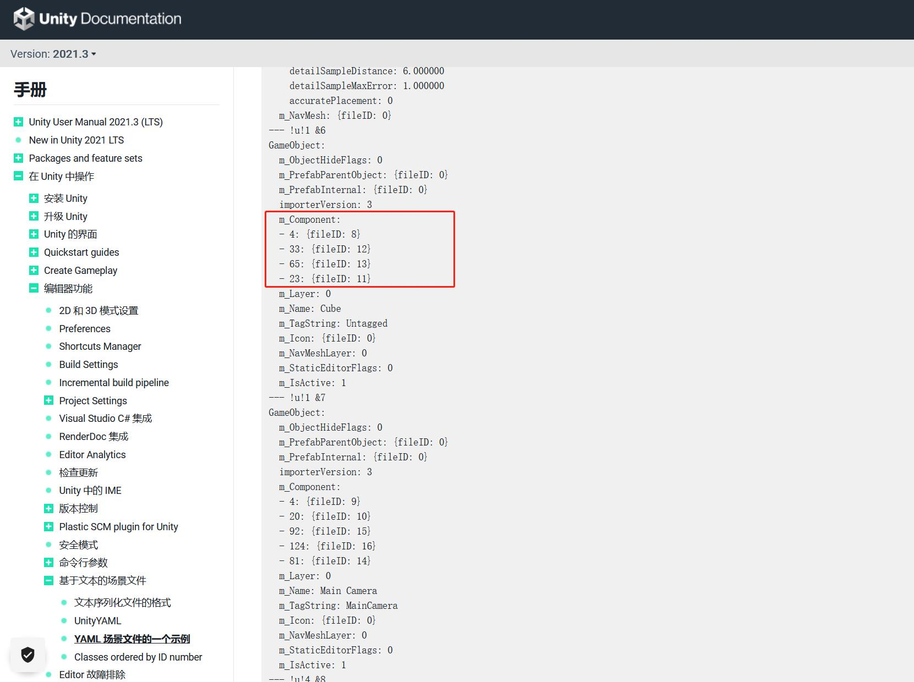
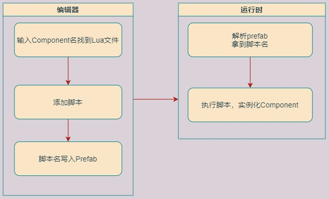

## 17.2 引擎集成sol2

```bash
CLion项目文件位于 samples\integrate_lua\lua_component
```

上一小节介绍了`sol2`的使用方式，从引擎抽出来的`GameObject`、`Component`组成了一个小例子。

这都是为了给在引擎里面集成`sol2`铺路，上一节例子跑通了，只要把代码复制到引擎里面就行了。

本小节开始，引擎里就集成了`sol2`，集成的步骤就不用介绍了，和上一节的例子相同。

为什么集成`sol2`，为什么用`lua`？

一是为了热更新，这个谁都懂。

二是为了方便实现编辑器添加组件的功能，下面来看这个。

### 如何向GameObject添加Component

#### 1. Unity的实现

Unity不开源但是从Yaml文件可以猜测出大概的流程。

在Unity里，每一个Class都会生成一个唯一ID，就叫它ClassID。

由于Component的类名和文件名必须相同，在编辑器里，输入Component名字，找到对应的CS脚本，就可以找到对应的Class添加。

编辑器添加后，在prefab的yaml里存储的是ClassID。



运行后，通过ClassID找到Class的Type，然后实例化。

如下图：


#### 2. 使用Lua的实现

如果是纯C++，也是可以通过类名，创建类实例的，用前面章节介绍的`RTTR`库即可。

问题就在于C++是编译型语言，创建一个类后，需要编译才能生效。

lua是脚本语言，创建新的lua Component后，执行这个lua文件即可生效。

集成lua后，添加Component的流程如下：




