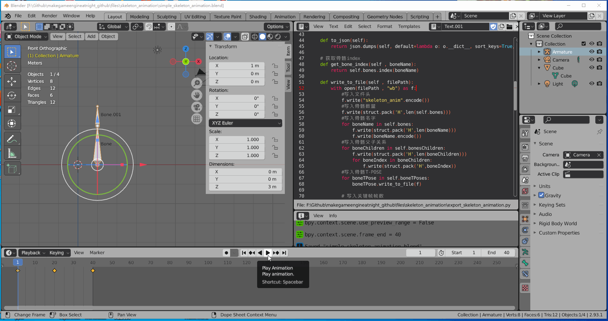
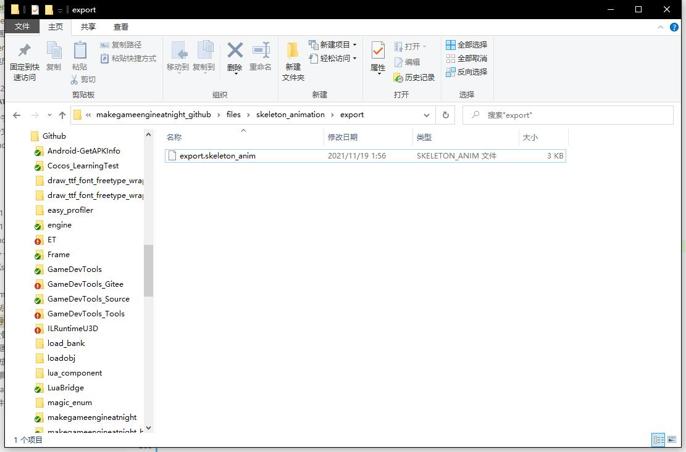

## 18.2 Blender导出骨骼动画

要导出哪些数据呢？

我们制作骨骼动画的时候，是先用父节点做大的摆动，然后再调整子节点。

子节点的坐标，是叠加了父节点的。

所以我们要导出节点间的父子关系，子节点相对父节点的位移。
以及每一帧父节点的移动，子节点的移动。

### 1. 编写Blender代码

在Blender中可以很方便的用Python进行插件开发，具体如何运行插件代码在之前的<第8章:绘制静态模型>已经介绍过了。



我编写了一小段代码，将骨骼动画数据导出到自定义的格式。

代码文件位于：`files\skeleton_animation\export_skeleton_animation.py`

```py
import bpy
import json
import os
import struct
from mathutils import Matrix
from math import radians

# 矩阵
class EngineMatrix:
    matrix = []

    def __init__(self , blenderMatrix):
        self.matrix = []
        for i in range(4):
            self.matrix.append([])
            for j in range(4):
                self.matrix[i].append(blenderMatrix[j][i])
        #调换y和z
        self.matrix[3][1] , self.matrix[3][2] = self.matrix[3][2] , self.matrix[3][1]
    
    def write_to_file(self , file):
        for i in range(4):
            for j in range(4):
                file.write(struct.pack('f' , self.matrix[i][j]))


# 存储骨骼动画片段
class EngineAnimation:
    # 存储骨骼名字 [bone_name , bone_name , ...]
    bones=[]

    # 存储骨骼父子关系，数组下标表示第几个Bone [[1],[]]
    bonesChildren = []

    # 存储骨骼 T-POSE，数组下标表示第几个Bone ["Bone.Matrix","Bone.001.Matrix"]
    boneTPoses = []

    # 存储骨骼关键帧数据，外面数组下标表示第几帧，里面数组下表表示第几个Bone [["Bone.Matrix","Bone.001.Matrix"] , ["Bone.Matrix","Bone.001.Matrix"]]
    frames = []

    def __init__(self):
        self.bonesChildren = {}
        self.boneTPoses = {}
        self.frames = {}

    def to_json(self):
        return json.dumps(self, default=lambda o: o.__dict__, sort_keys=True, indent=4)

    # 获取骨骼index
    def get_bone_index(self , boneName):
        return self.bones.index(boneName)

    def write_to_file(self , filePath):
        with open(filePath , "wb") as f:
            #写入文件头
            f.write("skeleton_anim".encode())
            #写入骨骼数量
            f.write(struct.pack('H',len(self.bones)))
            #写入骨骼名字
            for boneName in self.bones:
                f.write(struct.pack('H',len(boneName)))
                f.write(boneName.encode())
            #写入骨骼父子关系
            for boneChildren in self.bonesChildren:
                f.write(struct.pack('H',len(boneChildren)))
                for boneIndex in boneChildren:
                    f.write(struct.pack('H',boneIndex))
            #写入骨骼T-POSE
            for boneTPose in self.boneTPoses:
                boneTPose.write_to_file(f)

            # 写入关键帧帧数
            f.write(struct.pack('H',len(self.frames)))

            #写入关键帧数据
            for frame in self.frames:
                for boneMatrix in frame:
                    boneMatrix.write_to_file(f)

            f.close()

print("---------- EXPORT SKELETON ANIMATION ------------")

engineAnimation=EngineAnimation()

print("---------- SET POSE MODE ------------")
if bpy.ops.object.mode_set.poll():
    bpy.ops.object.mode_set(mode='POSE')

armature_obj = bpy.data.objects["Armature"]

print("---------- EXPORT BONE ------------")
for i in range(0, len(bpy.context.visible_pose_bones)):
    bone = bpy.context.visible_pose_bones[i]
    engineAnimation.bones.append(bone.name)

print("---------- EXPORT BONES CHILDREN ------------")
engineAnimation.bonesChildren= [None] * len(bpy.context.visible_pose_bones)

for i in range(0, len(bpy.context.visible_pose_bones)):
    bone = bpy.context.visible_pose_bones[i]
    engineAnimation.bonesChildren[engineAnimation.get_bone_index(bone.name)] = []
    for child in bone.children:
        engineAnimation.bonesChildren[engineAnimation.get_bone_index(bone.name)].append(engineAnimation.get_bone_index(child.name))
        
print("---------- EXPORT T-POS ------------")
engineAnimation.boneTPoses = [None] * len(bpy.context.visible_pose_bones)

for i in range(0, len(bpy.context.visible_pose_bones)):
    bone = bpy.context.visible_pose_bones[i]
    matrix_local = armature_obj.data.bones[bone.name].matrix_local @ Matrix.Rotation(radians(-90), 4, "X")
    engineAnimation.boneTPoses[engineAnimation.get_bone_index(bone.name)]=EngineMatrix(matrix_local)

print("---------- EXPORT FRAME ------------")
print("bpy.context.scene.frame_start:"+str(bpy.context.scene.frame_start))
print("bpy.context.scene.frame_end:"+str(bpy.context.scene.frame_end))
engineAnimation.frames = [None] * (bpy.context.scene.frame_end - bpy.context.scene.frame_start + 1)

frame_index = 0
for frame in range(bpy.context.scene.frame_start, bpy.context.scene.frame_end + 1):
    bpy.context.scene.frame_set(frame)
    print("---------- FRAME:"+str(frame))

    engineAnimation.frames[frame_index] = [None] * len(bpy.context.visible_pose_bones)
    for i in range(0, len(bpy.context.visible_pose_bones)):
        bone = bpy.context.visible_pose_bones[i]
        matrix_basis = armature_obj.pose.bones[bone.name].matrix_basis
        # print(matrix_basis)
        engineAnimation.frames[frame_index][engineAnimation.get_bone_index(bone.name)]=EngineMatrix(matrix_basis)
    frame_index = frame_index + 1

print("---------- WRITE FILE ------------")
blender_project_dir = os.path.dirname(bpy.data.filepath)
if os.path.exists(blender_project_dir+"/export")==False:
    os.mkdir(blender_project_dir+"/export")

engineAnimation.write_to_file(blender_project_dir+"/export/export.skeleton_anim")

print("---------- EXPORT SUCCESS ------------")

# print(engineAnimation.to_json())
```

值得注意的是，从Blender2.8之后，矩阵乘法用 `@` 替代 `*`，我在这上面浪费不少时间。

```bash
Blender 2.80: Python API Changes
https://wiki.blender.org/wiki/Reference/Release_Notes/2.80/Python_API#Matrix_Multiplication
```


### 2. 导出文件格式

执行上面代码后，得到了文件`export.skeleton_anim`。



文件结构如下：



下一篇就按照这个文件结构来进行解析，并播放骨骼动画。

### 3. 其他

有一些东西需要注意：

1. 绕Z轴旋转，从Y转向X，角度是负数。

    

2. Blender是行主序，和数学上的表现一致，可以直接用作代数运算。
3. GLM是列主序，Blender导出到GLM要转换。
4. Blender T-Pos是Z朝上，导出到GLM要转换。
   

参考了以下文章：

```bash
https://docs.blender.org/api/2.93/bpy.context.html#bpy.context.visible_objects

https://gamedev.stackexchange.com/questions/44058/exporting-bind-and-keyframe-bone-poses-from-blender-to-use-in-opengl
```


